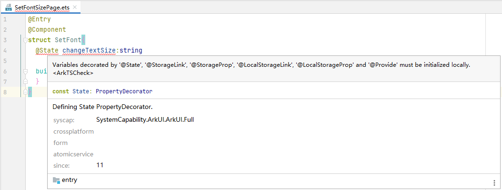
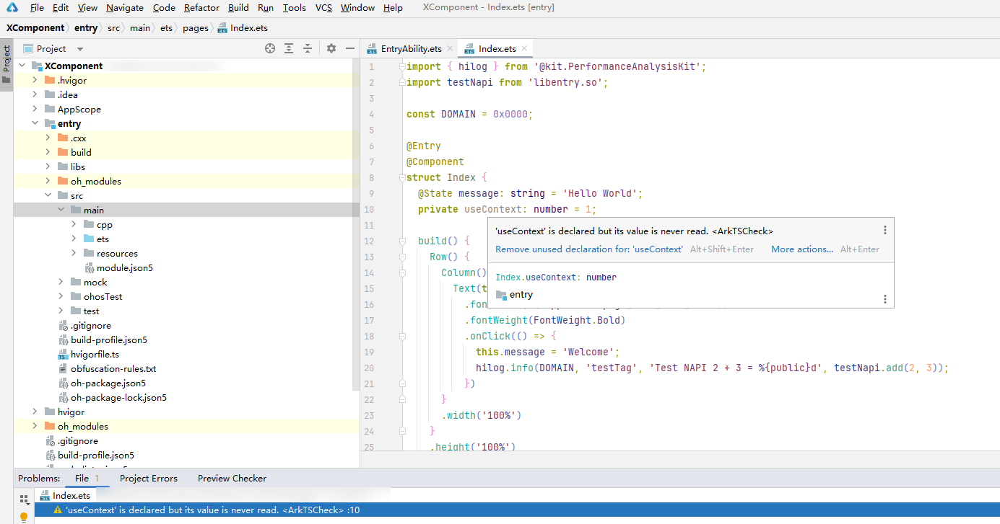
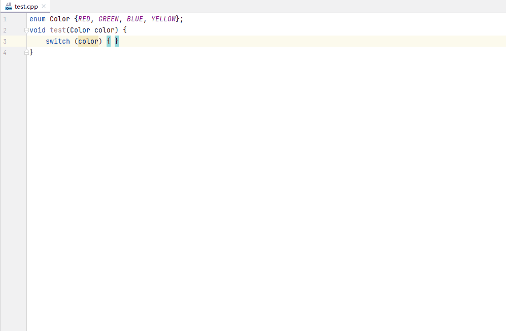
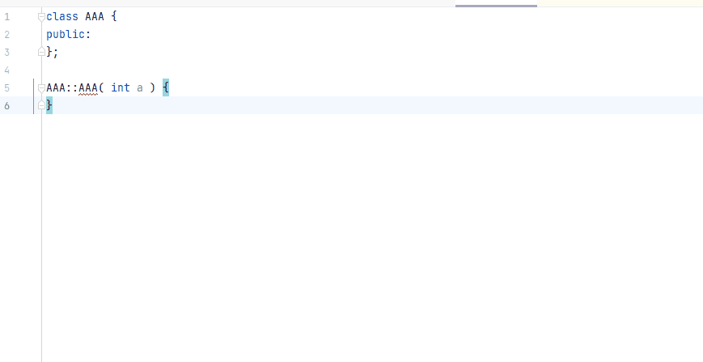

# 代码实时检查及快速修复

#### 实时检查

编辑器会实时地进行代码分析，如果输入的语法不符合编码规范，或者出现语义语法错误，将在代码中突出显示错误或警告，将鼠标放置在错误代码处，会提示详细的错误信息。

对于ArkTS代码，从DevEco Studio 4.0 Release版本开始，当compileSdkVersion≥10时，编辑器代码实时检查支持ArkTS性能语法规范检查。

当前compileSdkVersion≥10且arkTSVersion≥1.1（默认）时，ArkTS严格类型检查支持实时检查。

对于C/C++代码，可通过内置的Clang-Tidy对代码进行实时检查，实时检查前需完成选项配置，配置操作请参考[Clang-Tidy代码检查](`https://`developer.huawei.com/consumer/cn/doc/harmonyos-guides/ide-clang-tidy)。

#### 代码快速修复

DevEco Studio支持代码快速修复能力，辅助开发者快速修复ArkTS或C++代码问题。

<strong>查看告警信息：</strong>使用双击<strong>Shift</strong>快捷键打开文件查询框，输入<strong>problems</strong>打开问题工具面板；双击对应告警信息，可以查看告警的具体位置及原因。

<strong>快速修复：</strong>将光标放在错误告警的位置，可在弹出的悬浮窗中查看问题描述和对应修复方式；单击<strong>More actions</strong>可查看更多修复方法。或是在页面出现灯泡图标时，可点击图标并根据相应建议，实现代码快速修复。

<strong>C++快速修复使用演示</strong>

下面通过示例展示C++代码中快速修复功能的使用方法。

* 光标悬浮在switch表达式的条件变量处，点击灯泡图标，在下拉菜单中选择<strong>Create missing switch cases</strong>，完成缺失的case条件补充。

  
* 点击构造函数名称，左侧出现红色灯泡后，点击灯泡图标选择<strong>Create new constructor 'xxx'</strong>生成构造函数。

  
