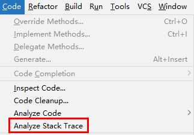
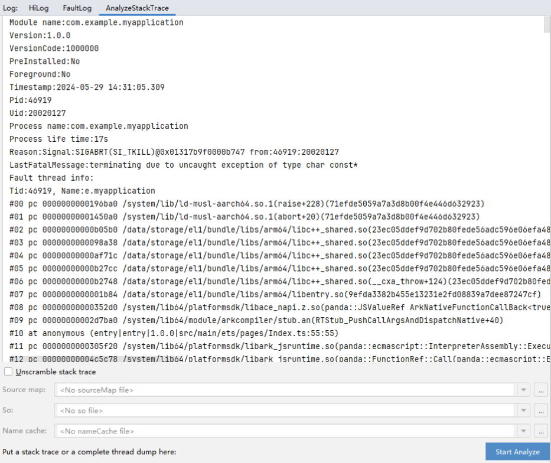
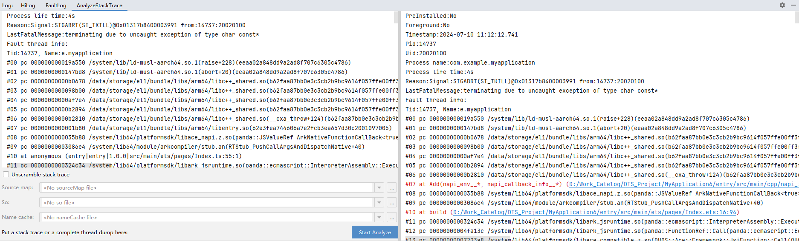

# 堆栈轨迹分析

对于发布的应用（Release应用），为减小应用程序大小，提高运行效率，会对代码进行优化，去除其中的debug信息。因此无法直接通过Release应用的堆栈信息定位到源码的具体文件和行位置，不易于开发者快速定位解决问题。

针对该场景，DevEco Studio提供了Release应用堆栈解析功能，开发者可以利用构建产物中包含Debug信息的文件（so文件、sourceMap文件、nameCache文件等），对Release应用中C++堆栈、ArkTS堆栈以及ArkTS堆栈中混淆的方法名和文件名进行还原。关于构建产物的介绍和堆栈解析的原理，请查看[异常堆栈解析原理](https://developer.huawei.com/consumer/cn/doc/harmonyos-guides/ide-exception-stack-parsing-principle)。

Release应用堆栈解析功能操作方法如下：

1. 单击菜单栏<strong>Code &gt; Analyze Stack Trace</strong>，或在FaultLog页面异常堆栈信息处右键选择<strong>Analyze Stack Trace。</strong>

   
2. 在弹出的<strong>Analyze Stack Trace</strong>对话框中，粘贴Release应用的异常堆栈信息。

   
3. 如果当前工程为堆栈所在应用对应的工程，且存在Release构建产物，点击<strong>Start Analyze</strong>即可进行解析。

   如果当前工程不是堆栈所在应用对应的工程，则需要配置应用对应构建产物：勾选<strong>Unscramble stack trace</strong>, 在下方的文件选择框中，分别添加应用对应的sourceMap文件、so文件以及nameCache文件，点击<strong>Start Analyze</strong>进行转换。

   DevEco Studio将解析后的堆栈信息显示在右侧的输出框中。

   

   在构建Release应用时，so文件是默认不包含符号表信息的，如果需要在构建Release应用时生成包含符号表的so文件，需要在工程的[模块级build-profile.json5](https://developer.huawei.com/consumer/cn/doc/harmonyos-guides/ide-hvigor-cpp)文件的buildOption属性中，配置如下信息：

   ```
   "buildOption": {
     "externalNativeOptions": {
       "arguments": "-DCMAKE_BUILD_TYPE=RelWithDebInfo"
     }
   }
   ```

   如果引用release Har包中native方法产生了异常堆栈，解析时请勾选<strong>Unscramble stack trace</strong>, 并选择har模块中编译出的带有符号信息的so文件，引用方build产物中的har模块so不带有符号信息。so文件在模块中相对路径为build/default/intermediates/libs/default/`&#123;cpu类型&#125;`/libxxx.so。
