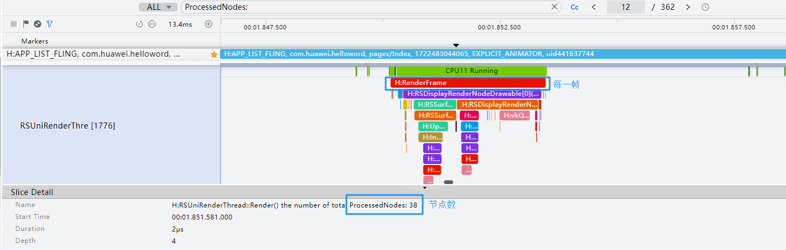

# 节点数超过500过多

如果使用DevEco Studio 6.0.1 Beta1以下版本，规则名称为：图形渲染服务处理节点数小于500。

#### 规则详情

后端Render Server在每帧数据里处理的节点数不应该超过500，否则会造成CPU使用过高，引发帧时延过高，从而导致丢帧。

#### 检测逻辑

* 打开滑动或者点击操作对应的trace。
  + 滑动场景查找滑动泳道：

    H:APP\_LIST\_FLING

    H:APP\_SWIPER\_SCROLL

    H:WEB\_LIST\_FLING
  + 点击转场场景查找泳道：

    H:ABILITY\_OR\_PAGE\_SWITCH

    H:APP\_TRANSITION\_FROM\_OTHER\_APP

    H:APP\_TRANSITION\_TO\_OTHER\_APP

    H:APP\_SWIPER\_NO\_ANIMATION\_SWITCH

    H:APP\_TABS\_NO\_ANIMATION\_SWITCH

    H:APP\_TABS\_FLING
* 以H:APP\_LIST\_FLING泳道为例，如下图：

  在泳道时序范围内，每一个RenderFrame为一帧，找到这一帧所有的ProcessedNodes字段，提取节点数累加求和（每一帧可能对应多个ProcessedNodes，所以需要累加求和），即每帧渲染的节点数 = Σ ProcessedNodes。

  

#### 计算逻辑

每帧渲染的节点数小于等于500。
