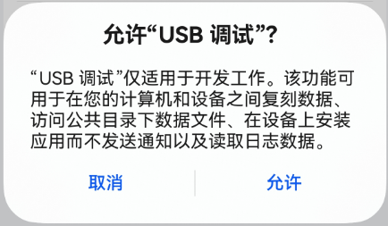
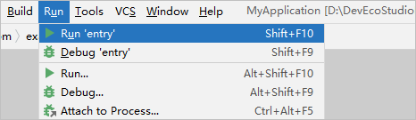
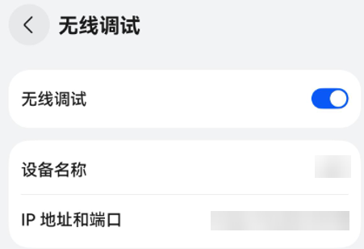
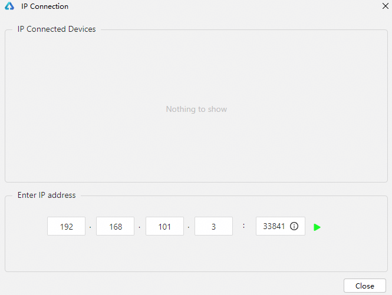

# 使用本地真机运行应用

在本地真机中运行HarmonyOS应用/元服务，可以采用USB连接方式或者无线连接方式。


Wearable设备仅支持无线连接方式（Lite Wearable设备不支持）。

#### 前提条件

* 确保设备系统版本升级到[HarmonyOS NEXT Developer Beta1](`https://`developer.huawei.com/consumer/cn/doc/harmonyos-releases/overview-500#section849861583816)或以上。
* 在真机设备上查看<strong>设置 &gt; 系统</strong>中开发者选项是否存在，如果不存在，可在**设置 &gt; *具体的设备名称*<strong>中，连续七次单击</strong>软件版本<strong>，直到提示“开启开发者选项”，点击</strong>确认开启**后输入PIN码（如果已设置），设备将自动重启，请等待设备完成重启。
* 在设备运行应用/元服务需要根据[配置调试签名](`https://`developer.huawei.com/consumer/cn/doc/harmonyos-guides/ide-signing)章节，提前对应用/元服务进行签名。

#### 使用USB连接方式

1. 使用USB方式，将真机设备与PC端进行连接。
2. 在<strong>设置 &gt; 系统 &gt; 开发者选项</strong>中，打开<strong>USB调试</strong>开关（确保设备已连接USB）。
3. 在真机设备中会弹出“允许USB调试”的弹框，单击<strong>允许</strong>。

   
4. 在菜单栏中，单击<strong>Run&gt;Run'模块名称'</strong>或，或使用默认快捷键<strong>Shift+F10</strong>（macOS为<strong>Control+R</strong>）运行应用/元服务。

   
5. DevEco Studio启动HAP的编译构建和安装。安装成功后，设备会自动运行安装的HarmonyOS应用/元服务。

#### 使用设备连接助手排查问题

从DevEco Studio 5.1.1 Beta1版本开始，设备连接后，如果DevEco Studio无法识别到设备，显示“No Devices”，可使用设备连接助手来排查问题。点击设备下拉框，并点击<strong>Troubleshoot Device Connections</strong>打开该功能，分为三个步骤，每个步骤排查完后点击<strong>Next</strong>排查下一个。

1. <strong>通过USB连接设备：</strong>根据界面提示，使用USB连接设备后，点击<strong>Rescan Devices</strong>按钮，扫描已连接的设备，确保扫描结果中包含待调试的设备。
2. <strong>启用USB调试：</strong>根据界面提示，确保设备系统版本正确，并且启用开发者选项和USB调试。
3. <strong>重启HDC服务：</strong>如果DevEco Studio仍然无法识别设备，点击<strong>Restart hdc Service</strong>按钮重启HDC服务，重启后HDC会重新识别设备。如果重启后仍识别不到设备，请参考[设备连接后，无法识别设备的处理指导](`https://`developer.huawei.com/consumer/cn/doc/harmonyos-faqs/faqs-app-debugging-3)或[如何解决设备无法识别问题](`https://`developer.huawei.com/consumer/cn/doc/harmonyos-faqs/faqs-performance-analysis-kit-32)。

#### 使用无线连接方式

1. 将真机设备和PC连接到同一WLAN网络。
2. 在<strong>设置 &gt; 系统 &gt;</strong> <strong>开发者选项</strong>中，打开<strong>无线调试</strong>或<strong>通过WLAN调试</strong>（Wearable设备）开关，并获取设备端的IP地址和端口号。

   
3. 连接设备，有两种方式。
   * 在DevEco Studio菜单栏中，单击<strong>Tools &gt; IP Connection</strong>，输入连接设备的IP地址和端口号，单击，连接正常后，设备状态为<strong>online</strong>。

     
   * 执行hdc命令，关于hdc工具的使用指导请参考[hdc](`https://`developer.huawei.com/consumer/cn/doc/harmonyos-guides/hdc)。

     ```
     hdc tconn 设备IP地址:端口号
     ```
4. 在菜单栏中，单击<strong>Run&gt;Run'模块名称'</strong>或，或使用默认快捷键<strong>Shift+F10</strong>（macOS为<strong>Control+R</strong>）运行应用/元服务。

   
5. DevEco Studio启动HAP的编译构建和安装。安装成功后，设备会自动运行安装的HarmonyOS应用/元服务。
