# 配置调试签名

针对开发调试场景，DevEco Studio为开发者提供了[自动签名](#section18815157237)方案，帮助开发者高效进行调试。此外，也可以选择[手动签名](#section297715173233)方式生成调试签名。

#### 使用场景说明

* 自动签名仅用于调试场景，方便开发者进行应用调试。部分调试场景下必须使用手动签名：
  1. 当需要进行跨设备调试、跨应用交互调试、断网情况下调试或者多用户共同开发且需要共享密钥时，必须使用[手动签名](#section297715173233)。
  2. 如果开发过程中使用到需要审批的权限时，例如：
     1. 使用部分不支持自动签名的[受限开放权限](`https://`developer.huawei.com/consumer/cn/doc/harmonyos-guides/restricted-permissions)时，必须使用[手动签名](#section297715173233)。支持自动签名的ACL权限清单请参见[自动签名支持的ACL权限](#section5301916183411)。
     2. 需要华为业务方审核的权限时（例如华为账号一键登录等），必须使用手动签名。
  3. 若kit需要配置指纹，建议使用手动签名。
* 发布场景必须使用手动签名。

#### 自动签名

DevEco Studio 6.0.0 Beta3及之前版本，自动签名未关联注册的应用。

从DevEco Studio 6.0.0 Beta5版本开始，自动签名新增关联注册应用的方式，签名操作界面新增“<strong>Associate with registered application</strong>”选项。

* 关联注册应用的自动签名：与应用市场（AppGallery Connect，简称AGC）的应用绑定，可在DevEco Studio开通[开放能力](`https://`developer.huawei.com/consumer/cn/doc/app/agc-help-create-app-0000002247955506#section1817619495251)。
* 未关联注册应用的自动签名：未与应用市场的应用绑定，不支持在DevEco Studio开通开放能力。

#### 约束与限制

* 从DevEco Studio 6.1.1 Beta1版本开始，关联注册应用的自动签名支持在所有国家/地区使用。
* 使用自动签名前，请确保本地系统时间与北京时间（UTC/GMT+08:00）保持一致。如果不一致，将导致签名失败。

#### 关联注册应用

<strong>操作步骤</strong>

1. 连接真机设备或模拟器，具体请参考[使用本地真机运行应用/元服务](`https://`developer.huawei.com/consumer/cn/doc/harmonyos-guides/ide-run-device)或[使用模拟器运行应用/元服务](`https://`developer.huawei.com/consumer/cn/doc/harmonyos-guides/ide-run-emulator)，真机连接成功后如下图所示：

   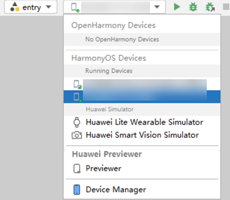

   

   如果同时连接多个设备，则使用自动化签名时，会同时将这多个设备的信息写到证书文件中。
2. 进入<strong>File &gt; Project Structure... &gt; Project &gt; Signing Configs</strong>界面，勾选“<strong>Associate with registered application</strong>”。如果未登录，请先点击<strong>Sign In</strong>进行登录。

   

   

   * 点击<strong>Team</strong>下拉框，可以切换团队账号。
   * 开始签名后，DevEco Studio根据Bundle name查询该团队在AGC上同包名的应用。若在AGC查询到应用，则进行自动签名；若在AGC未查询到应用或应用冲突，请根据提示信息修改后重新自动签名，具体修改请参考[常见问题](`https://`developer.huawei.com/consumer/cn/doc/harmonyos-faqs/faqs-signature-service-18)。
3. 点击<strong>Enable open capabilities</strong>，在DevEco Studio上开通[开放能力](`https://`developer.huawei.com/consumer/cn/doc/app/agc-help-create-app-0000002247955506#section1817619495251)。当前支持开通如下四种开放能力：Push Kit（[推送服务](`https://`developer.huawei.com/consumer/cn/doc/harmonyos-guides/push-kit-introduction)）、Device status detection（[应用设备状态检测](`https://`developer.huawei.com/consumer/cn/doc/harmonyos-guides/devicesecurity-deviceverify-develop)）、Map Kit（[地图服务](`https://`developer.huawei.com/consumer/cn/doc/harmonyos-guides/map-introduction)）、Safety Detect（[安全检测服务](`https://`developer.huawei.com/consumer/cn/doc/harmonyos-guides/devicesecurity-safetydetect-develop)），应用根据需要进行勾选。

   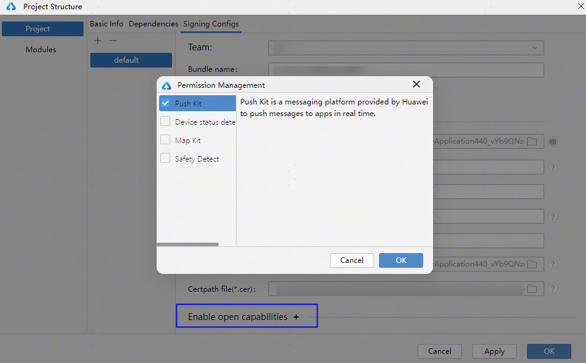
4. （可选）在配置文件中添加ACL权限信息，ACL权限清单请参考[自动签名支持的ACL权限](#section5301916183411)。

   在需要使用权限的模块的module.json5（Stage模型）/config.json（FA模型）文件中添加“requestPermissions”/“reqPermissions”字段，并在字段下添加对应的权限名等信息。以下示例为在Stage模型工程中增加"ohos.permission.ACCESS\_DDK\_USB"权限。

   ```
   {
     "module": {
       ...
       "requestPermissions": [{
         "name": "ohos.permission.ACCESS_DDK_USB",
       }],
       ...
     }
   }
   ```

   

   修改配置文件后点击<strong>OK</strong>，若应用已在AGC申请该权限则签名成功；若应用未申请该权限，会导致签名失败，点击Notice弹窗中"<strong>submit a permission request in AppGallery Connect</strong>"或"<strong>Submit</strong>"，跳转至AGC申请权限，然后再返回DevEco Studio界面重新签名。

   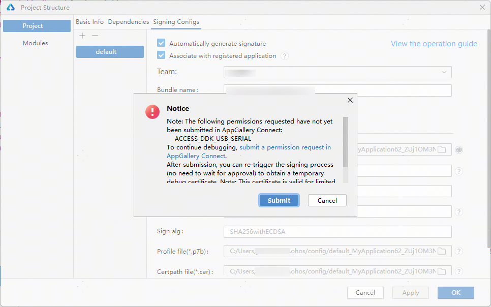

   

   * 申请ACL前注意事项：
     + 在申请ACL权限前，请审视是否符合[受限权限的使用场景](`https://`developer.huawei.com/consumer/cn/doc/harmonyos-guides/restricted-permissions)。当前仅少量符合特殊场景的应用可在通过审批后，使用受限权限。申请方式请见[申请使用受限权限](`https://`developer.huawei.com/consumer/cn/doc/harmonyos-guides/declare-permissions-in-acl)。
     + 涉及受限权限的应用，在上架时，应用市场（AGC）将根据应用的使用场景审核是否可以使用对应的受限权限。如不符合，应用的上架申请将被驳回，审核方式请见[发布HarmonyOS应用](`https://`developer.huawei.com/consumer/cn/doc/app/agc-help-release-app-0000002271695230)。
   * 申请ACL后Profile证书说明：
     + 在ACL权限申请审批完成前，可获得一个有效期较短的临时Profile证书，使应用完成签名。临时证书到期后，若申请仍未审批通过，签名时需再次申请和再次获取临时证书。
     + 在ACL权限申请审批完成后，可获取一个有效期较长的正式Profile证书。
5. 签名完成后，在本地生成密钥（.p12）、证书请求文件（.csr）、数字证书（.cer）及Profile文件（.p7b）。将鼠标悬停在Provisioning Profile: DevEco Managed Profile后，可查看证书有效期、包名（bundle name）、ACL权限（acl）、开放能力（capability）等信息；或进入工程级build-profile.json5文件，在“signingConfigs”下可查看到配置成功的签名信息。

#### 未关联注册应用

<strong>HarmonyOS工程按以下步骤操作：</strong>

1. 连接真机设备或模拟器，具体请参考[使用本地真机运行应用/元服务](`https://`developer.huawei.com/consumer/cn/doc/harmonyos-guides/ide-run-device)或[使用模拟器运行应用/元服务](`https://`developer.huawei.com/consumer/cn/doc/harmonyos-guides/ide-run-emulator)，真机连接成功后如下图所示：

   

   

   如果同时连接多个设备，则使用自动化签名时，会同时将这多个设备的信息写到证书文件中。
2. 进入<strong>File &gt; Project Structure... &gt; Project &gt; Signing Configs</strong>界面，勾选“<strong>Automatically generate signature</strong>”即可完成签名。如果未登录，请先单击<strong>Sign In</strong>进行登录，然后自动完成签名。

   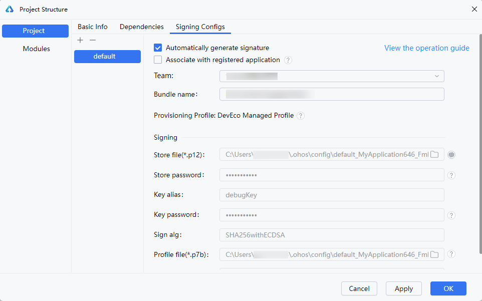
3. （可选）在配置文件中添加ACL权限信息，ACL权限清单请参考[自动签名支持的ACL权限](#section5301916183411)。修改配置文件后，点击<strong>Ok。</strong>

   在需要使用权限的模块的module.json5（Stage模型）/config.json（FA模型）文件中添加“requestPermissions”/“reqPermissions”字段，并在字段下添加对应的权限名等信息，以在Stage模型工程中增加"ohos.permission.ACCESS\_DDK\_USB"权限为例。

   ```
   {
     "module": {
       ...
       "requestPermissions": [{
         "name": "ohos.permission.ACCESS_DDK_USB",
       }],
       ...
     }
   }
   ```

   

   

   * 在调试签名时，不会强校验配置文件中添加的ACL权限。
   * 涉及受限权限的应用，上架时，应用市场（AGC）将根据应用的使用场景审核是否可以使用对应的受限权限，如不符合，应用的上架申请将被驳回。在配置ACL权限前，请审视是否符合[受限权限的使用场景](`https://`developer.huawei.com/consumer/cn/doc/harmonyos-guides/restricted-permissions)。当前仅少量符合特殊场景的应用可在通过审批后，使用受限权限，申请方式请见[申请使用受限权限](`https://`developer.huawei.com/consumer/cn/doc/harmonyos-guides/declare-permissions-in-acl)。
4. 签名完成后，在本地生成密钥（.p12）、证书请求文件（.csr）、数字证书（.cer）及Profile文件（.p7b）。将鼠标悬停在Provisioning Profile: DevEco Managed Profile后，可查看证书有效期、包名（bundle name）、ACL权限（acl）、开放能力（capability）等信息；或进入工程级build-profile.json5文件，在“signingConfigs”下可查看到配置成功的签名信息。

<strong>OpenHarmony工程按以下步骤操作：</strong>

1. 连接真机设备或模拟器，具体请参考[使用本地真机运行应用/元服务](`https://`developer.huawei.com/consumer/cn/doc/harmonyos-guides/ide-run-device)或[使用模拟器运行应用/元服务](`https://`developer.huawei.com/consumer/cn/doc/harmonyos-guides/ide-run-emulator)，真机连接成功后如下图所示：

   
2. 进入<strong>File &gt; Project Structure... &gt; Project &gt; Signing Configs</strong>界面。仅勾选“<strong>Automatically generate signature</strong>”时，生成OpenHarmony签名；勾选“<strong>Support HarmonyOS</strong>”和“<strong>Automatically generate signature</strong>”时，生成HarmonyOS签名。如果未登录，请先单击<strong>Sign In</strong>进行登录。

   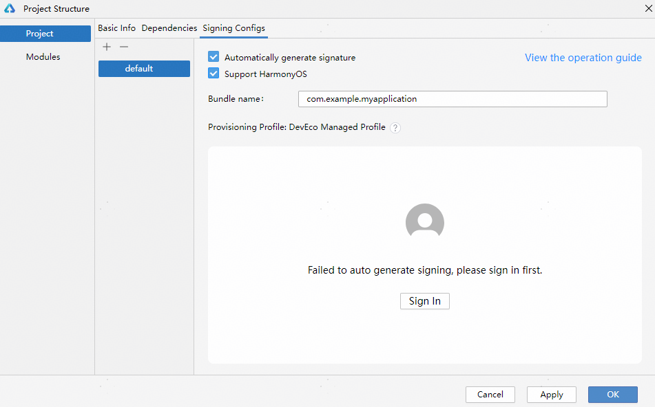

   签名完成后，如下图所示。在本地生成密钥（.p12）、证书请求文件（.csr）、数字证书（.cer）及Profile文件（.p7b），数字证书在AGCt网站的“证书、APP ID和Profile”页签中可以查看。

   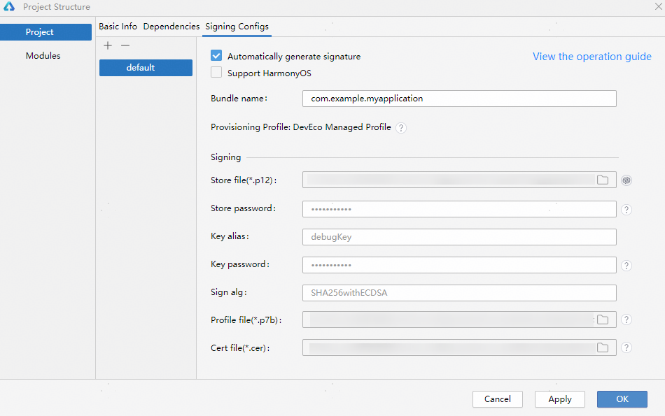

   

   * OpenHarmony工程签名时，推荐使用HarmonyOS签名。因为OpenHarmony签名是Release签名，Release签名的应用不支持调试和打印debug日志等。此外，OpenHarmony签名可能会影响应用运行。
   * 如果同时连接多个设备，则使用自动化签名时，会同时将这多个设备的信息写到证书文件中。

#### 手动签名

HarmonyOS应用/元服务通过数字证书（.cer文件）和Profile文件（.p7b文件）来保证应用/元服务的完整性。在申请调试数字证书和调试Profile文件前，需要通过DevEco Studio生成密钥（存储在格式为.p12的密钥库文件中）和证书请求文件（.csr文件）

<strong>基本概念</strong>

* <strong>密钥</strong>：格式为.p12，包含非对称加密中使用的公钥和私钥，存储在密钥库文件中，公钥和私钥用于数字签名和验证。
* <strong>证书请求文件</strong>：格式为.csr，全称为Certificate Signing Request，包含密钥对中的公钥和通用名称、组织名称、组织单位等信息，用于向AppGallery Connect申请数字证书。
* <strong>数字证书</strong>：格式为.cer，由华为AppGallery Connect颁发。
* <strong>Profile文件</strong>：格式为.p7b，包含HarmonyOS应用/元服务的包名、数字证书信息、描述应用/元服务允许申请的证书权限列表，以及允许应用/元服务调试的设备列表（如果应用/元服务类型为Release类型，则设备列表为空）等内容，每个应用/元服务包中均必须包含一个Profile文件。

从DevEco Studio 6.1.0 Beta2版本开始，手动签名时，生成密钥和证书请求文件的操作界面发生变更。

#### 生成密钥和证书请求文件

<strong>DevEco Studio 6.1.0 Beta2及之后版本</strong>

1. 在主菜单栏单击<strong>Build &gt; Generate Key</strong> <strong>and CSR</strong>。
2. 在<strong>Generate Key</strong> <strong>and CSR</strong>界面，可以单击<strong>Select an existing key</strong>选择已有的密钥库文件（存储有密钥的.p12文件），若没有密钥库文件则进行填写。下面以新创建密钥库文件为例进行说明。

   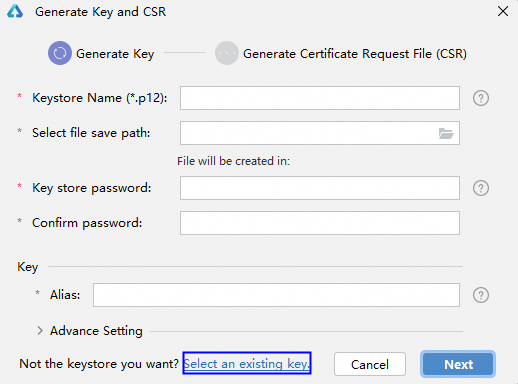
3. 在<strong>Generate Key</strong>窗口，填写密钥库信息后，点击<strong>Next</strong>。
   * <strong>Keystore Name</strong>：填写p12文件名称，仅允许包含字母、数字、下划线（\_）、中划线（-）、句号（.）。
   * <strong>Select file save path</strong>：设置密钥库文件存储路径。
   * <strong>Key store password</strong>：设置密钥库密码，必须由大写字母、小写字母、数字和特殊符号中的两种以上字符的组合，长度至少为8位。请记住该密码，后续签名配置需要使用。
   * <strong>Confirm password</strong>：再次输入密钥库密码。
   * <strong>Alias</strong>：密钥别名。请记住该别名，后续签名配置需要使用。
   * <strong>Advance Setting</strong>：密钥库文件的高级设置，选填。
     + <strong>Validity(years)：</strong>选填，证书有效期，建议设置为25年及以上，覆盖应用/元服务的完整生命周期。
     + <strong>First and last name：</strong>选填，通用名称，可填写应用名称或开发者姓名等。
     + <strong>Organizational unit</strong>：选填，组织单位，可填写部门名称或个人开发等。
     + <strong>Organization：</strong>选填，组织名称，可填写公司全称或开发者姓名等。
     + <strong>City or locality：</strong>选填，城市或地区。
     + <strong>State or province：</strong>选填，州或省。
     + <strong>Country code(XX)：</strong>选填，[国家码](`https://`developer.huawei.com/consumer/cn/doc/app/agc-help-connect-api-appendix-countrycode-0000002236201362)。

     

     First and last name、Organizational unit、Organization、City or locality、State or province填写要求小于64个字符，不可使用双引号（"）、斜杠（\）、反引号（`）。

   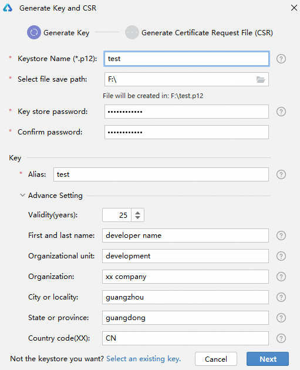
4. 在<strong>Generate</strong> <strong>Certificate Request File (CSR)</strong>窗口，设置CSR文件名和CSR文件存储路径后，点击<strong>Finish</strong>。
   * <strong>CSR File Name</strong>：填写CSR文件名称，仅允许包含字母、数字、下划线（\_）、中划线（-）、句号（.）。
   * <strong>Select file save path</strong>：设置CSR文件存储路径。

   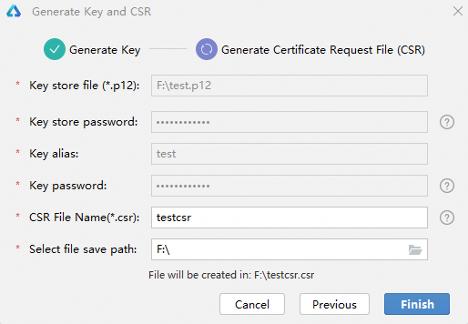
5. 创建CSR文件成功，可以在存储路径下获取生成的密钥库文件（.p12）、证书请求文件（.csr）。

   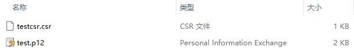

<strong>DevEco Studio 6.1.0 Beta2之前版本</strong>

1. 在主菜单栏单击<strong>Build &gt; Generate Key</strong> <strong>and CSR</strong>。

   

   如果本地已有对应的密钥，无需新生成密钥，可以在<strong>Generate Key</strong>界面中单击下方的Skip跳过密钥生成过程，直接使用已有密钥生成证书请求文件。
2. 在<strong>Key store file</strong>中，可以单击<strong>Choose Existing</strong>选择已有的密钥库文件（存储有密钥的.p12文件）；如果没有密钥库文件，单击<strong>New</strong>进行创建。下面以新创建密钥库文件为例进行说明。

   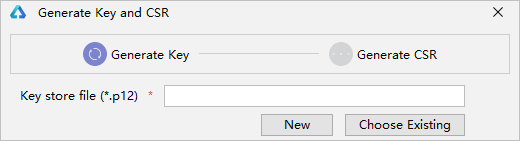
3. 在<strong>Create Key Store</strong>窗口，填写密钥库信息后，单击<strong>OK</strong>。
   * <strong>Key store file</strong>：设置密钥库文件存储路径，并填写p12文件名。
   * <strong>Password</strong>：设置密钥库密码，必须由大写字母、小写字母、数字和特殊符号中的两种以上字符的组合，长度至少为8位。请记住该密码，后续签名配置需要使用。
   * <strong>Confirm password</strong>：再次输入密钥库密码。

   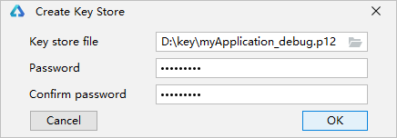
4. 在<strong>Generate Key</strong> <strong>and CSR</strong>界面，继续填写密钥信息后，单击<strong>Next</strong>。
   * <strong>Alias</strong>：必填，别名，用于标识密钥名称。请记住该别名，后续签名配置需要使用。
   * <strong>Password</strong>：必填，密码，与密钥库密码保持一致，无需手动输入。
   * <strong>Validity(years)：</strong>选填，证书有效期，建议设置为25年及以上，覆盖应用/元服务的完整生命周期。
   * <strong>First and last name：</strong>选填，通用名称，可填写应用名称或开发者姓名等。
   * <strong>Organizational unit</strong>：选填，组织单位，可填写部门名称或个人开发等。
   * <strong>Organization：</strong>选填，组织名称，可填写公司全称或开发者姓名等。
   * <strong>City or locality：</strong>选填，城市或地区。
   * <strong>State or province：</strong>选填，州或省。
   * <strong>Country code(XX)：</strong>选填，[国家码](`https://`developer.huawei.com/consumer/cn/doc/app/agc-help-connect-api-appendix-countrycode-0000002236201362)。

   

   First and last name、Organizational unit、Organization、City or locality、State or province要求：字符长度为（0，64），且不可使用双引号（"）、斜杠（\）、反引号（`）。

   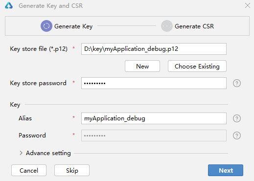
5. 在<strong>Generate Key</strong> <strong>and CSR</strong>界面，设置CSR文件存储路径和CSR文件名。

   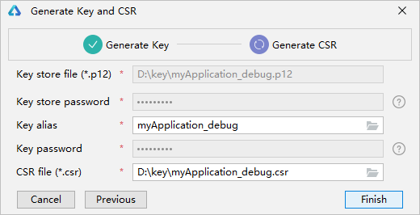
6. 单击<strong>Finish</strong>，创建CSR文件成功，可以在存储路径下获取生成的密钥库文件（.p12）、证书请求文件（.csr）和material文件夹（存放密码加密材料等）。

   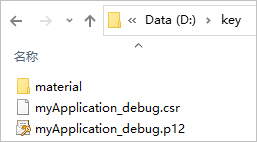

#### 申请调试证书

在AGC中申请和下载调试证书，具体请参考[申请调试证书](`https://`developer.huawei.com/consumer/cn/doc/app/agc-help-debug-cert-0000002283256797)。


如您未在AGC中注册该应用，申请前需要在AGC中注册，具体请参考[创建HarmonyOS应用](`https://`developer.huawei.com/consumer/cn/doc/app/agc-help-create-app-0000002247955506)。

#### 申请调试Profile文件和添加权限信息

1. （可选）如需使用ACL权限，在AGC中[申请ACL权限](`https://`developer.huawei.com/consumer/cn/doc/app/agc-help-apply-acl-0000002394212138)。同时，在DevEco Studio配置文件中添加权限信息。

   

   * ACL权限申请仅支持中国境内（香港特别行政区、澳门特别行政区、中国台湾除外）。
   * 若应用因特殊场景要求使用受限开放权限，请务必在此步骤进行申请，否则应用将在审核时被驳回。受限开放权限可申请的特殊场景请参考[受限开放权限](`https://`developer.huawei.com/consumer/cn/doc/harmonyos-guides/restricted-permissions)。
   * 确保应用申请受限开放权限时提供的场景和功能信息准确。如果应用内使用的受限开放权限超出您申请的范围，或申请权限后使用的功能和场景超出可使用的范围，将影响应用上架。

   在需要使用权限的模块的module.json5（Stage模型）/config.json（FA模型）文件中添加“requestPermissions”/“reqPermissions”字段，并在字段下添加对应的权限名等信息，以在Stage模型工程中增加"ohos.permission.ACCESS\_DDK\_USB"权限为例。

   ```
   {
     "module": {
       ...
       "requestPermissions": [{
         "name": "ohos.permission.ACCESS_DDK_USB",
       }],
       ...
     }
   }
   ```

   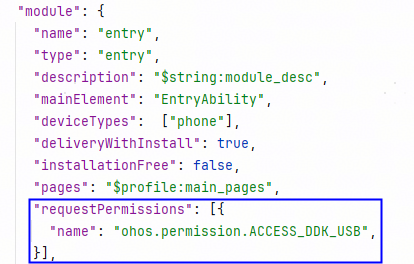
2. 在AGC中申请和下载Profile文件，具体请参考[申请调试Profile](`https://`developer.huawei.com/consumer/cn/doc/app/agc-help-debug-profile-0000002248181278)。

#### 配置签名信息

1. 连接真机设备，确保[DevEco Studio与真机设备已连接](`https://`developer.huawei.com/consumer/cn/doc/harmonyos-guides/ide-run-device)。

   
2. 在<strong>File &gt;</strong> <strong>Project Structure &gt;</strong> <strong>Project &gt; Signing Configs</strong>窗口中，取消勾选“Automatically generate signature”和“Associate with registered application”，分别配置密钥(.p12文件)、Profile(.p7b文件)和数字证书(.cer文件)的路径等信息，配置完毕后点击<strong>Apply</strong>。
   * <strong>Store file</strong>：选择密钥库文件，文件后缀为.p12，该文件为[生成密钥和证书请求文件](#section462703710326)中生成的.p12文件。
   * <strong>Store password</strong>：输入密钥库密码，该密码与[生成密钥和证书请求文件](#section462703710326)中填写的密钥库密码保持一致。
   * <strong>Key alias</strong>：输入密钥的别名信息，与[生成密钥和证书请求文件](#section462703710326)中填写的别名保持一致。
   * <strong>Key password</strong>：输入密钥的密码，与[生成密钥和证书请求文件](#section462703710326)中填写的<strong>Store Password</strong>保持一致。
   * <strong>Sign alg</strong>：签名算法，固定为SHA256withECDSA。
   * <strong>Profile file</strong>：选择[申请调试Profile文件和添加权限信息](#section89479413571)中生成的Profile文件，文件后缀为.p7b。
   * <strong>Certpath file</strong>：选择[申请调试证书](#section081822416419)中生成的数字证书文件，文件后缀为.cer。

   

   * Store file，Profile file，Certpath file三个字段支持配置相对路径，以项目根目录为起点，配置文件所在位置的路径名称。
   * 密钥库文件、密钥库密码、密钥别名、密钥密码、Profile文件、数字证书文件必须配套使用，否则会导致签名失败。若失败请根据报错信息进行修改，再进行签名。

   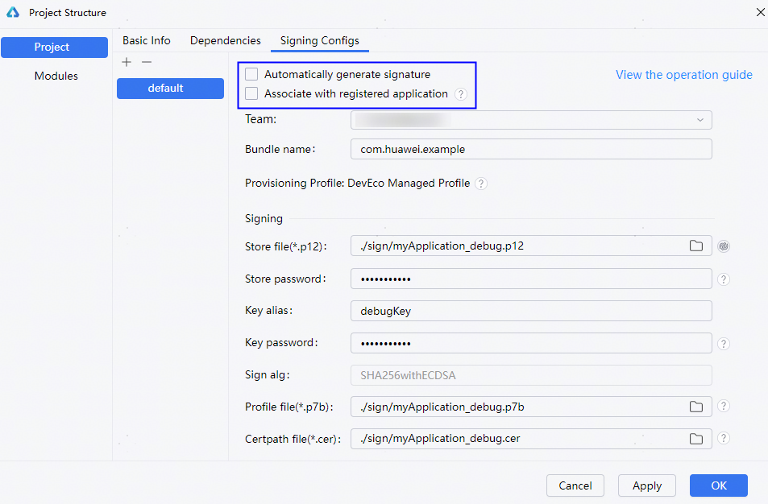

   配置完成后，将鼠标悬停在<strong>Provisioning Profile: DevEco Manage Profile</strong>后，可查看证书有效期、包名（bundle name）、企业名称（common name）、ACL权限（acl）、开放能力（capability）相关信息；或者进入工程级build-profile.json5文件，在“signingConfigs”下可查看到配置成功的签名信息。

   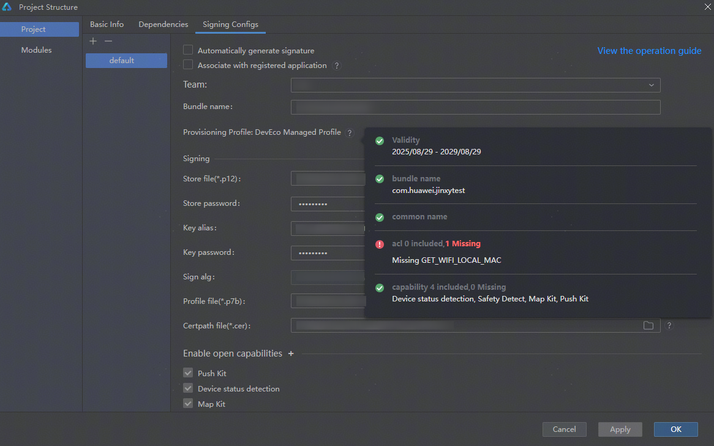
3. 进入工程级build-profile.json5文件，在“signingConfigs”下可查看到配置成功的签名信息，点击右上角的“Run”按钮运行应用/元服务。

   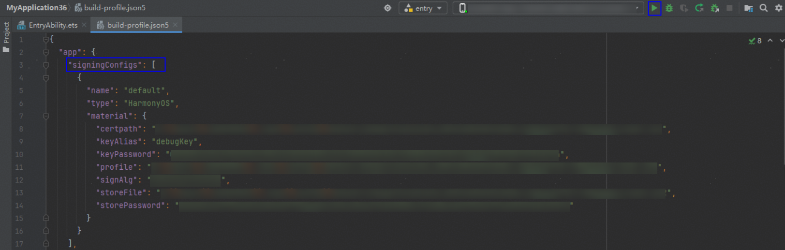

#### 附录

#### 自动签名支持的ACL权限

自动签名当前支持申请的ACL权限的清单如下所示。执行[操作步骤](#section18815157237)后，DevEco Studio将校验当前配置的ACL权限是否在以下列表中，然后通过应用市场（AGC）申请对应的Profile文件，用于签名打包，从而避免繁琐的手动签名步骤。

从DevEco Studio 6.1.0 Beta2版本开始，自动签名支持配置的ACL权限具体参考[受限开放权限](`https://`developer.huawei.com/consumer/cn/doc/harmonyos-guides/restricted-permissions)。

<strong>6.0.2 Beta1</strong>

新增权限

* ohos.permission.SUBSCRIBE\_NOTIFICATION
* ohos.permission.ACCESS\_USER\_FULL\_DISK
* ohos.permission.CUSTOM\_SCREEN\_RECORDING
* ohos.permission.GET\_IP\_MAC\_INFO

<strong>6.0.1 Release（6.0.1.260）</strong>

新增权限

* ohos.permission.SET\_SYSTEMSHARE\_APPLAUNCHTRUSTLIST
* ohos.permission.HOOK\_KEY\_EVENT
* ohos.permission.WEB\_NATIVE\_MESSAGING

<strong>6.0.0 Beta3</strong>

新增权限

* ohos.permission.CUSTOMIZE\_SAVE\_BUTTON
* ohos.permission.GET\_ABILITY\_INFO
* ohos.permission.LINKTURBO
* ohos.permission.GET\_WIFI\_LOCAL\_MAC
* ohos.permission.GET\_ETHERNET\_LOCAL\_MAC
* ohos.permission.USE\_FLOAT\_BALL
* ohos.permission.READ\_LOCAL\_DEVICE\_NAME
* ohos.permission.ACCESS\_NET\_TRACE\_INFO
* ohos.permission.KEEP\_BACKGROUND\_RUNNING\_SYSTEM
* ohos.permission.atomicService.MANAGE\_STORAGE
* ohos.permission.MANAGE\_SCREEN\_TIME\_GUARD

<strong>5.1.0 Release</strong>

新增权限

* ohos.permission.ACCESS\_DDK\_USB\_SERIAL
* ohos.permission.ACCESS\_DDK\_SCSI\_PERIPHERAL
* ohos.permission.USE\_FRAUD\_APP\_PICKER

<strong>5.0.5 Release</strong>

新增权限

* ohos.permission.kernel.DISABLE\_GOTPLT\_RO\_PROTECTION
* ohos.permission.MANAGE\_APN\_SETTING

<strong>5.0.3 Release</strong>

新增权限

* ohos.permission.READ\_WRITE\_USB\_DEV
* ohos.permission.USE\_FRAUD\_CALL\_LOG\_PICKER
* ohos.permission.USE\_FRAUD\_MESSAGES\_PICKER
* ohos.permission.ACCESS\_DISK\_PHY\_INFO
* ohos.permission.SET\_PAC\_URL
* ohos.permission.PERSONAL\_MANAGE\_RESTRICTIONS
* ohos.permission.START\_PROVISIONING\_MESSAGE
* ohos.permission.PRELOAD\_FILE
* ohos.permission.kernel.ALLOW\_WRITABLE\_CODE\_MEMORY
* ohos.permission.kernel.DISABLE\_CODE\_MEMORY\_PROTECTION
* ohos.permission.kernel.ALLOW\_EXECUTABLE\_FORT\_MEMORY
* ohos.permission.GET\_WIFI\_PEERS\_MAC
* ohos.permission.READ\_WRITE\_DESKTOP\_DIRECTORY
* ohos.permission.MANAGE\_PASTEBOARD\_APP\_SHARE\_OPTION
* ohos.permission.MANAGE\_UDMF\_APP\_SHARE\_OPTION
* ohos.permission.READ\_WRITE\_USER\_FILE

<strong>5.0.0 Release</strong>

支持权限

* ohos.permission.READ\_CONTACTS
* ohos.permission.WRITE\_CONTACTS
* ohos.permission.READ\_AUDIO
* ohos.permission.WRITE\_AUDIO
* ohos.permission.READ\_IMAGEVIDEO
* ohos.permission.READ\_PASTEBOARD
* ohos.permission.WRITE\_IMAGEVIDEO
* ohos.permission.ACCESS\_DDK\_USB
* ohos.permission.ACCESS\_DDK\_HID
* ohos.permission.SYSTEM\_FLOAT\_WINDOW
* ohos.permission.FILE\_ACCESS\_PERSIST
* ohos.permission.INPUT\_MONITORING
* ohos.permission.INTERCEPT\_INPUT\_EVENT
* ohos.permission.SHORT\_TERM\_WRITE\_IMAGEVIDEO
