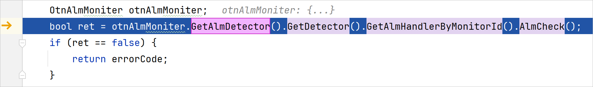

# 智能步入

进行C++调试时，当前代码行有多个函数调用时，开发者可以使用Smart Step Into功能直接Step Into到其中某一个函数的实现中。

#### 操作步骤

通过点击调试窗口“entry-Native”调试器下的Debugger窗格中的按钮（或使用快捷键<strong>Shift+F7</strong>）触发Smart Step Into功能后，DevEco Studio会将当前代码中可以进行跳转的函数进行高亮显示。

开发者点击需要跳转的函数，程序会运行到目标函数的实现内。

已经执行完毕的函数不会高亮显示。
