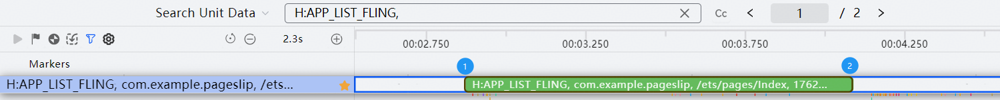
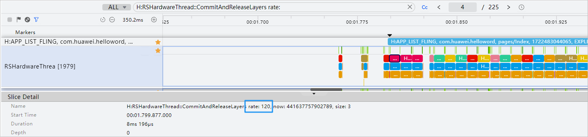
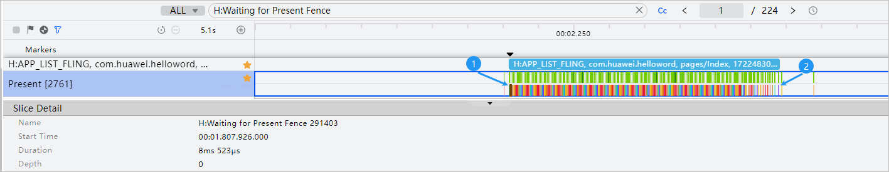

# 滑动过程流畅

#### 规则详情

应用的滑动过程卡顿率≤ 5ms/s；满帧30FPS的游戏类、地图类和视频类的应用帧率应≥ 29FPS。

#### 检测逻辑

* 开始时间：以APP\_LIST\_FLING滑动泳道为例，泳道的起点（如图标记1）。
* 结束时间：以APP\_LIST\_FLING滑动泳道为例，泳道的终点（如图标记2）。

  其他滑动泳道标记如下：

  H:APP\_SWIPER\_SCROLL

  H:WEB\_LIST\_FLING

* 查找滑动泳道：H:APP\_LIST\_FLING，如果是web页面，找H:WEB\_LIST\_FLING。
* 刷新率：查找关键词H:RSHardwareThread::CommitAndReleaseLayers rate，如下图：

  
* 每帧标准时长(ms)：1000ms/刷新率。

  总时长(s)：在以上泳道时间范围内，总时长 =【最后一个“H:Waiting for Present Fence xxxx” 时间（如图标记2）】 - 【第一个“H:Waiting for Present Fence xxxx” 时间（如图标记1）】。

  
* 实际每帧时长：【下一个H:Waiting for Present Fence xxxx的起始时间（如图标记2）】 - 【当前H:Waiting for Present Fence xxxx的起始时间（如图标记1）】。

  

  每帧丢帧时间(ms)：max（【Waiting for Present Fence实际时长(ms)】- 【每帧时长(ms)】 \* 1.5 , 0）；即每帧耗时大于标准耗时1.5倍时则判定为丢帧。

#### 计算逻辑

卡顿率(即流畅度) = 【每帧丢帧时间累计总和(ms)】/ 总时长(s)，须小于等于5ms/s。
