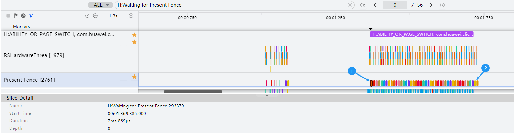
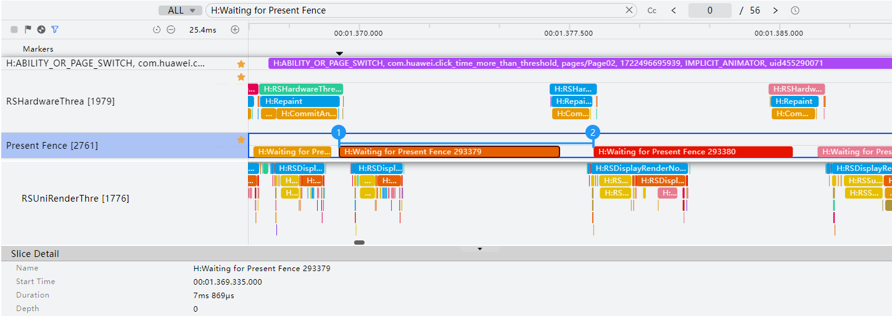

# 转场操作流畅

#### 规则详情

应用的应用内转场过程卡顿率≤ 0ms/s；滑动过程卡顿率：动效时间内累计丢帧时间/动效时长。

#### 检测逻辑

* 开始时间：以ABILITY\_OR\_PAGE\_SWITCH转场泳道为例，泳道的起点（如图标记1）。
* 结束时间：以ABILITY\_OR\_PAGE\_SWITCH转场泳道为例，泳道的终点（如图标记2）。

  其他转场泳道标记如下：

  H:APP\_TRANSITION\_FROM\_OTHER\_APP

  H:APP\_TRANSITION\_TO\_OTHER\_APP

  H:APP\_SWIPER\_NO\_ANIMATION\_SWITCH

  H:APP\_TABS\_NO\_ANIMATION\_SWITCH

  H:APP\_TABS\_FLING

* 总时长(s)：【最后一个“H:Waiting for Present Fence xxxx” 时间（如图标记2）】 - 【第一个“H:Waiting for Present Fence xxxx” 时间（如图标记1）】。

  

* 每帧时长(ms)：1000ms / 刷新率。
* 刷新率：在泳道范围内查找关键词H:RSHardwareThread::CommitAndReleaseLayers rate，如下图：

  

* 每帧渲染实际耗时(ms)：【下一个H:Waiting for Present Fence xxxx的起始时间】 - 【当前H:Waiting for Present Fence xxxx的起始时间】如下图 【标记2 - 标记1】。

  

* 每帧丢帧时间(ms)：max（【每帧渲染实际耗时(ms)】- 【每帧时长(ms)】 \* 1.5, 0）；即每帧耗时大于标准耗时1.5倍时则判定为丢帧。

#### 计算逻辑

卡顿率=所有【每帧丢帧时间(ms)】/ 总时长(s)，卡顿率小于等于0ms/s。
