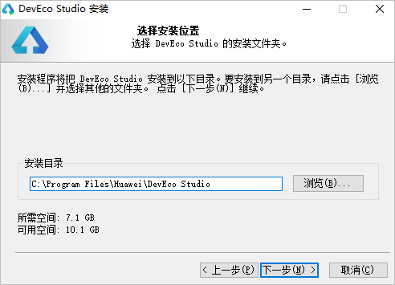
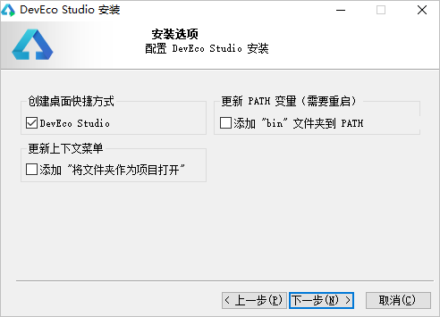
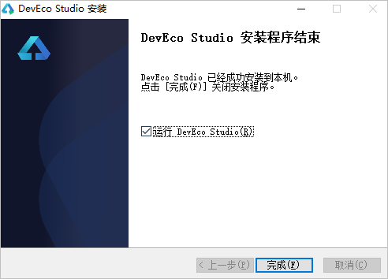
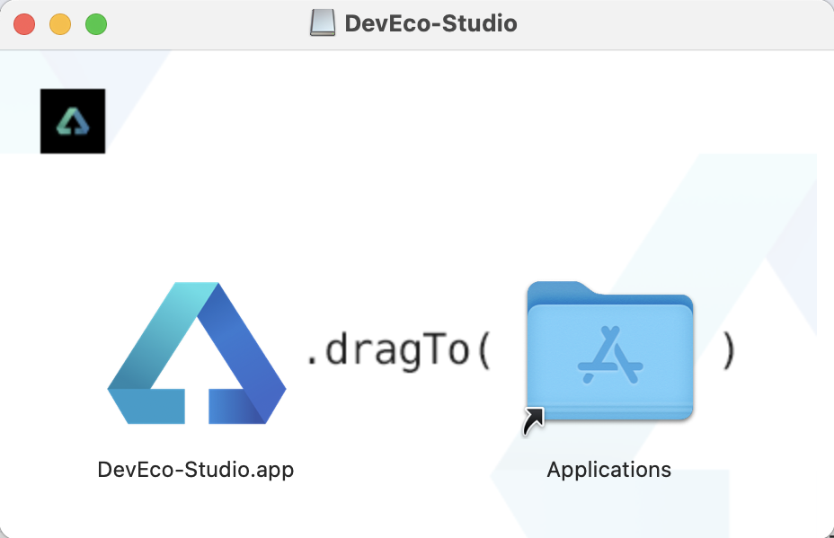
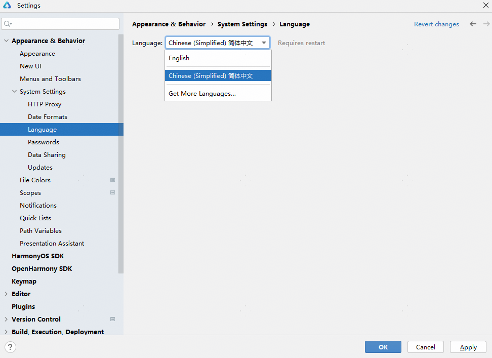
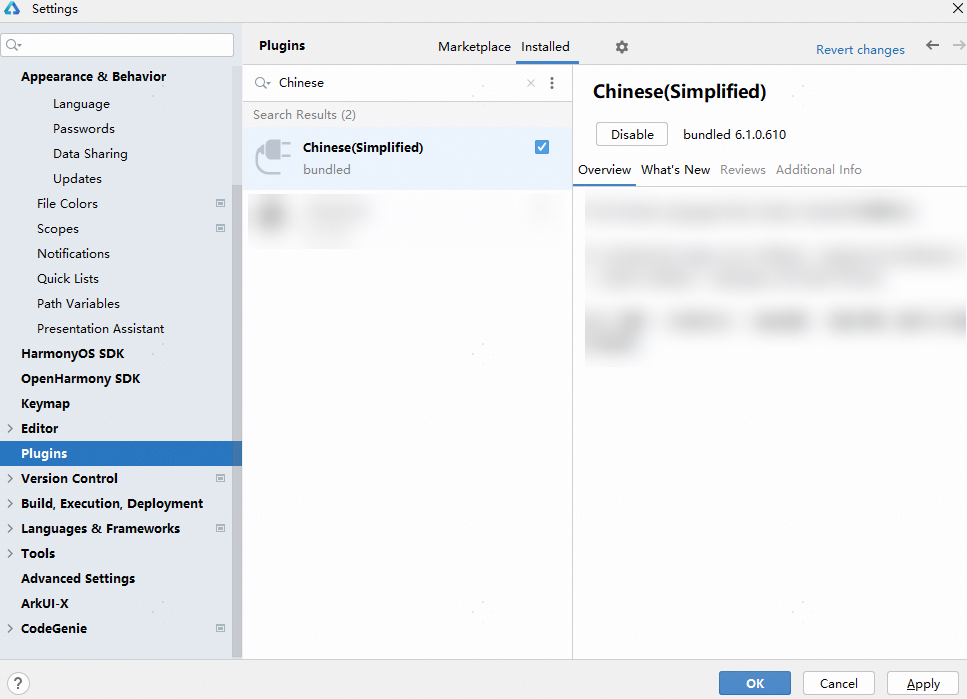

# 下载与安装DevEco Studio

## 下载软件

请前往[下载中心](`https://`developer.huawei.com/consumer/cn/download/deveco-studio)，登录华为账号后下载DevEco Studio，并根据下载中心页面<strong>工具完整性</strong>指导进行完整性校验。

DevEco Studio支持Windows和macOS系统，下面将针对两种操作系统的软件安装方式分别进行介绍。

## Windows环境

### 运行环境要求

为保证DevEco Studio正常运行，建议电脑配置满足如下要求：

* 操作系统：Windows10 64位、Windows11 64位
* 内存：16GB及以上
* 硬盘：100GB及以上
* 分辨率：1280\*800像素及以上

### 安装DevEco Studio

1. 下载完成后，双击下载的“deveco-studio-xxxx.exe”，进入DevEco Studio安装向导。在如下界面选择安装路径，默认安装于C:\Program Files路径下，也可以单击<strong>浏览（B）...</strong>指定其他安装路径，然后单击<strong>下一步</strong>。

   
2. 在如下安装选项界面勾选<strong>DevEco Studio</strong>后，单击<strong>下一步</strong>，直至安装完成。

   
3. 安装完成后，单击<strong>Finish</strong>完成安装。安装完成后，如有需要请根据[配置代理](./ide-environment-config)，检查和配置开发环境。

   

   

   * DevEco Studio提供开箱即用的开发体验，将HarmonyOS SDK、Node.js、Hvigor、OHPM、模拟器平台等进行合一打包，简化DevEco Studio安装配置流程。
   * HarmonyOS SDK已嵌入DevEco Studio中，无需额外下载配置。HarmonyOS SDK可以在DevEco Studio安装位置下DevEco Studio\sdk目录中查看。如需进行OpenHarmony应用开发，可通过File &gt; Settings &gt; OpenHarmony SDK页签下载OpenHarmony SDK。
   * 首次运行DevEco Studio时，若出现<strong>Import DevEco Studio Settings</strong>弹窗，请选择<strong>Do not import settings</strong>后单击<strong>OK</strong>。

## macOS环境

### 运行环境要求

为保证DevEco Studio正常运行，建议电脑配置满足如下要求：

* 操作系统：macOS(X86) 11/12/13/14/15、 macOS(ARM) 12/13/14/15
* 内存：8GB及以上
* 硬盘：100GB及以上
* 分辨率：1280\*800像素及以上

### 安装DevEco Studio

1. 在安装界面中，将“<strong>DevEco-Studio.app</strong>”拖拽到“<strong>Applications</strong>”中，等待安装完成。

   
2. 安装完成后，如有需要请根据[配置代理](./ide-environment-config)，检查和配置开发环境。

   

   * DevEco Studio提供开箱即用的开发体验，将HarmonyOS SDK、Node.js、Hvigor、OHPM、模拟器平台等进行合一打包，简化DevEco Studio安装配置流程。
   * HarmonyOS SDK已嵌入DevEco Studio中，无需额外下载配置。HarmonyOS SDK可以在DevEco Studio安装位置下DevEco Studio\sdk目录中查看。如需进行OpenHarmony应用开发，可通过DevEco Studio &gt; Preferences/Settings <strong>&gt;</strong> OpenHarmony SDK页签下载OpenHarmony SDK。

## 诊断开发环境

为了您开发应用/元服务的良好体验，DevEco Studio提供了开发环境诊断的功能，帮助您识别开发环境是否完备。您可以在欢迎页面单击<strong>Diagnose</strong>进行诊断。如果您已经打开了工程开发界面，也可以在菜单栏单击<strong>Help &gt; Diagnostic Tools &gt; Diagnose Development Environment</strong>进行诊断。

DevEco Studio开发环境诊断项包括电脑的配置、网络的连通情况、依赖的工具是否安装等。如果检测结果为未通过，请根据检查项的描述和修复建议进行处理。

## 启用中文化插件

该功能仅支持中国境内（香港特别行政区、澳门特别行政区、中国台湾除外）。

* 从DevEco Studio 6.0.0 Beta1版本开始，中文化插件默认启用。如需切换为中文显示效果，在菜单栏进入<strong>File &gt; Settings...</strong>（macOS为<strong>DevEco Studio &gt; Preferences/Settings</strong> ） <strong>&gt; Appearance & Behavior &gt; System Settings</strong> &gt; <strong>Language</strong>，语言选择<strong>Chinese</strong>并点击<strong>Apply</strong>，在弹窗中点击<strong>Restart</strong>重启即可完成语言切换。若语言选择时未找到Chinese，请按照[之前版本操作](#li1956431816322)启用插件后，再选择。

  

  从DevEco Studio 6.1.0 Beta1版本开始，语言选择时<strong>Chinese</strong>变更为<strong>Chinese(Simplified)</strong>简体中文。

  

* 若使用DevEco Studio 6.0.0 Beta1以下版本，请在菜单栏进入<strong>File &gt; Settings</strong> （macOS为<strong>DevEco Studio &gt; Preferences</strong> ）<strong>&gt; Plugins</strong>，选择<strong>Installed</strong>页签，在搜索框输入“Chinese”，搜索结果里将出现<strong>Chinese(Simplified)</strong>，在右侧单击<strong>Enable</strong>，点击<strong>OK</strong>，在弹窗中单击<strong>Restart</strong>，重启DevEco Studio后即可生效。

  
