# 三方库源码调试

三方共享包分为静态共享包HAR和动态共享包HSP，两种共享包的源码调试方式有所区别，具体请查看以下指导。

#### 区分字节码HAR和源码HAR

HAR包分为字节码HAR和源码HAR，同时满足以下两个条件的是字节码HAR，否则是源码HAR，更多关于如何构建源码HAR和字节码HAR的指导请查看[构建HAR](`https://`developer.huawei.com/consumer/cn/doc/harmonyos-guides/ide-hvigor-build-har)。

1. 查看HAR包的ets目录下存在.abc文件。
2. 查看HAR包的oh-package.json5文件，存在byteCodeHar字段并且值为true。

   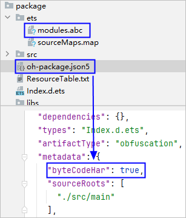

#### 字节码HAR调试

#### C++代码调试

如果HAP/HSP引用字节码HAR包，同时HAR包中包含C++代码，参考以下步骤对该HAR包进行调试。

1. 点击<strong>Run &gt; Edit Configurations &gt; Debugger</strong> <strong>&gt;</strong> <strong>Symbol Directories</strong>页签，点击<strong>+</strong>，添加带调试信息的so文件，so文件在`&#123;ProjectPath&#125;`/`&#123;ModuleName&#125;`/build/`&#123;product&#125;`/intermediates/libs/default/arm64-v8a路径下。

   

   在工程级或模块级build-profile.json5中添加strip字段并设置为false，可以生成带调试信息的so文件，具体请参考[配置CPP](`https://`developer.huawei.com/consumer/cn/doc/harmonyos-guides/ide-hvigor-cpp#section2182144382320)。

   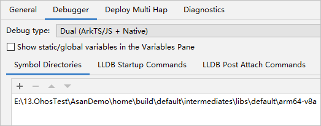
2. DevEco Studio调试应用时会优先加载配置的so文件，本地so文件包含调试信息时，可以正常调试源码。由于so的源码文件信息为编译时的文件路径，若与本地的源码文件路径不一致时，需要关联源码文件，有两种方式：
   * 方式一：可以在<strong>LLDB Startup Commands</strong>页签中添加命令做映射，示例如下。

     ```
     settings set -- target.source-map {old-path} {new-path}
     ```

     + old-path：编译时的文件路径。
     + new-path：本地的源码文件路径。

     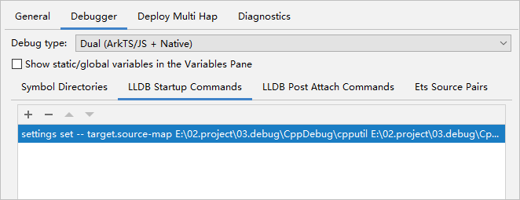
   * 方式二：当Step Into进入汇编代码后，会弹出源码关联的提示，请点击<strong>Select file</strong>，选择本地对应C++源码进行关联。

     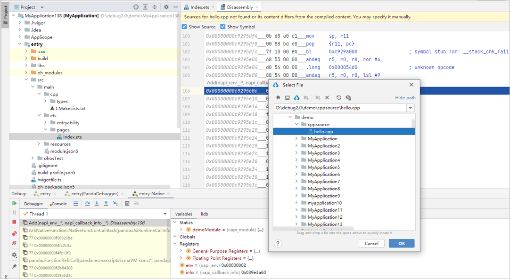

#### ArkTS代码调试

假如在工程A（HAR包工程）中以debug模式编译得到字节码HAR包，工程B（主工程）中引用该字节码HAR包，并且本地有HAR包的源码，要调试该字节码HAR，有两种方式：在主工程中调试或在HAR包工程中调试。


release模式编译的字节码HAR不支持调试。

* <strong>方式一：在主工程中调试。</strong>
  1. 在主工程中导入字节码HAR对应的模块，确保模块的层级目录与HAR包工程的保持一致，例如HAR模块都在工程根目录下。

     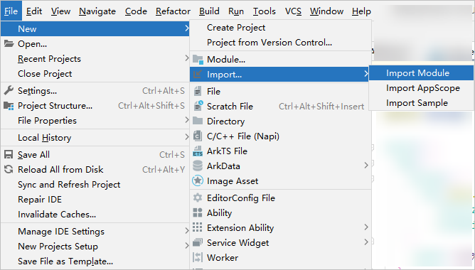
  2. 导入成功后，由于debug模式编译的字节码HAR中包含[sourceMap](`https://`developer.huawei.com/consumer/cn/doc/harmonyos-guides/ide-exception-stack-parsing-principle)，调试时默认会关联当前工程的源码，此时可以在HAR模块上直接添加断点。
* <strong>方式二：在HAR包工程中调试，通过修改前缀配置进行attach调试。</strong>
  1. 在HAR包工程新建一个entry类型的demo主模块，如果主模块已存在则跳过本步骤。
  2. 在demo主模块的oh-package.json5中配置对字节码HAR包的依赖。

     ```
     // demo主模块的oh-package.json5
     "dependencies": {
       "@ohos/test_stage_ets_library": "file:./lib/test_stage_ets_library.har",
     }
     ```

     

     如果在demo主模块的oh-package.json5中，配置对字节码HAR模块的依赖，如file:../test\_stage\_ets\_library，调试时可能导致断点无效。
  3. 在HAR包工程主模块中调用HAR模块的接口，确保编译后主模块的sourceMap文件中包含HAR模块的相关信息。
  4. 构建HAR包工程，打开主模块的sourceMap，根据HAR的oh-package.json5中的name进行查找，将Index文件的前缀路径记录为localUrl，例如以下的demo|test\_stage\_ets\_library|1.0.0。

     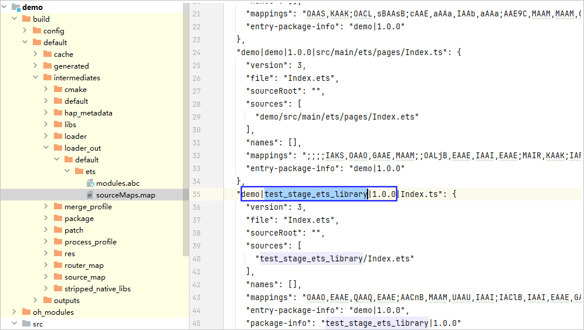
  5. 主工程应用在设备上运行起来后，在HAR包工程中通过attach方式对该应用进行调试，在Debug窗口获取程序加载时的前缀，记录为remoteUrl，例如以下的entry|@ohos/test\_stage\_ets\_library|1.0.0。

     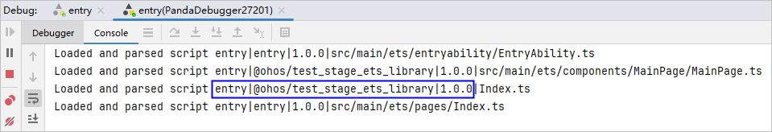
  6. 点击<strong>Run &gt; Edit Configurations &gt; Debugger</strong> <strong>&gt; Ets Source Pairs</strong>，点击<strong>+</strong>，填写前两个步骤获取到的<strong>remoteUrl</strong>和<strong>localUrl</strong>。
     + remoteUrl：应用程序加载HAR包的前缀路径。
     + localUrl：本地生成sourceMap中HAR的前缀路径。

     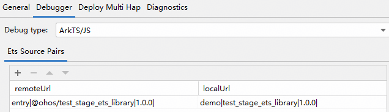
  7. 在HAR包工程中重新通过attach方式对主工程应用进行调试，此时可以在HAR模块上添加断点进行调试。

     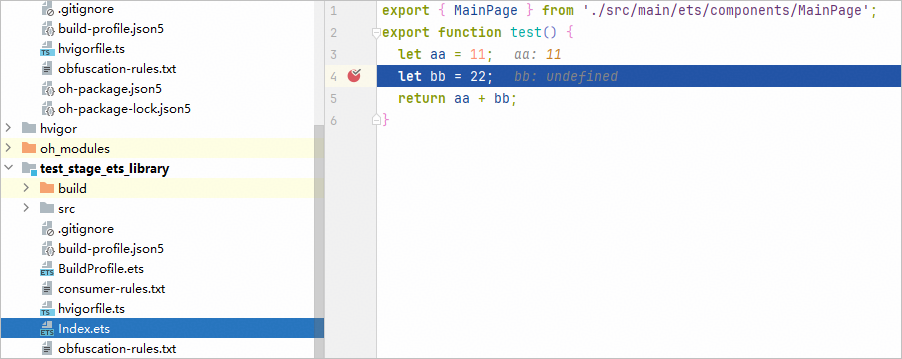

  

  如果在HAR包工程中同时配置[Symbol Directories](#section177418333199)和Ets Source Pairs，可同时attach调试ArkTS和C++断点。

#### 源码HAR调试

#### C++代码调试

如果HAP/HSP引用源码HAR包，同时HAR包中包含C++代码，可参考[字节码HAR](#section177418333199)进行调试。

#### ArkTS代码调试

工程中引用源码HAR包，对该HAR包进行调试，根据本地是否有源码，调试方式分别如下：

* 如果HAR包在本地没有对应源码，此时应用构建打包时引用的源码来源是工程级oh\_modules目录下的源码，只能针对oh\_modules下的源码进行调试。

  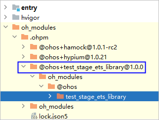
* 如果HAR包在本地有对应源码，调试时可关联本地源码以实现对源码的调试，有两种方式。
  + 方式一：参考[字节码HAR调试](#section1035165781918)。
  + 方式二：当Step Into进入oh\_modules中的ets代码后，会弹出源码关联的提示时，请点击<strong>Choose Sources</strong>，选择本地对应ets源码进行关联。

    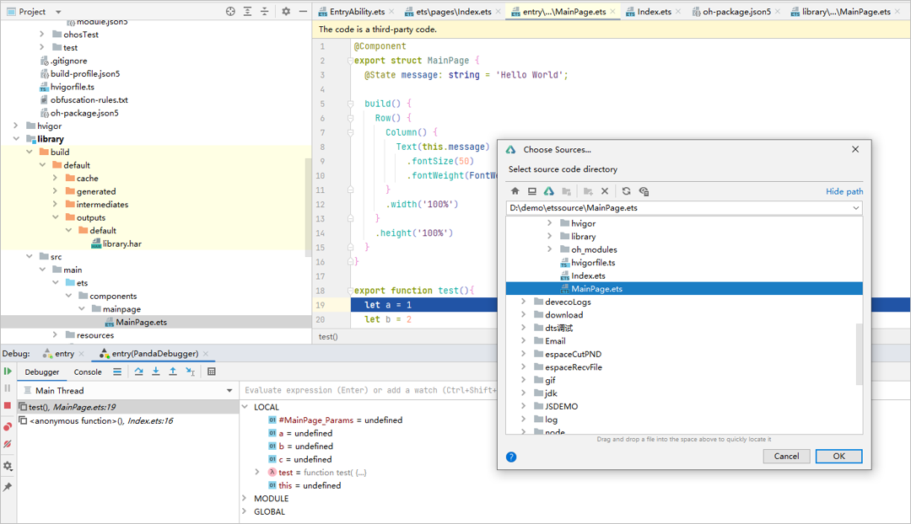

#### HSP源码调试

如果要调试HSP源码，需要将源码置于本地工程模块下，参考[字节码HAR的方式一](#li17359570194)进行调试。
