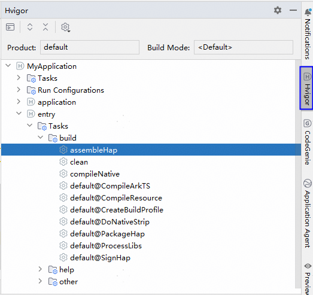

# 任务可视化与执行

从DevEco Studio 6.1.0 Beta1版本开始，Hvigor提供任务可视化窗口，用于展示工程和各个模块常用的构建任务，便于快速执行。

1. 点击编辑窗口右侧工具栏的<strong>Hvigor</strong>，或者菜单栏<strong>View &gt; Tool Windows &gt;</strong> <strong>Hvigor</strong>，打开任务可视化窗口，会显示当前product和构建模式下的任务，切换product和构建模式时会同步工程，同步成功后会刷新任务列表。
   * Tasks：工程级的任务。
   * Run Configurations：Run/Debug Configurations窗口中的任务。
   * 其他目录：模块级的任务，如entry。

   其中工程级和模块级的任务，build和help目录下是Hvigor的默认任务，other目录下是开发者[自定义的任务](`https://`developer.huawei.com/consumer/cn/doc/harmonyos-guides/ide-hvigor-task)。

   
2. 可以通过鼠标双击、鼠标右键或Enter键快速执行一个选中的任务，也可以点击打开Run Anything窗口，搜索任务并双击执行。
