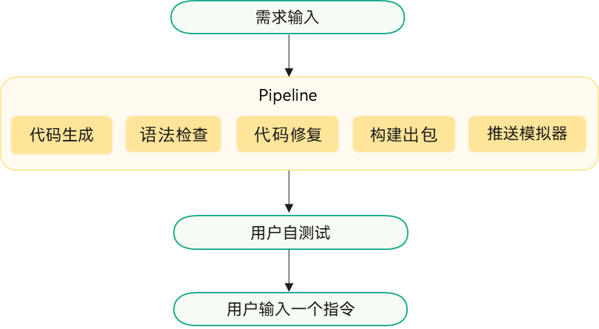
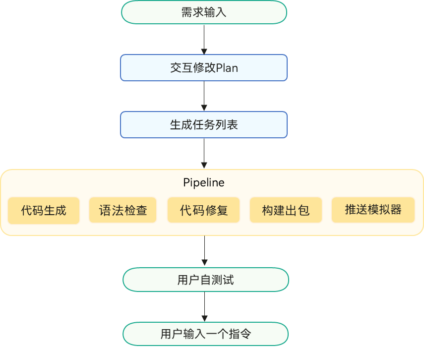
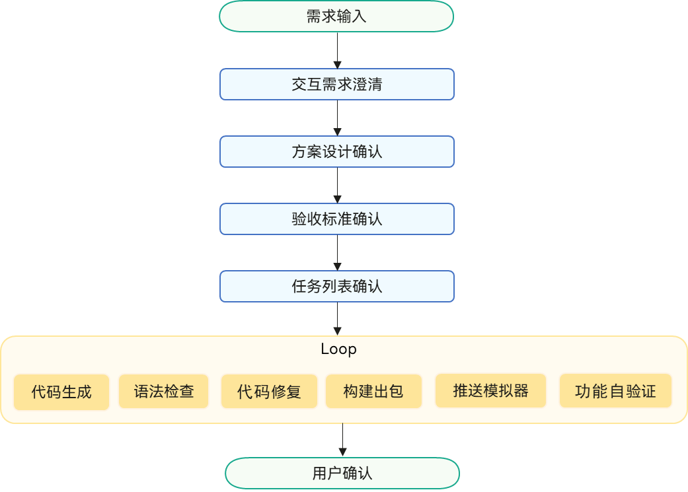

# Agent模式

## 功能概述

DevEco Code支持三种Agent模式，分别为Build模式、Plan模式、Goal模式。

在DevEco Code对话框输入**/agents**，可查看当前可用的Agent模式，按**Tab****键**可快速切换不同模式。

## Build模式

开发者输入需求描述后，Agent直接进入任务执行阶段，自动完成需求理解、代码生成、代码修复、构建出包和推送至模拟器的操作。然后，用户对实现结果测试验证，输入指令后可继续修改。

### 约束与限制

推包验证需配置模拟器。

### 实现流程

### 示例

## Plan + Build模式

该模式面向复杂的任务需求，可深度理解开发者意图，实现从需求理解、自动编码、编译、构建、推包至模拟器的全流程开发。

使用时需先选择Plan模式，通过交互方式规划可执行的任务列表，再切换至Build模式，Agent按照任务列表开始自动执行流水线。

### 实现流程

Plan + Build模式实现流程分为三大阶段：

1. 任务列表制定阶段，开发者输入需求描述后，Agent结合用户需求、工程目录结构、代码文件、依赖关系和技术约束等理解需求背景，主动识别需求描述的模糊点、缺失信息和潜在约束，并通过Question工具与用户交互，补全信息。
2. 计划执行阶段，基于制定的任务列表，Agent自动进行代码生成、语法检查和代码修复，以及自动构建出包、推送至模拟器。
3. 用户自测阶段，开发者对实现结果测试验证，输入指令后可继续修改。

### 示例

## Goal模式

该模式是从需求到验证的全自动流水线，适用于完整的特性开发、关键质量模块开发、多人协作开发和从零搭建项目的场景。

用户输入需求描述后，通过交互的方式进行需求分析、架构设计和任务拆分，并生成结构化文档。Agent按照结构化文档闭环代码生成、语法校验、编译打包、模拟器部署、自动化验证与问题修复的全链路迭代，达成用户目标。

### 约束与限制

推包验证需配置模拟器。

### 实现流程

Goal Agent实现流程分为两大阶段：

1. 人机交互阶段：需求分析时，结合用户需求、工程目录结构、代码文件、依赖关系和技术约束等理解需求背景，主动识别需求中的模糊点，通过Question工具以交互的方式补全需求信息，确认设计方案、验收标准和任务列表等。
2. 自主迭代阶段：Agent自动进行代码开发、检查语法错误并修复，自动构建出包、推送到模拟器，自动验证功能的正确性，发现问题后自动修复代码，持续迭代直到完成用户的需求。

### 示例

