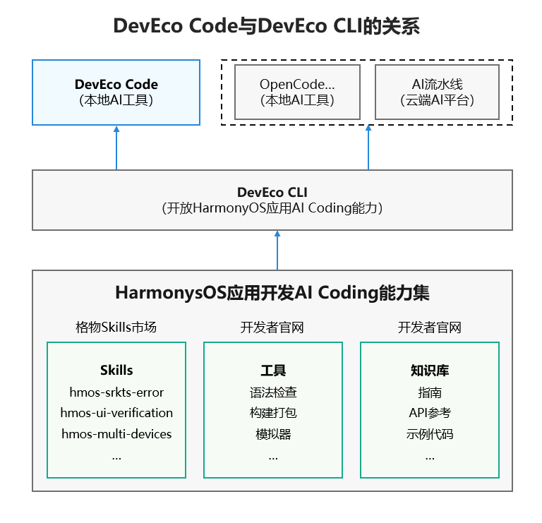

# 工具概述

DevEco Code是一款面向HarmonyOS应用开发的AI Agent工具，基于华为[BitFun](https://github.com/GCWing/BitFun)技术与开源OpenCode构建，不仅保留OpenCode的终端交互、配置Model/Provider/MCP/Skill等能力，还集成HarmonyOS精品Skills、DevEco Studio开发工具链和HarmonyOS知识库，从而支持代码编写、编译构建、运行调试、ArkTS问题修复及文档查阅等功能。

