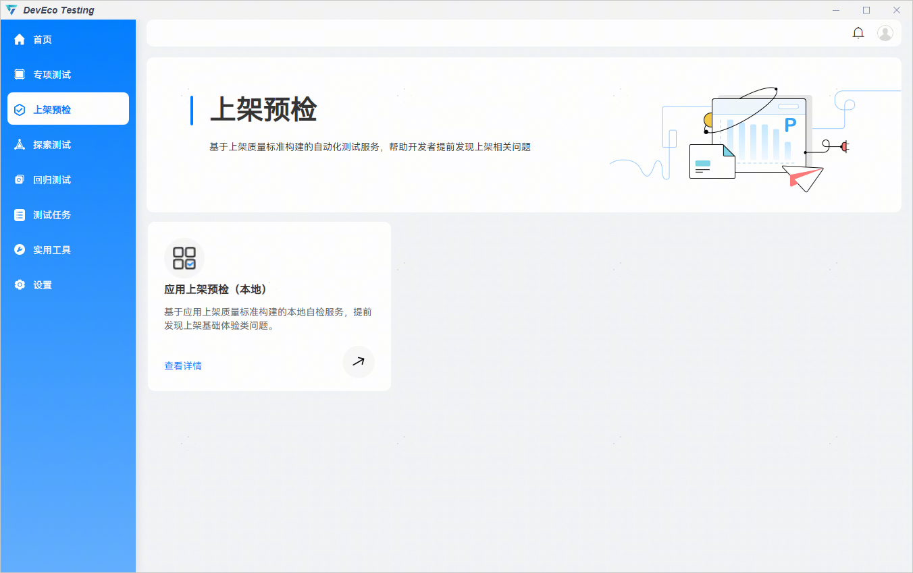
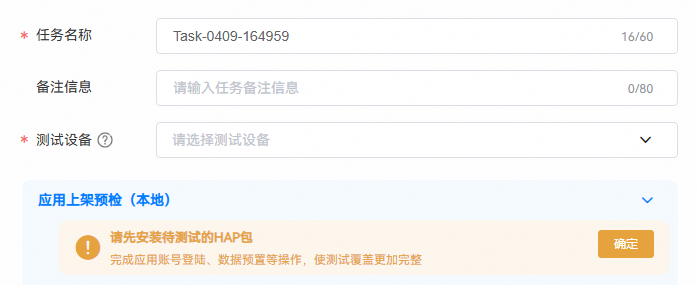
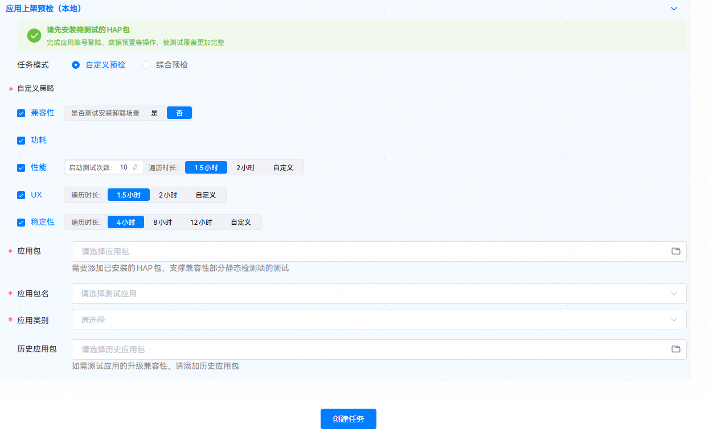
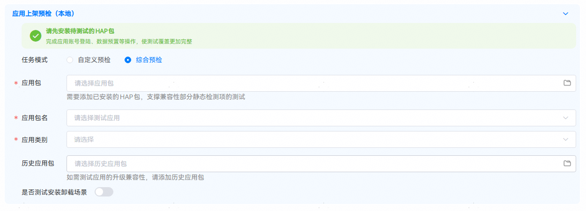
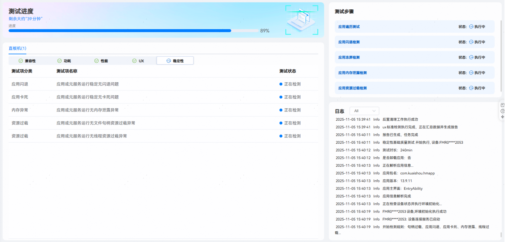
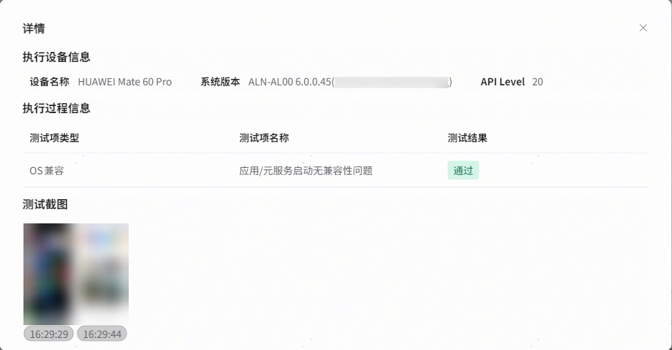
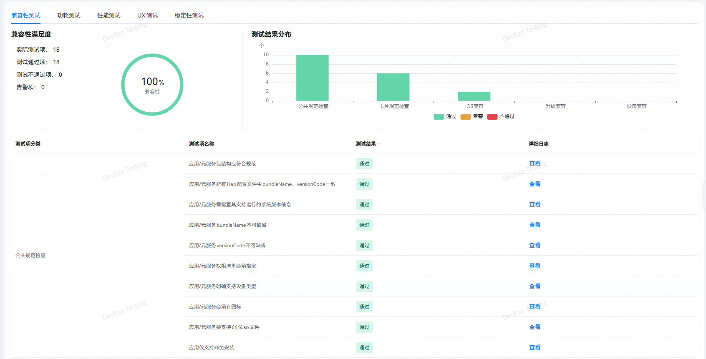
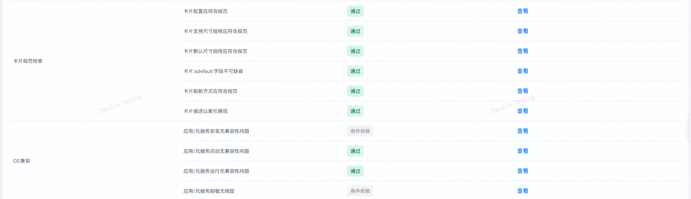
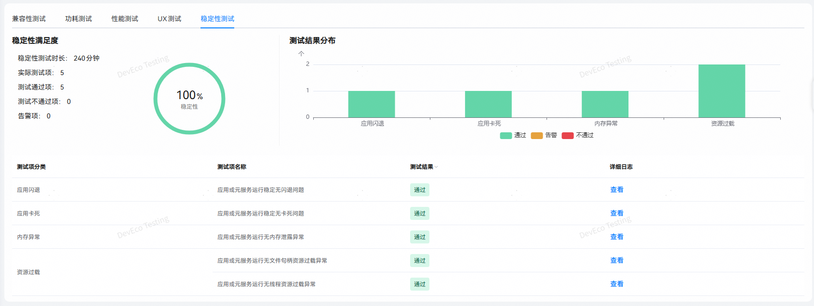

# 上架预检

## 应用上架预检（本地）

<strong>应用上架预检（本地）：</strong>基于鸿蒙应用上架质量标准构建的一键式自动化测试服务，提供兼容性、性能、稳定性、UX、功耗专项基础质量的专业检测报告，帮助用户识别应用的基础质量问题。

<strong>创建任务</strong>

步骤1：打开DevEco Testing客户端，左边菜单栏选择“上架预检”，点击“应用上架预检（本地）”卡片，进入任务创建界面。

步骤2<strong>：</strong>进入任务创建界面后，配置任务参数。

* 任务名称：用于标识任务，系统会根据时间生成默认任务名，支持自定义修改。
* 备注信息：填写任务备注信息，便于快速筛选报告。
* 测试设备：选择待测设备，最多可选择3台相同类型的设备并发执行，提高测试效率；支持 HarmonyOS 5.0及以上版本。

任务模式分为“自定义预检”与“综合预检”。“自定义预检”可自定义选择执行的专项及参数；“综合预检”执行全部专项。

<strong>自定义预检：</strong>

自定义策略：选择本次测试的专项和对应的参数。

* 兼容性：选择是否测试安装卸载场景。
* 功耗：无特殊参数。
* 性能：选择启动测试次数（对应用进行启动测试）、遍历时长。
* UX：选择遍历时长。
* 稳定性：选择测试时长。
* 应用包名：选择设备中已安装的应用包名。
* 应用类别：选择应用所属的分类。
* 选择应用包：选择与待测应用相同的应用包文件用于测试静态检查项，仅支持.hap或.zip文件。

<strong>综合预检</strong>

* 应用包名：选择设备中已安装的应用包名。
* 应用类型：选择应用所属的分类。
* 选择应用包：选择与待测应用相同的应用包文件用于测试静态检查项，可选.hap、.zip文件。

步骤3<strong>：</strong>配置完成后，点击创建任务按钮开始测试。

<strong>测试执行</strong>

创建任务后，将会跳转到执行页，执行测试环境初始化操作。初始化完成后，开始检测应用。

测试页面支持查看各测试项以及测试状态。每个专项测试完成后，点击查看按钮可以查看各测试项详情。

<strong>测试报告</strong>

测试报告：任务信息包含：任务名称、任务类型、测试时间等。点击打开目录按钮可导出报告。

应用信息：包含应用名称、版本等信息。

测试总览：专项测试的基础质量满足度与总体测试结论。

测试详情：专项测试结果详情。

<strong>兼容性测试：</strong>

<strong>功耗测试：</strong>

<strong>性能测试：</strong>

<strong>UX测试：</strong>

<strong>稳定性测试：</strong>

更多测试服务详情，请前往DevEco Testing客户端->上架预检->应用上架预检（本地）->任务创建页->测试指南中查询。