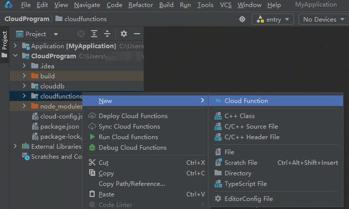
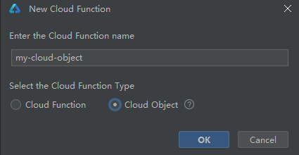
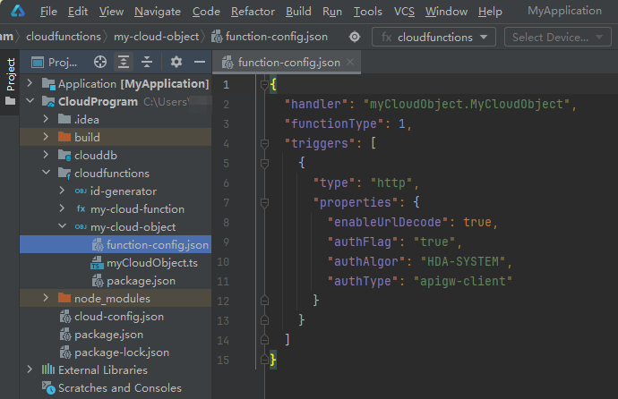
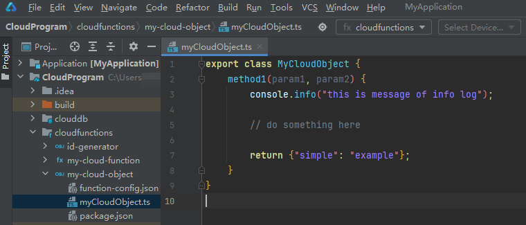
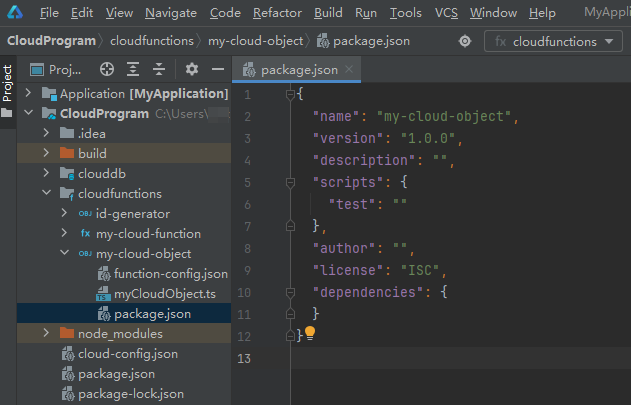

---

title: "创建云对象"
displayed_sidebar: cloudDevSidebar
original_url: https://developer.huawei.com/consumer/cn/doc/harmonyos-guides-V5/agc-harmonyos-clouddev-createcloudobj
format: md
---

# 创建云对象

首先您需要在云侧工程下创建云对象。

1. 右击“cloudfunctions”目录，选择“New > Cloud Function”。

   
2. 在“Select the Cloud Function Type”栏选择“Cloud Object”，输入云对象名称（如“my-cloud-object”），点击“OK”。

   与云函数名一样，云对象名称长度2-63个字符，仅支持小写英文字母、数字、中划线（-），首字符必须为小写字母，结尾不能为中划线（-）。

   

   “cloudfunctions”目录下生成新建的云对象目录，目录下主要包含如下文件：
   * 云对象配置文件“function-config.json”：包含handler、触发器等信息。
     + handler: 云对象的入口模块及云对象导出的类，通过“.”连接。
     + functionType：表示函数类型，“0”表示云函数，“1”表示云对象。
     + triggers：定义了云对象使用的触发器类型，当前云对象仅支持HTTP触发器。

     

     云对象的配置文件“function-config.json”不建议手动修改，否则将导致云对象部署失败或其它错误。

     
   * 云对象入口文件“*xxx*.ts”（如“myCloudObject.ts”）：在此文件中编写云对象代码。

     
   * 云对象依赖配置文件“package.json”：在此文件中添加依赖。

     
