# 调试函数

函数开发完成后，您可以对函数进行调试，以验证函数代码运行是否正常。

目前DevEco Studio函数调试支持本地调用和远程调用，请根据实际场景选择使用：

* [通过本地调用方式调试函数](#section248615546567)：在DevEco Studio调试本地开发好的函数。支持单个调试和批量调试，并支持Run和Debug两种模式，调试功能丰富，常在函数开发过程或问题定位过程中使用。
* [通过远程调用方式调试函数](#section123191549587)：先将函数部署至AGC云端，然后直接在DevEco Studio调用云端函数。此方式主要用于测试函数在云端的运行情况、或补充测试因各种因素限制未能在本地调用方式中发现的问题。

## 前提条件

* 请确保您已登录。
* 如果您的工程有代码逻辑涉及云函数调用云数据库，您需在调试前先[将整个云工程部署到AGC云端](./agc-harmonyos-clouddev-deploy)，否则云端将没有相关数据及环境变量。

## 通过本地调用方式调试函数

您可在DevEco Studio调试本地开发好的函数，支持单个调试和批量调试，并支持Run和Debug两种模式。

* 单个调试和批量调试流程相同，区别仅在于：单个调试是一次只为一个函数启动本地调试，之后只能调用该函数；批量调试是一次为“cloudfunctions”目录下所有函数启动本地调试、然后逐个调用各个函数。
* Run模式和Debug模式的区别在于：Debug模式支持使用断点来追踪函数的运行情况，Run模式则不支持。

下文以Debug模式下调试单个函数“my-cloud-function”为例，介绍如何在DevEco Studio调试本地函数。

1. 右击“my-cloud-function”函数目录，选择“Debug 'my-cloud-function'”。

   

   * 直接从当前路径下Debug，使用的是默认的Debug配置，您也可[自定义Debug配置](#section65830284215)。自定义Debug配置后再从此路径下Debug，将优先采用自定义Debug配置。
   * 如需批量调试多个函数，右击“cloudfunctions”目录，选择“Debug Cloud Functions”，即可启动该目录下所有函数。如“cloudfunctions”目录下同时存在云函数和云对象，将会启动所有的云函数和云对象。

   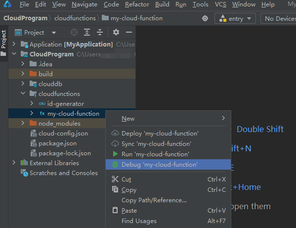
2. 在下方通知栏“cloudfunctions”窗口，查看调试日志。如果出现“Cloud Functions loaded successfully”，表示函数成功加载到本地运行的HTTP Server中，并生成对应的Function URI。

   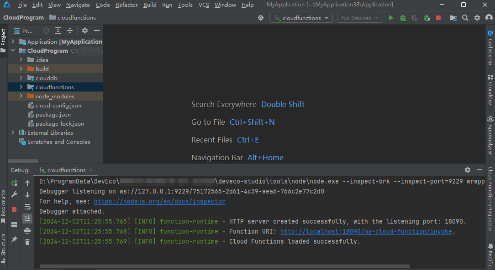
3. 如需设置断点调试，在函数代码中选定要设置断点的有效代码行，在行号（如下图行15）后单击鼠标左键设置断点（如下图的红点）。

   设置断点后，调试能够在断点处中断，并高亮显示该行。

   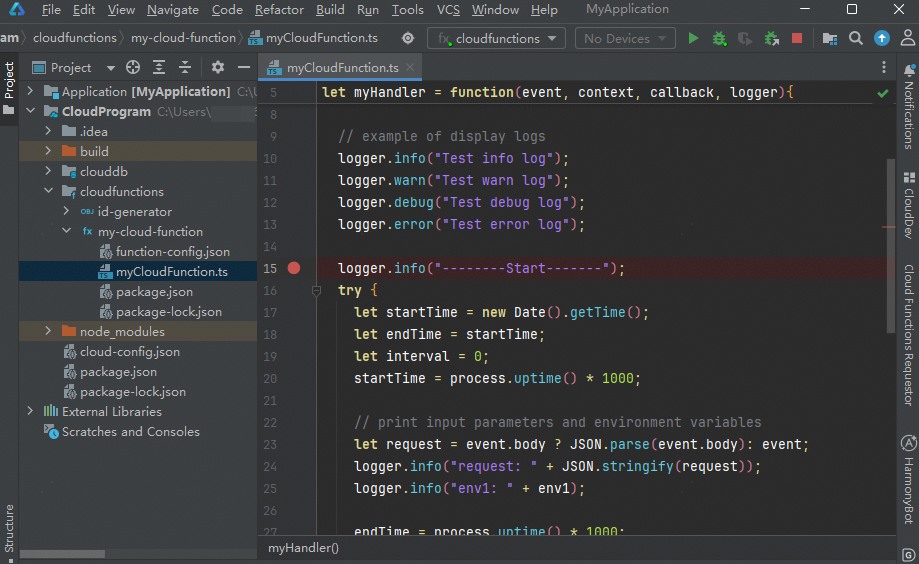
4. 在菜单栏选择“View > Tool Windows > Cloud Functions Requestor”，使用事件模拟器（Cloud Functions Requestor）触发函数调用。

   
5. 在弹出的“Cloud Functions Requestor”面板，配置触发事件参数。
   * Cloud Function：选择需要触发的云函数，此处以函数“my-cloud-function”为例。
   * Environment：选择函数调用环境。此处选择“Local”，表示本地调用。
   * Event：输入事件参数，内容为JSON格式请求体数据。

   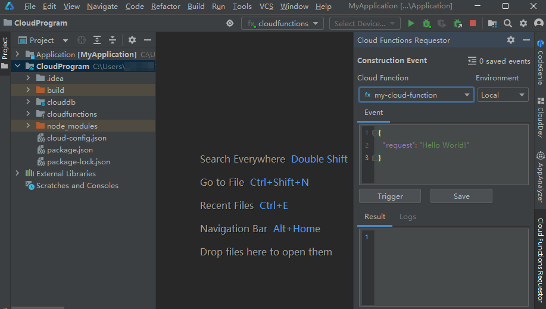
6. （可选）点击“Save”，可保存当前触发事件。

   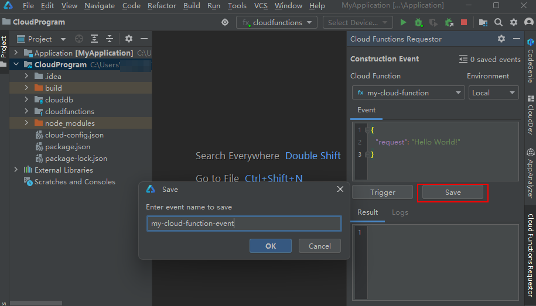

   点击右上角可展开保存的触发事件，后续可直接点击“Load”加载事件。对于不需要保存的触发事件，也可以点击“Delete”删除。

   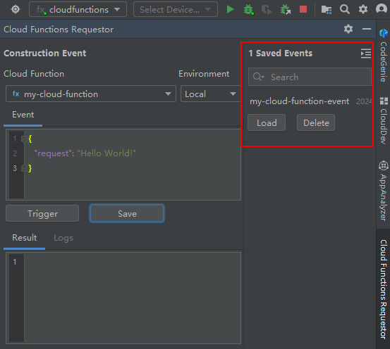
7. 点击“Trigger”， 将会触发执行用户函数代码。执行结果将展示在“Result”框内，“cloudfunctions”窗口同时打印调试日志。

   

   “Result”框右侧的“Logs”面板仅用于在[通过远程调用方式调试函数](#section123191549587)时查看日志。

   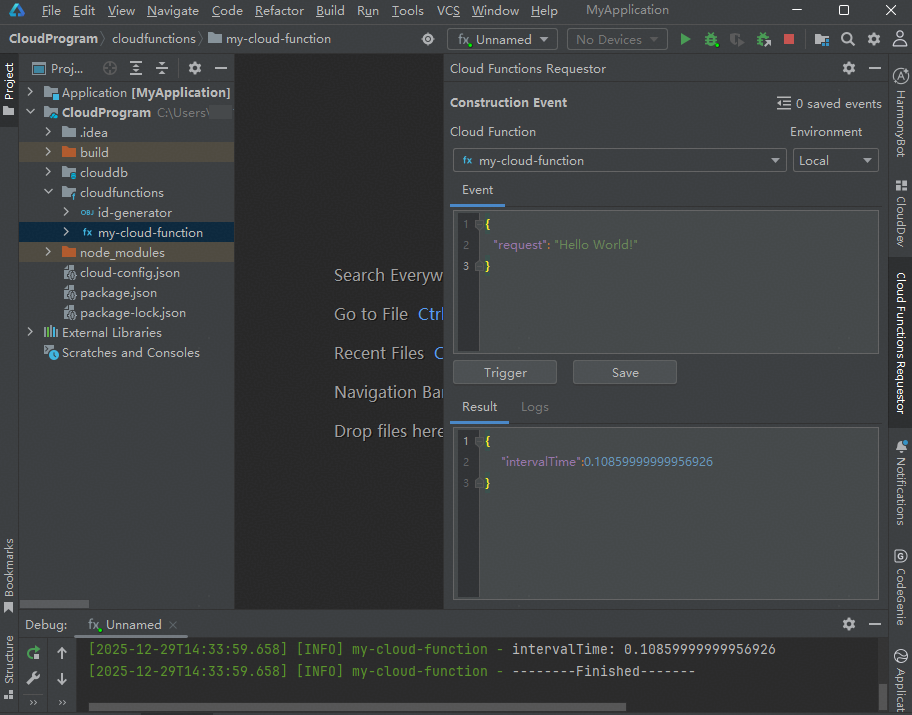
8. （可选）如[配置了环境变量](#li15793566149)，可将变量信息传入到函数执行环境中，用于函数运行时读取。

   ```
   logger.info(context.env.name);//name为环境变量名称
   ```

   如下图，函数“my-cloud-function”配置了环境变量“env1”，可成功访问环境变量“env1”的值“value1”。

   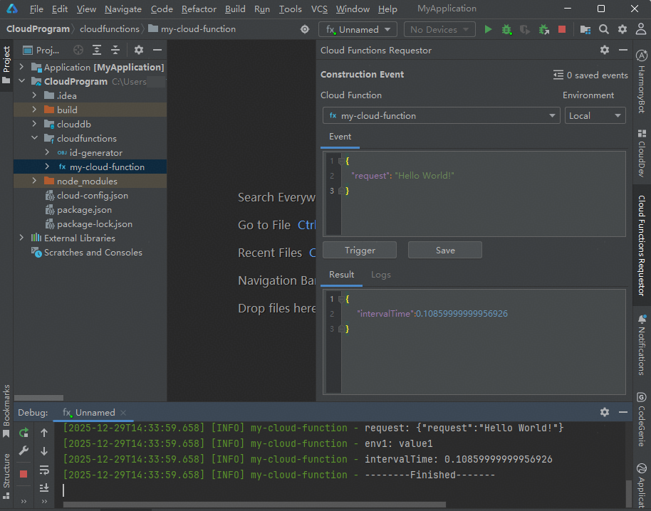
9. 点击菜单栏，可停止调试。
10. 根据调试结果修改函数代码后，点击重新以Debug模式启动调试，直至没有问题。
11. 参考步骤5~10，完成其他函数的调试。

## 通过远程调用方式调试函数

您还可以将函数部署至AGC云端，然后在DevEco Studio调用云端函数，以测试函数在云端的运行情况、或补充测试因各种因素限制未能在本地调试中发现的问题。

1. 参考[部署函数](./agc-harmonyos-clouddev-deployfunc)将需要调试的函数部署至AGC云端。
2. （可选）如函数代码涉及访问环境变量，需在AGC Portal函数列表中点击函数名称，为函数配置环境变量的值，供函数在运行时读取和使用。

   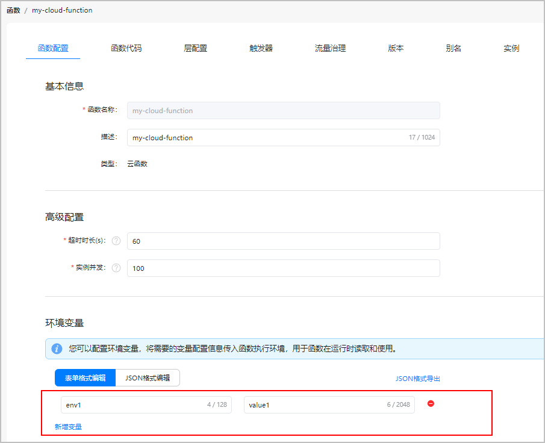
3. 在菜单栏选择“View > Tool Windows > Cloud Functions Requestor”，使用事件模拟器（Cloud Functions Requestor）触发函数调用。

   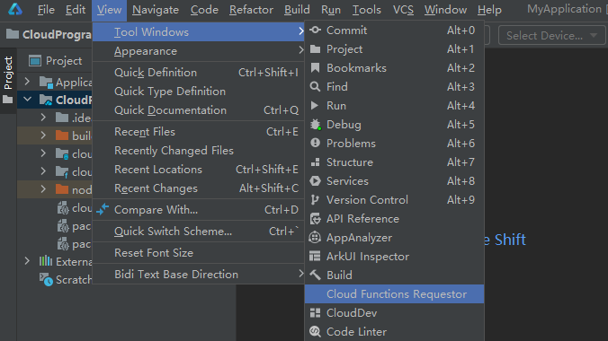
4. 在弹出的“Cloud Functions Requestor”面板，配置触发事件参数。
   * Cloud Function：选择需要触发的云函数，此处依然以函数“my-cloud-function”为例。
   * Environment：选择函数调用环境。此处选择“Remote”，表示远程调用。
   * Event：输入事件参数，内容为JSON格式请求体数据。

   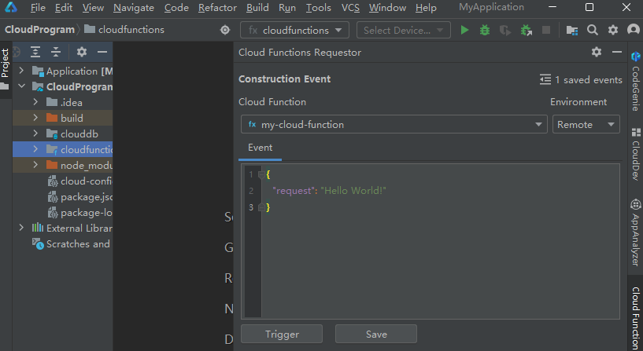
5. 点击“Trigger”， 将会触发执行用户函数代码，执行结果将展示在“Result”框内。

   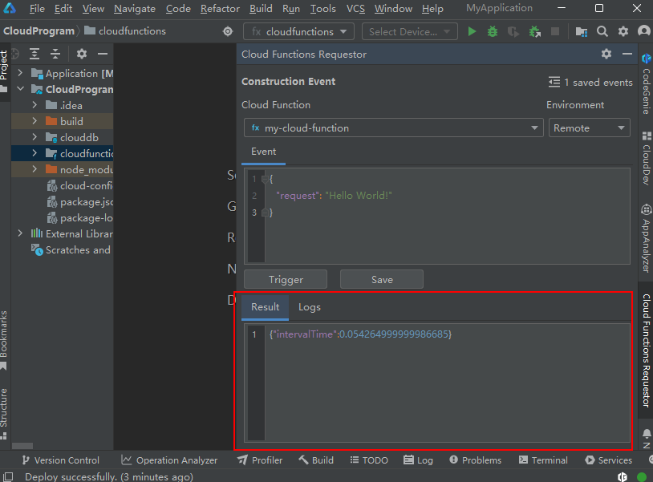
6. 点击“Logs”页签，可查看打印的日志定位问题。修改函数代码、重新部署函数后再次执行远程调用，直至没有问题。

   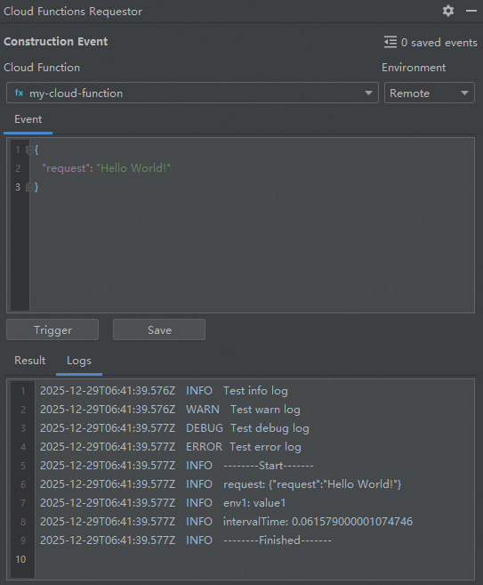
7. 参考步骤1~5，完成其他函数的调试。

## （可选）自定义Run/Debug配置

直接启动函数调试采用的是默认的Run/Debug配置。如有特殊需求，您也可使用自定义Run/Debug配置项来进行调试。

1. 在菜单栏选择“Run > Edit Configurations”。

   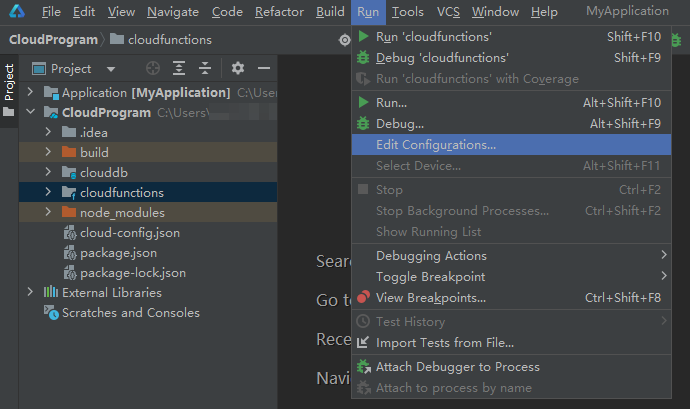
2. 在“Run/Debug Configurations”窗口，点击，选择“Cloud Functions”，新增一个Run/Debug配置。

   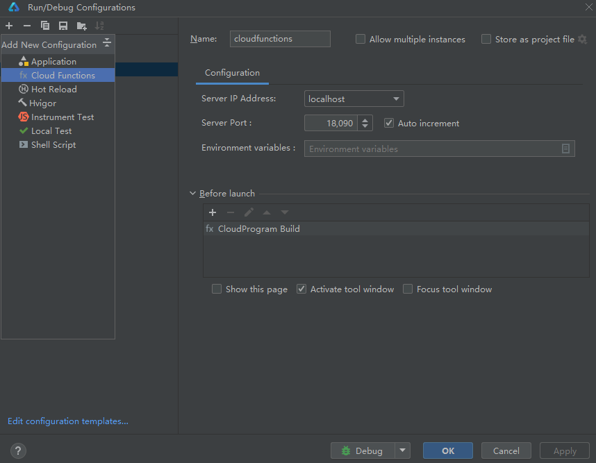
3. 自定义Run/Debug配置，完成后点击“Run”或“Debug”即可立即按当前自定义配置启动本地调试。

   如当前暂不使用自定义配置，可点击“OK”保存配置。后续有需要时再选择自定义配置，分别点击或进行Run或Debug。

   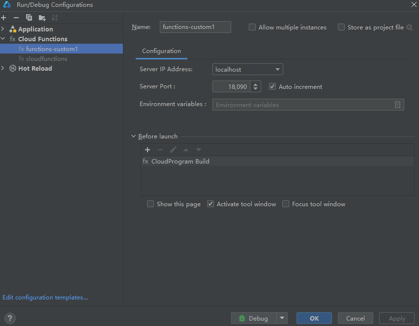
   * Name：Run/Debug配置的名称，如“functions-custom1”。
   * Server IP Address：HTTP服务端监听IP地址，默认为localhost，支持切换为您的局域网IP地址。
   * Server Port：HTTP服务端监听端口。默认为“18090”，自定义端口号建议大于1024。勾选“Auto increment”表示如当前端口被占用则端口号自动加“1”。
   * Environment variables：函数运行的环境变量，为key-value形式。

     点击“Edit environment variables”按钮，在“Environment Variables”弹窗中点击“+”添加一个环境变量，然后点击“OK”。添加成功后，您便可以将变量配置信息传入到函数执行环境中，用于函数运行时读取。

     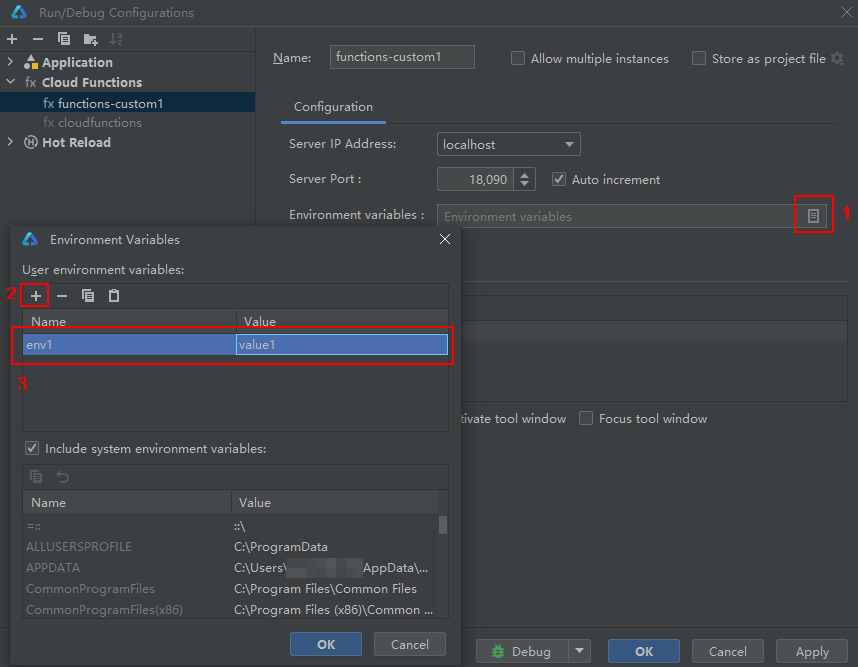
