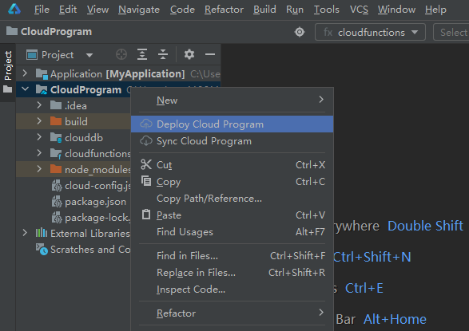
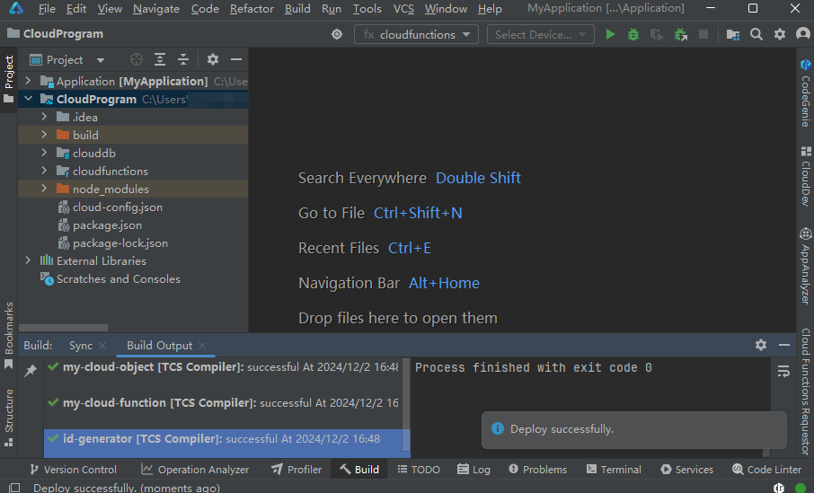
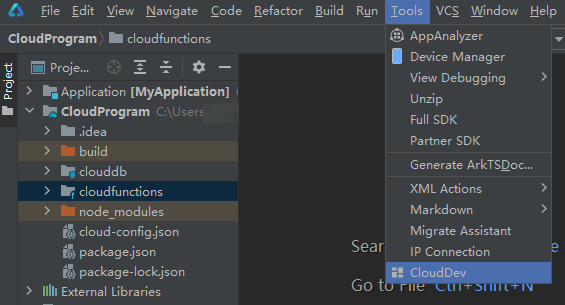
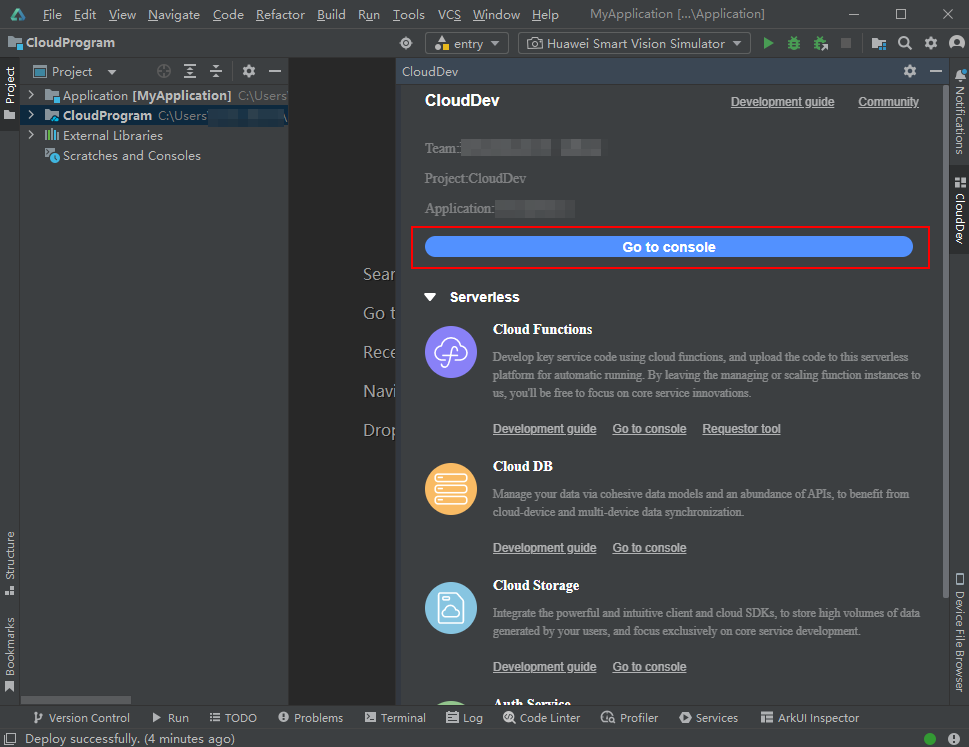

---

title: "部署云侧工程"
displayed_sidebar: cloudDevSidebar
original_url: /docs/tools/end-cloud/agc-harmonyos-clouddev-deploy
format: md
---

# 部署云侧工程

您也可选择在云函数和云数据库全部开发完成后，将整个云工程资源统一部署到AGC云端。

1. 右击云开发工程（“CloudProgram”），选择“Deploy Cloud Program”。

   
2. 您可在底部状态栏右侧查看云工程打包与部署进度。

   请您耐心等待，直至出现“Deploy successfully”消息，表示云工程已成功部署。

   
3. 在菜单栏选择“Tools > CloudDev”。

   
4. 在打开的CloudDev面板中，点击“Go to console”，打开当前项目的AGC云开发子控制台。

   
5. 分别进入云函数与云数据库服务菜单，可查看到您刚刚部署的云函数与云数据库资源。

   
