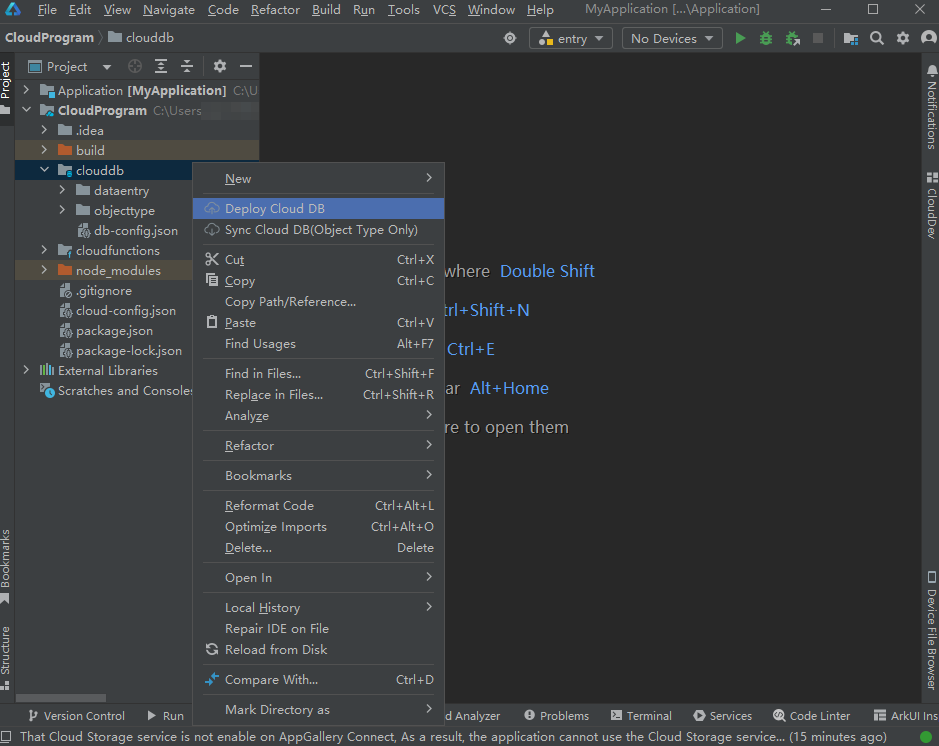
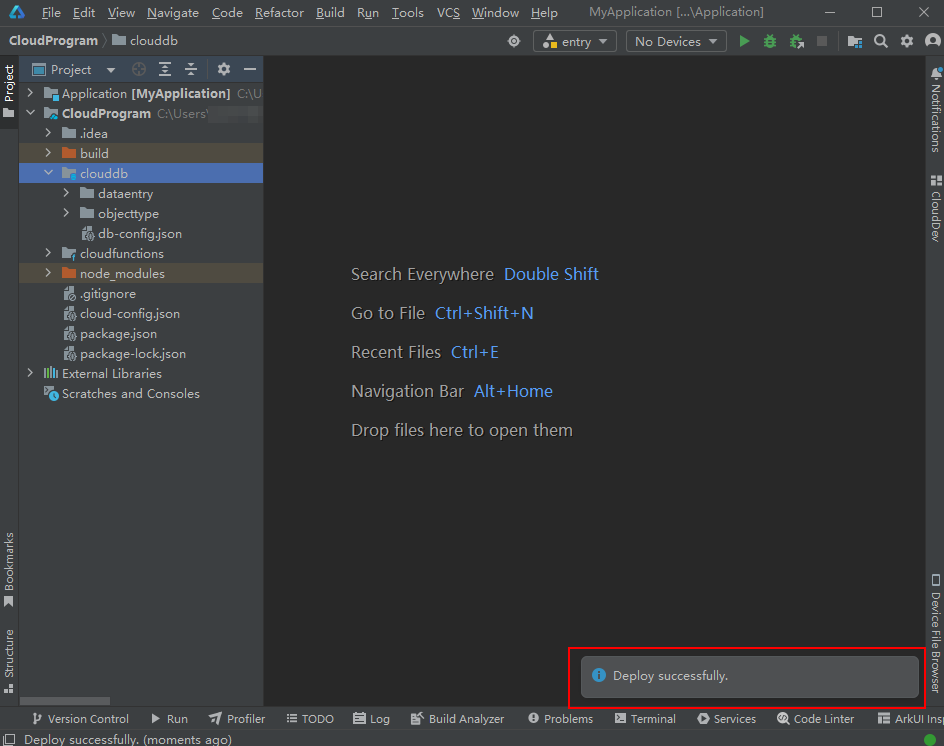
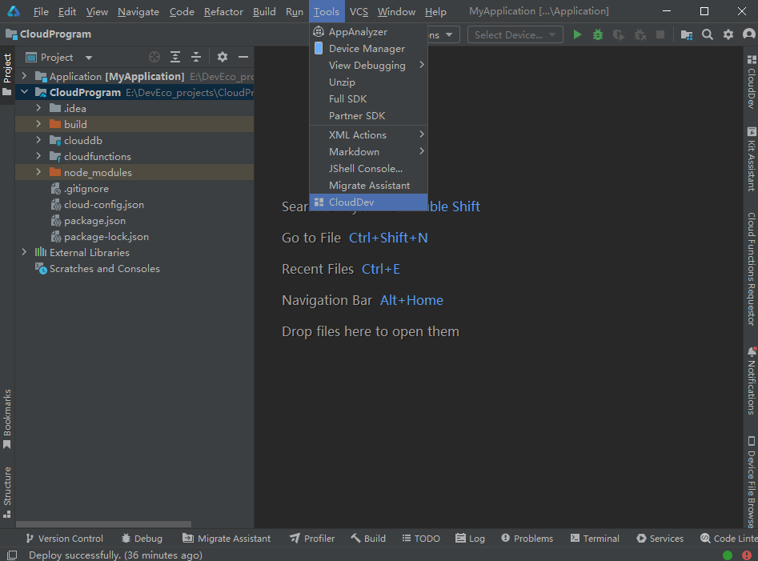
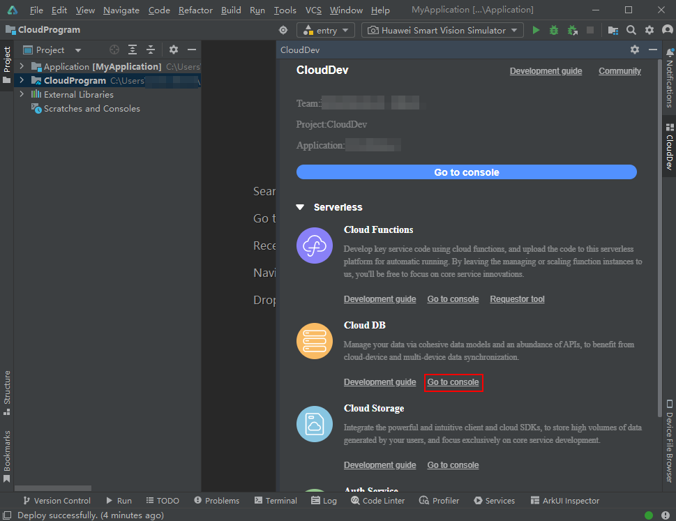
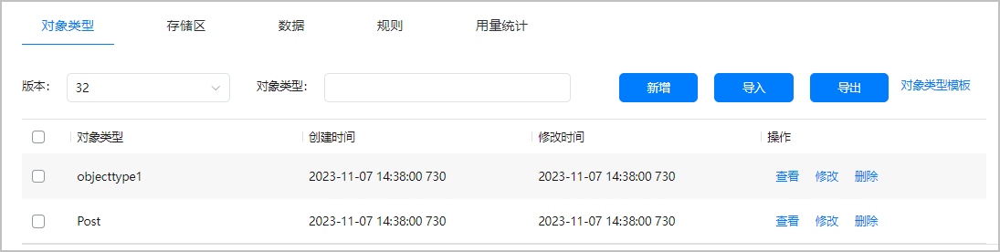
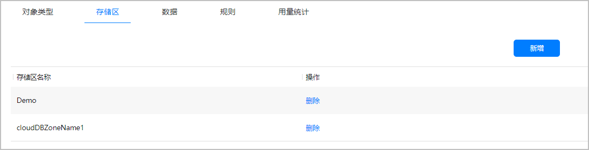
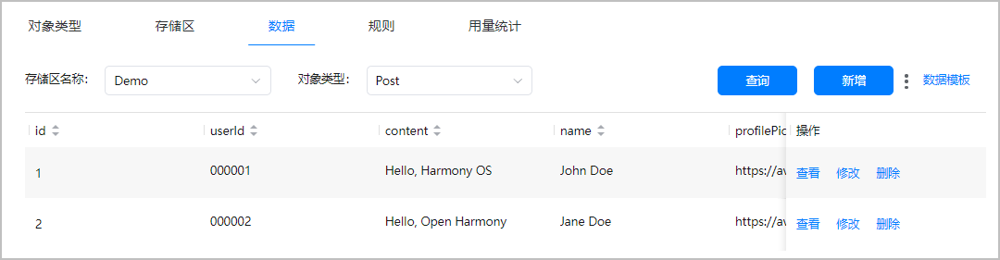
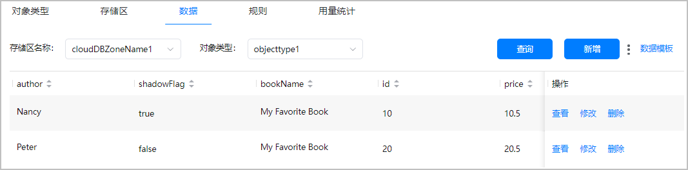

---

title: "部署云数据库"
displayed_sidebar: cloudDevSidebar
---

# 部署云数据库

完成数据条目创建后，您可以直接部署该数据条目。您也可以等所有对象类型和数据条目开发完成后，再统一批量部署到AGC云端。

* 部署到AGC云端的存储区数量不得超过4个，否则会导致部署失败，提示“clouddb deploy failed. Reason is the number of CloudDBZone exceeds the limit.”错误。如AGC云端当前已存在4个存储区，请将数据部署到已有的存储区，或者删除已有存储区后再部署新的存储区。**需要注意的是，删除存储区，该存储区内的数据也将一并删除，且不可恢复。**
* 对象类型中的fieldType等字段信息，部署到AGC云端后，请勿在本地再做修改。例如，fieldType设置为String，对象类型部署成功后，又在本地修改fieldType为Integer，再次部署将失败，提示“clouddb deploy failed. Reason is existing fields cannot be modified.”错误。如需更改fieldType等字段信息，请先删除云端部署的对象类型。**需要注意的是，删除云端对象类型，对象类型内添加的数据也将一并删除，且不可恢复。**

部署云数据库的操作如下：

1. 右击“clouddb”目录，选择“Deploy Cloud DB”。

   
2. 您可在底部状态栏右侧查看云数据库打包与部署进度。

   请您耐心等待，直至出现“Deploy successfully”消息，表示云数据库已成功部署。

   

   

   云数据库部署成功后，DevEco Studio将自动从云侧下载云数据库的schema文件至“AppScope/resources/rawfile/schema.json”路径，该文件是云数据库端侧API必须引入的配置文件。

   如果后续又在本地工程修改了对象类型，请重新部署云数据库，DevEco Studio将自动更新schema.json文件；如果后续在AGC云侧修改了对象类型，您需[手动从AGC控制台导出schema.json文件](https://developer.huawei.com/consumer/cn/doc/AppGallery-connect-Guides/agc-clouddb-agcconsole-objecttypes-0000001127675459#section1558018208151)，拷贝至本地工程的“AppScope/resources/rawfile”目录下。否则，可能导致schema.json文件中的对象类型和代码中的对象类型不一致，端侧访问云数据库时提示[1008230002](https://developer.huawei.com/consumer/cn/doc/harmonyos-references/errorcode-cloudfoundation#section1008230002-云数据库schema配置错误)错误.
3. 在菜单栏选择“Tools > CloudDev”。

   
4. 在打开的CloudDev面板中，点击“Serverless > Cloud DB”下的“Go to console”，进入当前项目的云数据库服务页面。

   
5. 分别点击“对象类型”、“存储区”与“数据”页签，可查看到本地开发的云数据库资源均已成功部署至AGC云端。

   部署成功后，您便可以从端侧访问云数据库了，具体请参见[在端侧访问云数据库](./agc-harmonyos-clouddev-invokeclouddatabase)。

   您还可以在AGC控制台继续编辑以上部署的云数据库资源，具体操作请参考[管理数据库](https://developer.huawei.com/consumer/cn/doc/AppGallery-connect-Guides/agc-clouddb-managingclouddb-0000001080815650).

   对象类型“Post”与“objecttype1”：

   

   对象类型“Post”所属存储区“Demo”、“objecttype1”所属存储区“cloudDBZoneName1”：

   

   “d\_Post.json”内的数据条目、“d\_objecttype1.json”内的数据条目：

   

   部署对象类型或数据条目JSON文件，实际是部署JSON文件内包含的对象类型或数据条目。因此，您在AGC控制台查看到的将是一个个对象类型或者一条条数据，而非JSON文件。

   

   
