# 创建HarmonyOS应用工程

## 新建工程

### 前提条件

* 您已完成[开发准备工作](https://developer.huawei.com/consumer/cn/doc/harmonyos-guides/agc-harmonyos-clouddev-prerequisite).
* 您已使用[已实名认证](./agc-harmonyos-clouddev-account)、且注册地为中国境内（香港特别行政区、澳门特别行政区、中国台湾除外）的华为开发者账号登录DevEco Studio。
* 请确保您的华为开发者账号无欠款，账户欠费将导致云存储服务开通失败。

### 选择模板

1. 选择以下任一种方式，打开工程创建向导界面。
   * 如果当前未打开任何工程，可以在DevEco Studio的欢迎页点击“Create Project”开始创建一个新工程。
   * 如果已经打开了工程，可以在菜单栏选择“File > New > Create Project”来创建一个新工程。
2. 在“Application”页签，选择合适的云开发模板，然后点击“Next”。

   

   当前仅支持通用云开发模板（[CloudDev]Empty Ability）。

   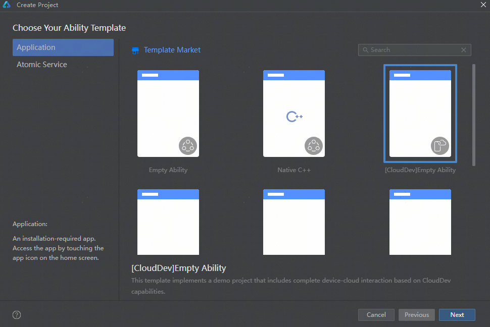

### 配置工程信息

1. 在工程配置界面，配置工程的基本信息。

   其中，Device type和Enable CloudDev参数不可更改，其他参数请参考[创建一个新的工程](./ide-create-new-project#section181328285169)内对应的指导进行配置。

   | 参数 | 说明 |
   | --- | --- |
   | Device type | 该工程模板支持的设备类型，目前仅支持手机设备。 |
   | Enable CloudDev | 是否启用云开发。云开发模板默认启用且无法更改。 |

   

2. 点击“Next”，开始关联云开发资源。

### 关联云开发资源

为工程关联云开发所需的资源，即将您账号团队在AGC创建的同包名应用关联到当前工程。具体操作如下：

1. （可选）如您尚未登录DevEco Studio，点击“Sign In”，在弹出的账号登录页面，使用[已实名认证](./agc-harmonyos-clouddev-account)的华为开发者账号完成登录。

   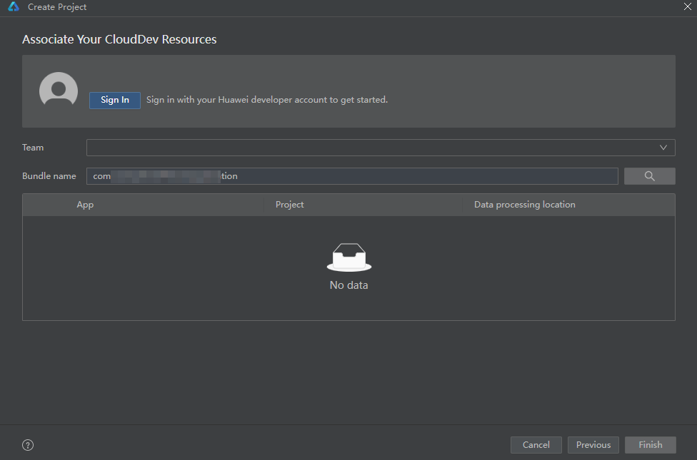

   登录成功后，界面将展示账号昵称。

   
2. 点击“Team”下拉框，选择开发团队。

   
3. 关联应用。

   选中团队后，系统根据工程Bundle name在该团队中自动查询AGC上的同包名应用。

   * 如查询到应用，选中该应用，点击“Finish”即可。

     
   * 如查询到的应用尚未关联任何项目（即为游离应用），则无法选中。请先[将游离应用添加到AGC项目下](#section152521927193013)。

     
   * 如果查询到的应用所属项目尚未启用数据处理位置，请点击界面提示内的“AppGallery Connect”[设置数据处理位置](https://developer.huawei.com/consumer/cn/doc/app/agc-help-datalocation-0000001160439813)。设置完成后返回DevEco Studio界面，点击Bundle name后的刷新当前APP ID列表，即可看到设置的数据处理位置。

     

     + 由于云开发目前仅支持中国境内（香港特别行政区、澳门特别行政区、中国台湾除外），请确保项目启用的数据处理位置包含“中国”。
     + 无论项目启用的默认数据处理位置为哪个站点，后续开发的云服务资源都将部署在“中国”站点。

     
   * 如查询到应用但出现如下提示，表明查询到的应用类型为元服务，与当前工程类型不一致。请修改以确保当前工程与AGC上同包名应用均为HarmonyOS应用类型。

     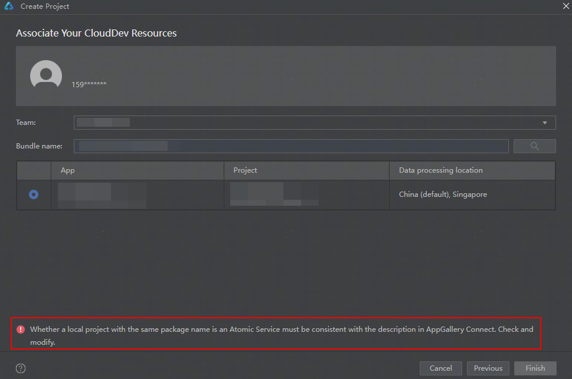
   * 如在当前团队中未查询到同包名应用，请先确认填写的包名是否有误。
     + 如包名有误，点击界面提示中的“go back”返回工程信息配置界面进行修改。
     + 如包名无误，则表明当前团队尚未在AGC控制台创建与当前工程包名相同的应用。您可点击界面提示中的“AppGallery Connect”，[前往AGC控制台进行补充创建](#section397317130308)。

     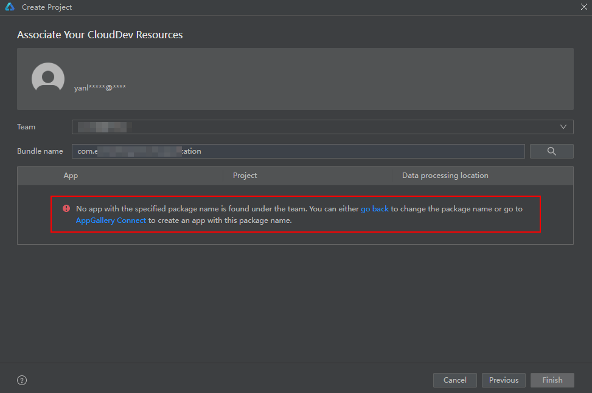

     完成以上操作后，DevEco Studio即可获取到同包名应用信息。选中应用后，点击“Finish”。

     
4. 如您所属的团队尚未签署云开发相关协议，点击协议链接仔细阅读协议内容后，勾选同意协议，点击“Finish”。

   

   只有账号持有者和法务角色才有权限签署协议。

   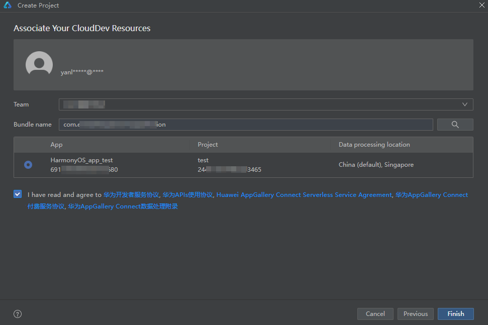
5. 进入主开发界面，DevEco Studio执行工程同步操作，端侧工程会自动执行“ohpm install”，云侧工程会自动执行“npm install”，以分别下载端侧和云侧依赖。

   

   若云侧执行“npm install”失败，请排查是否尚未[配置NPM代理](./ide-environment-config#section197296441787)。

   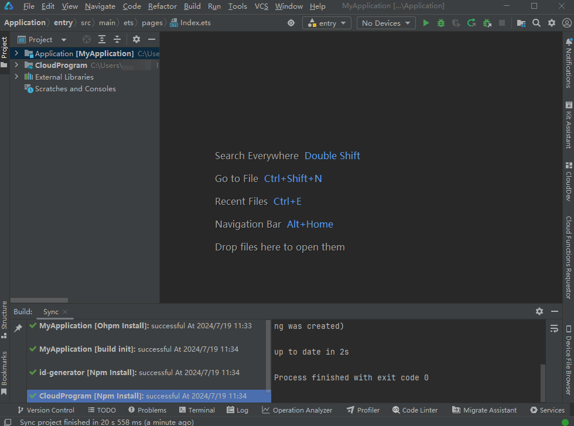
6. 在主开发界面，可查看刚刚新建的工程。关于工程的详细目录结构介绍，请参见[端云一体化开发工程目录结构](#section20250910164411)。

   

## 工程初始化配置

当您成功创建工程并关联云开发资源后，DevEco Studio会为您的工程自动执行一些初始化配置。

### 自动开通云开发服务

DevEco Studio为工程关联的项目自动开通云函数、云数据库、云存储等云开发服务，您可在“Notifications”窗口查看服务开通状态。

* 如服务开通失败，您可通过[CloudDev云开发管理面板](./agc-harmonyos-clouddev-console)快捷进入AGC控制台进行手动开通。
* 如云存储服务自动开通与手动开通均失败，可能是账户欠费导致。请您[检查账户是否余额不足](https://developer.huawei.com/consumer/cn/doc/AppGallery-connect-Guides/agc-account-bill-0000001200817917#section813072912208)，[补齐欠款](https://developer.huawei.com/consumer/cn/doc/AppGallery-connect-Guides/agc-account-recharge-0000001126625360)后再前往AGC控制台进行手动开通.

## 端云一体化开发工程目录结构

端云一体化开发工程主要包含端开发工程（Application）与云开发工程（CloudProgram）。

### 端开发工程（Application）

端开发工程主要用于开发应用端侧的业务代码，使用通用云开发模板创建的端开发工程目录结构如下图所示。“Application/cloud\_objects”模块用于存放云对象的端侧调用接口类，“src/main/ets/pages”目录下包含了云存储、云数据库和云函数页面，其他目录文件介绍请参见[工程目录结构](./ide-project-structure)。

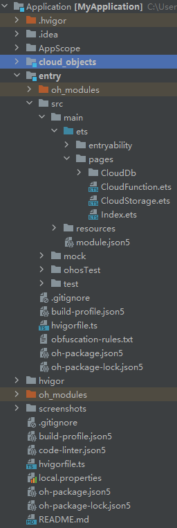

### 云开发工程（CloudProgram）

在云开发工程中，您可为您的应用开发云端代码，包括云函数和云数据库服务代码。使用通用云开发模板创建的云开发工程目录结构如下图所示。

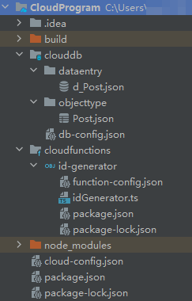

* clouddb：云数据库目录，包含数据条目目录（dataentry）和对象类型目录（objecttype）。
  + dataentry：用于存放数据条目文件。

    该目录下一般会根据您选择的云开发模板预置数据条目示例文件。在通用云开发模板工程中，该目录下会预置名为“d\_Post.json”的数据条目示例文件，内含两条示例数据。您可按需使用、修改或删除。

    
  + objecttype：用于存放对象类型文件。

    该目录下一般会根据您选择的云开发模板预置对象类型示例文件。在通用云开发模板工程中，该目录下会预置名为“Post.json”的对象类型示例文件，内含对象类型“Post”的权限、索引、字段名称和字段值等。您可按需使用、修改或删除。

    
  + db-config.json：模块配置文件，主要包含云数据库工程的配置信息，如默认存储区名称、默认数据处理位置。
* cloudfunctions：云函数目录，包含各个云函数/云对象子目录。每个子目录下包含了云函数/云对象的配置文件、入口文件、依赖文件等。

  该目录下一般会根据您选择的云开发模板预置示例函数。通用云开发模板工程下预置了一个用于生成UUID的示例云对象“id-generator”，您可按需使用、修改或删除。

  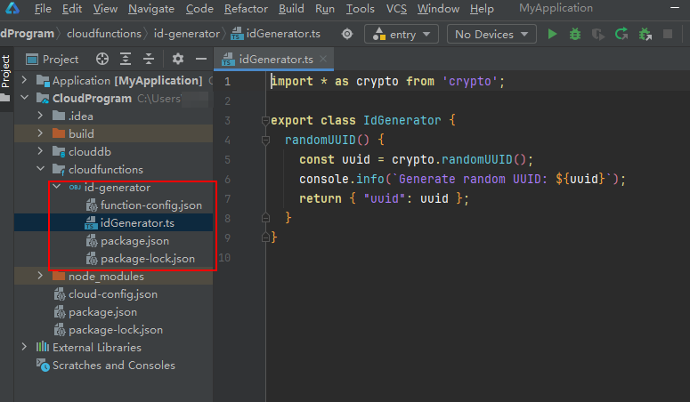
* node\_modules：工程同步时执行“npm install”生成，包含“typescript”和“@types/node”公共依赖。
* cloud-config.json：云开发工程配置文件，包含应用名称与ID、项目名称与ID、启用的数据处理位置、支持的设备类型等。
* package.json：定义了“typescript”和“@types/node”公共依赖。
* package-lock.json：工程同步时执行“npm install”生成，记录当前状态下实际安装的各个npm package的具体来源和版本号。

## （可选）AGC应用管理

### 从DevEco Studio补充创建同包名应用

如创建工程时，发现尚未在AGC控制台创建与工程包名相同的应用，可进行补充创建。

1. 点击界面提示内的“AppGallery Connect”，浏览器打开AGC控制台页面。

   
2. 在“应用开发基础信息”页面，填写待创建的应用信息，完成后点击“下一步”。

   

   | 参数 | 说明 |
   | --- | --- |
   | 应用类型 | 创建的HarmonyOS应用形态，默认与您本地工程类型保持一致，不可更改。 |
   | 应用名称 | 应用在华为应用市场详情页展示的名称。 |
   | 应用包名 | 从DevEco Studio中带入自动填充，且不可更改。 |
   | 应用分类 | 请选择普通应用或游戏类应用。  说明：  应用分类设置后不支持修改，请谨慎选择。 |
3. 进入“所属项目信息”页面，为应用选择所属的项目后点击“下一步”。
   * 如需将应用添加到已有项目，点击下拉框进行选择。
   * 如需将应用添加到新项目，直接在框中填写新项目名称。

   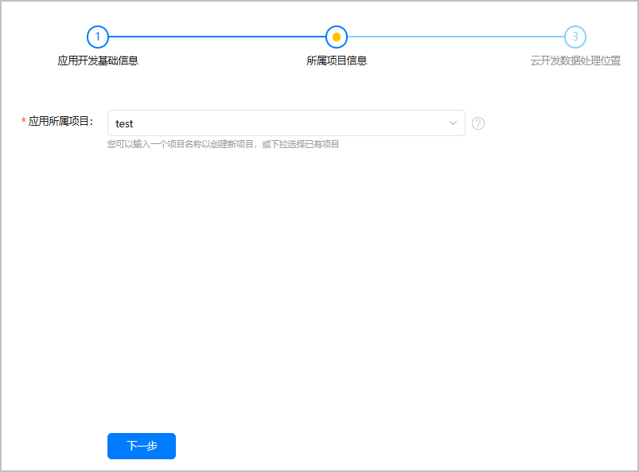
4. 进入“云开发数据处理位置”页面，设置或管理项目的数据处理位置。
   * 如项目尚未设置数据处理位置：
     1. 点击“启用”。

        
     2. 仔细阅读提示框的文字说明后，在“启用”栏为您的项目勾选一个或多个数据处理位置，并在“设为默认”栏将其中一个设置为默认数据处理位置。

        

        启用的数据处理位置必须包含中国站点。

        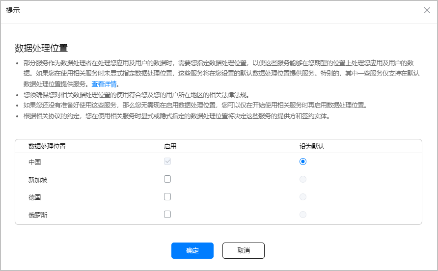
   * 如项目已设置过数据处理位置，可点击“管理”启用新的数据处理位置、取消已启用的数据处理位置，或修改默认数据处理位置。

     
5. 点击“确认”，应用创建完成。

   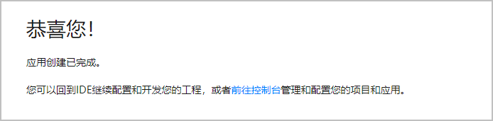
6. 返回DevEco Studio，可看到界面已获取并展示了刚刚创建的应用信息。若不展示，可点击Bundle name后的刷新。

   

### 将游离应用添加到AGC项目下

游离应用指未关联任何AGC项目的应用。创建工程时，如需要关联的AGC应用为游离应用，则您需要将该应用添加到您的AGC项目下。

应用与项目的关联关系一旦创建则无法再修改，请谨慎操作。

1. 点击“Not associated yet”，或点击界面下方提示内的“AppGallery Connect”，可打开AGC控制台“开发与服务”页面。

   
2. 点击选择希望为应用关联的项目，或者点击“添加项目”新建一个项目。

   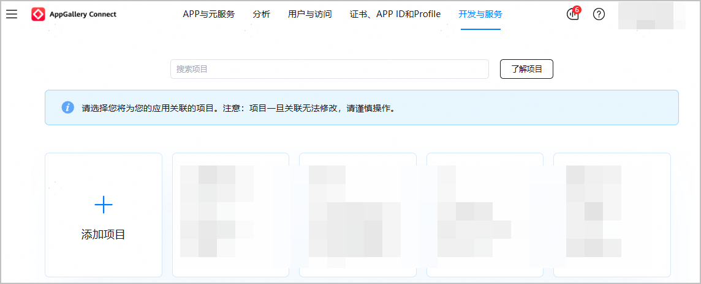
3. 如选择了新建一个项目，设置项目名称，点击“确认”。

   如选择了已有项目，则忽略此步骤。

   
4. 设置或管理项目的数据处理位置。
   * 如项目尚未设置数据处理位置：
     1. 点击“启用”。

        
     2. 仔细阅读提示框的文字说明后，在“启用”栏为您的项目勾选一个或多个数据处理位置，并在“设为默认”栏将其中一个设置为默认数据处理位置。

        

        启用的数据处理位置必须包含中国站点。

        
   * 如项目已设置过数据处理位置，可点击“管理”启用新的数据处理位置、取消已启用的数据处理位置，或修改默认数据处理位置。

     
5. 点击“确认”，应用成功关联项目。

   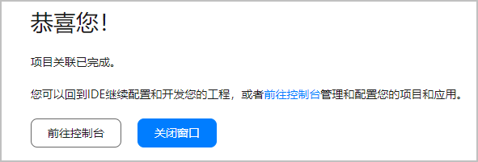
6. 返回DevEco Studio，可看到应用已关联上了项目。

   
