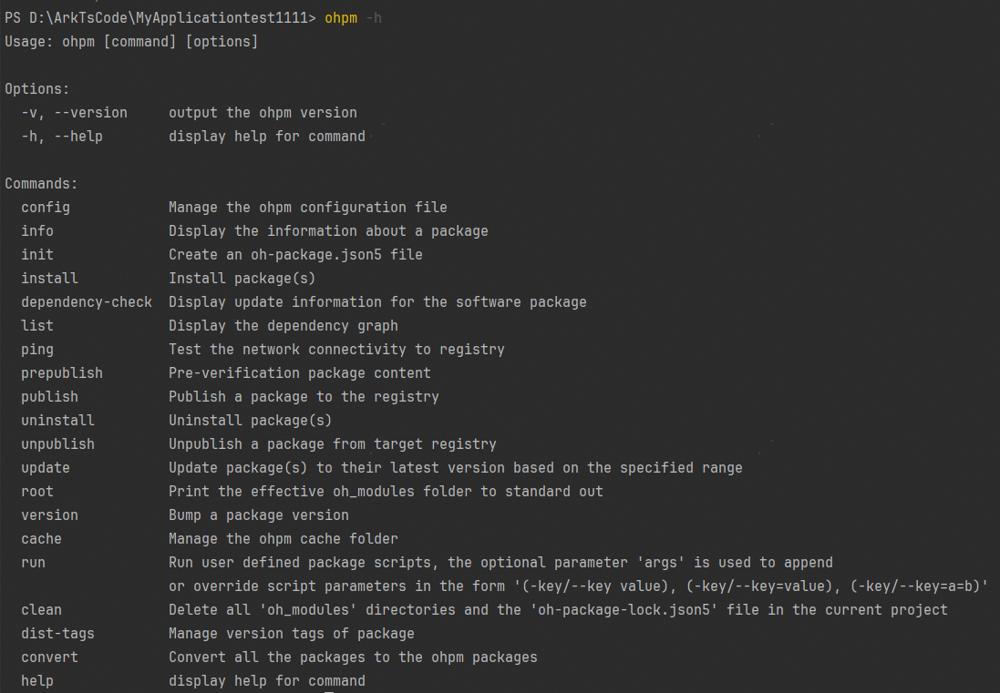

# ohpm help

获取有关 ohpm 的帮助。

## 命令格式

```
ohpm help [command]
ohpm [command] --help
alias: -h
```


command：命令名称。

## 功能描述

如果提供了命令名称，则显示相应命令的帮助信息。

如果提供的命令名称不存在或未提供，则显示所有命令的概要信息。

## 示例

执行以下命令：

```
ohpm -h
```

结果示例：

