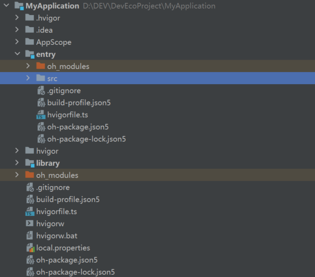
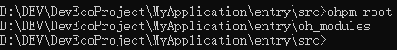

# ohpm root

在标准输出中打印有效的 oh\_modules 目录路径信息。

## 命令格式

```
ohpm root
```

## 功能描述

可以在模块的任意子目录下执行，用于打印命令工作路径下所在包的有效 oh\_modules 目录路径信息。

## Options

### prefix

* 默认值：""
* 类型： string

可以在 root 命令后面配置 --prefix &lt;string&gt; 参数，用来指定包的根目录，该目录下必须存在 oh-package.json5 文件，将会打印该根目录中有效的 oh\_modules 目录路径信息。

### log\_level

* 默认值：无
* 类型： String

从ohpm 6.0.2.636版本开始，可以在 root 命令后配置--log\_level &lt;string&gt;参数，指定执行当前命令的日志级别（info、debug、warn、error），如果未指定该值则日志级别为.ohpmrc中配置的log\_level的级别。

### debug

* 默认值：false
* 类型： Boolean

从ohpm 6.0.2.636版本开始，可以在命令后配置--debug参数，指定执行当前命令的日志级别为debug，该配置仅在当前命令行生效，不修改.ohpmrc中的日志级别，如果未指定该值则日志级别为.ohpmrc中配置的log\_level的级别。

## 示例

项目结构为：



在entry模块的src目录下执行：

```
ohpm root
```

结果示例：

