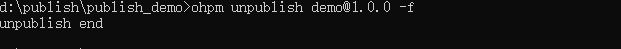

# ohpm unpublish

下架已发布的三方库。

## 命令格式

```
ohpm unpublish [options] [<@group>]<pkg>[@<version>]
```


* @group：三方库的命名空间，可选。
* pkg：三方库名称，必选。
* version：三方库的版本号，可选。

## 功能描述

* 从 OpenHarmony 三方库中心仓下架已经发布并审核通过上架的三方库。
* 若不指定版本，则默认下架三方库的所有版本，并且需要加上 -f 配置参数；全部版本均下架后，在 24h 内则不允许重新发布相同名称的三方库。
* 若下架了某个版本，该版本号不允许再次使用，后续发布必须使用新的版本号。
* 若此三方库被其它三方库依赖，则不删除，而是打上 deprecated 的标签；若没有被依赖，则直接删除。

## Options

### force

* 默认值：false
* 类型：Boolean
* 别名：f

强制下架。

### publish\_registry

* 默认值：""
* 类型：URL

可以在 unpublish 命令后面配置 --publish\_registry &lt;r&gt; 参数，指定发布仓库地址。如果未指定，默认从配置中获取发布仓库地址。

### publish\_id

* 默认值：""
* 类型：String

可以在 unpublish 命令后面配置 --publish\_id &lt;id&gt; 参数，指定发布码。

### key\_path

* 默认值：""
* 类型：String

可以在 unpublish 命令后面配置 --key\_path &lt;p&gt; 参数，指定ssh私钥路径。

### fetch\_timeout

* 默认值：60000
* 类型： Number
* 别名：ft

可以在 unpublish 命令后面配置 --ft, --fetch\_timeout &lt;number&gt; 参数，设置操作的超时时间，如果没有指定，默认超时时间为60000ms。

### strict\_ssl

* 默认值：true
* 类型： Boolean

可以在 unpublish 命令后面配置 --strict\_ssl true 参数，校验 https 证书；配置 --strict\_ssl false 参数，不校验 https 证书。

### log\_level

* 默认值：无
* 类型： String

从ohpm 6.0.2.636版本开始，可以在 unpublish 命令后配置--log\_level &lt;string&gt;参数，指定执行当前命令的日志级别（info、debug、warn、error），如果未指定该值则日志级别为.ohpmrc中配置的log\_level的级别。

### debug

* 默认值：false
* 类型： Boolean

从ohpm 6.0.2.636版本开始，可以在命令后配置--debug参数，指定执行当前命令的日志级别为debug，该配置仅在当前命令行生效，不修改.ohpmrc中的日志级别，如果未指定该值则日志级别为.ohpmrc中配置的log\_level的级别。

## 示例

下架已发布的三方库，执行以下命令：

```
ohpm unpublish demo@1.0.0 -f
```

结果示例：

