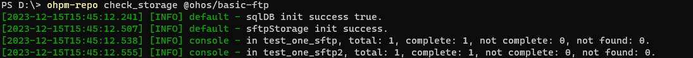

# ohpm-repo check\_storage

检查sftp中存储包的完整性。

## 前提条件

* 已成功执行[start 命令](./ide-ohpm-repo-start)或者[restart 命令](./ide-ohpm-repo-restart)，ohpm-repo服务启动成功。
* 数据存储db模块的类型必须为mysql，文件存储store模块的类型必须为sftp。

## 命令格式

```
ohpm-repo check_storage <target> [options]
```

## 功能描述

命令根据元数据检查sftp存储的包是否存在且完整。该命令要求数据存储db模块必须使用mysql，文件存储store模块必须使用sftp。

## 参数

### `<target>`

* 类型：String
* 必填参数
* 格式： [``<@scope>``/]`<pkg>`[``<@version>``]或@all
* 说明： `<@scope>`和`<@version>`是可选的，`<pkg>`是包名。

必须在check\_storage命令后面配置`<target>`参数，指定要检查的包或者用@all指定检查所有包。

## 选项

### failed

* 默认值：无
* 类型：无

可以在check\_storage命令后面配置--failed选项 ，则只检查在下载错误日志中未被处理的且满足`<target>`条件的包。

## 示例

执行以下命令，检查包@ohos/basic-ftp的完整性：

```
ohpm-repo check_storage @ohos/basic-ftp
```


检查@ohos/basic-ftp包在所有sftp存储目录中的完整性。

结果示例：


