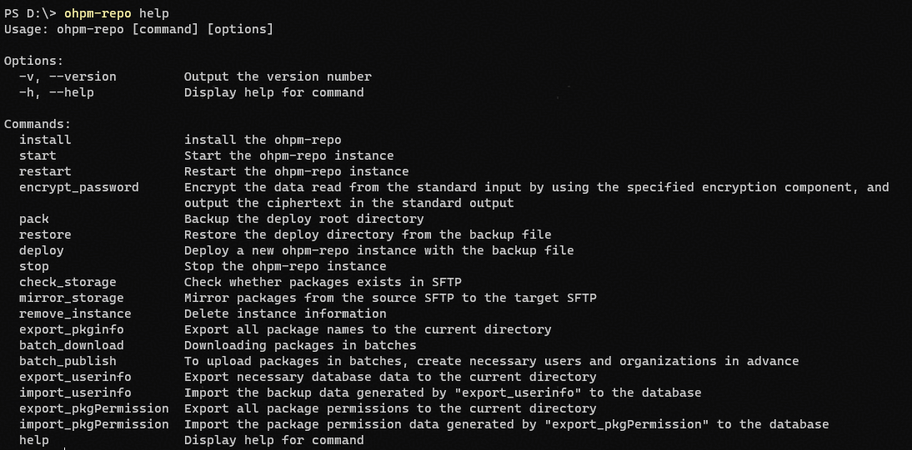
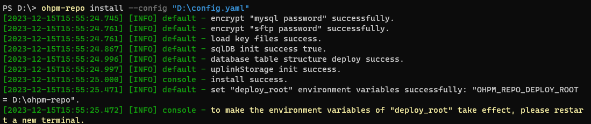
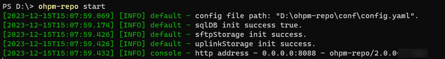
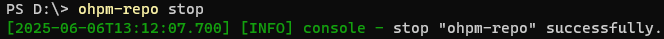
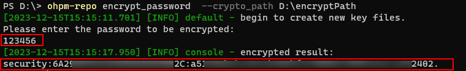
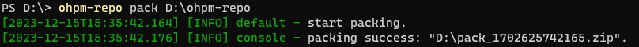
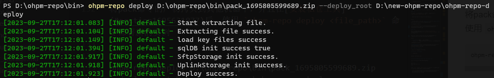
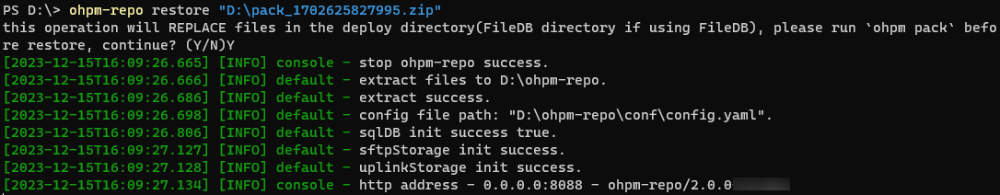
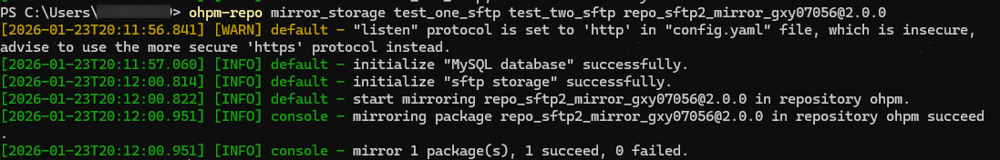
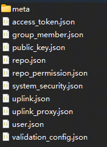

# ohpm-repo 命令参考


## 命令速览

- [ohpm-repo help](#ohpm-repo-help) — 获取有关ohpm-repo的帮助。
- [ohpm-repo install](#ohpm-repo-install) — 安装ohpm-repo服务。
- [ohpm-repo start](#ohpm-repo-start) — 启动ohpm-repo服务。
- [ohpm-repo restart](#ohpm-repo-restart) — 重新启动ohpm-repo服务。
- [ohpm-repo stop](#ohpm-repo-stop) — 停止ohpm-repo实例。
- [ohpm-repo --version](#ohpm-repo---version) — 查询ohpm-repo版本。
- [ohpm-repo encrypt\_password](#ohpm-repo-encrypt_password) — 对键入的密码类型字符串进行加密。
- [ohpm-repo pack](#ohpm-repo-pack) — 打包ohpm-repo部署目录文件。
- [ohpm-repo deploy](#ohpm-repo-deploy) — 使用备份文件部署新的ohpm-repo实例。
- [ohpm-repo restore](#ohpm-repo-restore) — 将ohpm-repo pack打包产物替换`deploy_root`目录下相应文件，重启服务。
- [ohpm-repo mirror\_storage](#ohpm-repo-mirror_storage) — 同步sftp存储的包。
- [ohpm-repo check\_storage](#ohpm-repo-check_storage) — 检查sftp中存储包的完整性。
- [ohpm-repo remove\_instance](#ohpm-repo-remove_instance) — 删除本机实例信息。
- [ohpm-repo export\_pkginfo](#ohpm-repo-export_pkginfo) — 导出ohpm-repo或OpenHarmony三方库中心仓已上架的包列表。
- [ohpm-repo batch\_download](#ohpm-repo-batch_download) — 批量下载ohpm-repo或OpenHarmony三方库中心仓的包文件。
- [ohpm-repo batch\_publish](#ohpm-repo-batch_publish) — 批量上传包文件。
- [ohpm-repo export\_userinfo](#ohpm-repo-export_userinfo) — 导出用户必要的DB数据。
- [ohpm-repo import\_userinfo](#ohpm-repo-import_userinfo) — 导入用户DB数据。
- [ohpm-repo export\_pkgPermission](#ohpm-repo-export_pkgpermission) — ohpm-repo 5.4.0版本开始，支持导出包权限数据。
- [ohpm-repo import\_pkgPermission](#ohpm-repo-import_pkgpermission) — ohpm-repo 5.4.0版本开始，支持导入包权限数据。

---

## ohpm-repo help

获取有关ohpm-repo的帮助。

### 命令格式

```
ohpm-repo help [command]
ohpm-repo [command] --help
alias: -h
```

### 参数

command：命令名称

### 功能描述

* 如果提供了命令名称，则显示相应命令的帮助信息。
* 如果提供的命令名称不存在或未提供，则显示所有命令的概要信息。

### 示例

执行以下命令：

```
ohpm-repo -h
```

结果示例：




## ohpm-repo install

安装ohpm-repo服务。

### 命令格式

```
ohpm-repo install [options]
```

### 功能描述

在启动服务之前做好准备工作，包括：检查ohpm-repo配置文件的合法性和数据库的初始化等。

### 选项

### config

* 默认值："`<binary\_root>`/conf/config.yaml"

  `<binary\_root>`：ohpm-repo私仓解压根目录。
* 类型： String

可以在install命令后面配置--config `<string>`参数，指定配置文件路径。支持相对路径，以当前命令行工作路径作为根目录。


执行install成功后，会在`deploy_root`/conf中生成一个运行时配置文件config.yaml，作为后续命令的配置文件，其中`deploy_root`为[ohpm-repo部署目录](./ide-ohpm-repo-configuration#zh-cn_topic_0000001745376470_关于-deploy_root)。

### skip-db

* 默认值：false
* 类型：Boolean
* 别名：s

在install命令后面配置-s或者--skip-db，指定是否跳过对mysql数据库中数据表的初始化；默认会读取ohpm-repo解压目录中的schema.sql文件，对mysql数据库中的表进行初始化。


1. 在ohpm-repo配置文件config.yaml中，配置项db.type只有为mysql时，此参数才生效。

2. 从ohpm-repo 5.2.0 版本起，旧参数 -sd 已被标记为弃用。请将配置中的 -sd 替换为 -s，旧参数将在未来版本中彻底移除。

### diagnosis-and-repair

* 默认值：false
* 类型：Boolean
* 别名：dr

在install命令后面配置--dr或者--diagnosis-and-repair，诊断并修复包权限表；默认不诊断和不修复包权限表。

### 示例

执行以下命令：

```
ohpm-repo install  --config D:\config.yaml
```

结果示例：



### 注意

安装成功后，必须根据给出的提示信息刷新环境变量，针对Windows系统和Linux/Mac系统，有不同处理方式：


* Windows系统： 关闭当前窗口，重新开启一个窗口。
* Linux系统或Mac系统： 在命令行中执行环境变量刷新命令：source ~/.bashrc或者 . ~/.bashrc。


## ohpm-repo start

启动ohpm-repo服务。

### 前提条件

已成功执行[install命令](#ohpm-repo-install)，并按要求刷新环境变量。

### 命令格式

```
ohpm-repo start
```

### 功能描述

用于启动ohpm-repo服务，创建一个ohpm-repo实例。


启动时将ohpm-repo服务的pid存放到`deploy_root`/runtime/.pid文件中，其中`deploy_root`为[ohpm-repo私仓部署目录](./ide-ohpm-repo-configuration#zh-cn_topic_0000001745376470_关于-deploy_root)。

### 示例

执行以下命令：

```
ohpm-repo start
```

结果示例：




## ohpm-repo restart

重新启动ohpm-repo服务。

### 前提条件

已成功执行[install命令](#ohpm-repo-install)，并按要求刷新环境变量。

### 命令格式

```
ohpm-repo restart
```

### 功能描述

停止当前ohpm-repo服务，重新启动一个新的ohpm-repo服务。


启动时将ohpm-repo服务的pid存放到`deploy_root`/runtime/.pid文件，其中`deploy_root`为[ohpm-repo私仓部署目录](./ide-ohpm-repo-configuration#zh-cn_topic_0000001745376470_关于-deploy_root)。

### 示例

执行以下命令：

```
ohpm-repo restart
```

结果示例：


## ohpm-repo stop

停止ohpm-repo实例。

### 命令格式

```
ohpm-repo stop
```

### 功能描述

用于停止已经启动的ohpm-repo实例。

### 示例

执行以下命令：

```
ohpm-repo stop
```

结果示例：




## ohpm-repo --version

查询ohpm-repo版本。

### 命令格式

```
ohpm-repo --version
alias: -v
```

### 功能描述

打印ohpm-repo的版本号。

### 示例

执行以下命令，查看版本信息：

```
ohpm-repo -v
```

结果示例：


## ohpm-repo encrypt\_password

对键入的密码类型字符串进行加密。

### 命令格式

```
ohpm-repo encrypt_password [options]
```

### 功能描述

使用指定的加密组件加密从标准输入读取的数据，并在标准输出中输出密文。

### 选项

### crypto\_path

* 类型：String
* 必填参数

必须在encrypt\_password命令后面配置--crypto\_path `<string>`参数，指定加密组件的路径。如果是完整组件，将用该组件对键入的密码内容进行加密。如果是一个空目录，则命令将生成新的加密组件并对键入的密码内容进行加密。

### 示例

执行以下命令：

```
ohpm-repo encrypt_password --crypto_path D:\encryptPath
```

结果示例：




## ohpm-repo pack

打包ohpm-repo部署目录文件。

### 前提条件

已成功执行[start 命令](#ohpm-repo-start)或者[restart 命令](#ohpm-repo-restart)，ohpm-repo服务启动成功。

### 命令格式

```
ohpm-repo pack `deploy_root`
```

### 功能描述

用于打包ohpm-repo部署目录[deploy\_root](./ide-ohpm-repo-configuration#zh-cn_topic_0000001745376470_关于-deploy_root)下的conf ，db和meta目录。

说明：

* 如果数据存储db模块使用的是mysql，则命令只打包conf和meta目录内容。
* 如果数据存储db模块使用的是filedb，则命令打包conf、db和meta目录内容，且在命令执行过程中，会先将ohpm-repo服务设置为只读模式，等打包完成以后，再将ohpm-repo服务重置为读写模式。
* 打包产物可通过ohpm-repo restore命令自动解压至`deploy_root`目录。

### 参数

### `deploy_root`

* 类型： String
* 必填参数

必须在pack命令后面配置`deploy_root`参数，指定待打包的[ohpm-repo私仓部署目录](./ide-ohpm-repo-configuration#zh-cn_topic_0000001745376470_关于-deploy_root)。

### 示例

执行以下命令：

```
ohpm-repo pack D:\ohpm-repo
```

结果示例：




## ohpm-repo deploy

使用备份文件部署新的ohpm-repo实例。

### 前提条件

已获得由[pack 命令](#ohpm-repo-pack)打包的.zip文件。

### 命令格式

```
ohpm-repo deploy <file_path> [options]
```

### 功能描述

命令将使用由ohpm-repo pack得到的打包产物部署新的ohpm-repo实例。 命令要求数据存储必须使用mysql，文件存储必须使用sftp或者custom ，且在命令执行时，会检查数据库mysql中存储的ohpm-repo实例列表与配置的sftp或者custom存储目录中的ohpm-repo实例列表是否一致，若不一致则命令执行失败。

### 参数

### `<file\_path>`

* 类型：String
* 必填参数

必须在deploy命令后面配置`<file\_path>`参数，指定打包产物路径。

### 选项

### deploy\_root

* windows系统默认值："~/AppData/Roaming/Huawei/ohpm-repo"
* 其他系统默认值："~/ohpm-repo"
* 类型： String

可以在deploy命令后面配置--deploy\_root `<string>`参数，未配置将使用默认值。支持相对和绝对路径配置，当配置为相对路径时，以当前命令行工作路径为根目录。

### logs

* 类型： String

可以在deploy命令后面配置--logs `<string>`参数，指定log目录，优先级高于config.yaml中的配置，支持相对和绝对路径配置，当配置为相对路径时，以当前命令行工作路径为根目录。

### uplinkCachePath

* 类型： String

可以在deploy命令后面配置--uplinkCachePath `<string>`参数，指定远程包缓存路径，优先级高于config.yaml中的配置，支持相对和绝对路径配置，当配置为相对路径时，以当前命令行工作路径为根目录。


部署实例成功后，命令行所配置的deploy\_root，logs和uplinkCachePath会写入到运行时配置文件中，可从`deploy_root`/conf目录中的配置文件config.yaml中查看。

### skip-db

* 默认值：false
* 类型：Boolean
* 别名：s

在deploy命令后面配置-s或者--skip-db，指定是否跳过对mysql数据库中数据表的初始化；默认会读取ohpm-repo解压目录中的schema.sql文件，对mysql数据库中的表进行初始化。


1. 在ohpm-repo配置文件config.yaml中，配置项db.type只有为mysql时，此参数才生效。

2. 从ohpm-repo 5.2.0 版本起， -sd 已标记废弃，替换为 -s。

### 示例

执行以下命令：

```
ohpm-repo deploy D:\ohpm-repo\bin\pack_1695805599689.zip --deploy_root D:\new-ohpm-repo\ohpm-repo-deploy
```

结果示例：




## ohpm-repo restore

将ohpm-repo pack打包产物替换`deploy_root`目录下相应文件，重启服务。

### 前提条件

* 已成功执行[start 命令](#ohpm-repo-start)或者[restart 命令](#ohpm-repo-restart)，ohpm-repo服务启动成功。
* 已获得由[pack 命令](#ohpm-repo-pack)打包的.zip 文件。

### 命令格式

```
ohpm-repo restore <file_path>
```

### 功能描述

该命令会停止当前ohpm-repo服务，并用打包文件`<file\_path>`中的内容替换ohpm-repo部署根目录`deploy_root`的相应文件，然后重启ohpm-repo服务。该命令执行前必须已执行过ohpm-repo实例启动命令ohpm-repo start。


* `<file\_path>`：由ohpm-repo pack命令得到的打包产物。

支持相对和绝对路径配置，当配置为相对路径时，以当前命令行工作路径为根目录。

* `deploy_root`：ohpm-repo部署根目录 执行install命令后，会创建一个名为OHPM\_REPO\_DEPLOY\_ROOT的环境变量，记录的是[ohpm-repo私仓部署目录](./ide-ohpm-repo-configuration#zh-cn_topic_0000001745376470_关于-deploy_root)。

### 参数

### `<file\_path>`

* 类型：String
* 必填参数

指定待解压的打包文件路径。

### 示例

执行以下命令：

```
ohpm-repo restore "D:\pack_1702625827995.zip"
```

结果示例：




## ohpm-repo mirror\_storage

同步sftp存储的包。

### 前提条件

* 已成功执行[start 命令](#ohpm-repo-start)或者[restart 命令](#ohpm-repo-restart)，ohpm-repo服务启动成功。
* 数据存储db模块的类型必须为mysql，文件存储store模块的类型必须为sftp。

### 命令格式

```
ohpm-repo mirror_storage <source_sftp> <target_sftp> <target> [options]
```

### 功能描述

该命令必须配置文件存储插件模块为sftp。命令会将**源sftp**目录下满足`<target>`条件的包同步到**目标sftp**目录下。

### 参数

### `<source\_sftp>`

* 类型：String
* 必填参数

必须在mirror\_storage命令后面配置`<source\_sftp>`参数，指定**源sftp**配置的名字。

### `<target\_sftp>`

* 类型：String
* 必填参数

必须在mirror\_storage命令后面配置`<target\_sftp>`参数，指定**目标sftp**配置的名字。

### `<target>`

* 类型：String
* 必填参数
* 格式： [``<@scope>``/]`\<pkg\>`[``<@version>``] 或 @all
* 说明： `<@scope>`和`<@version>`是可选的， `<pkg>`是包名。

必须在mirror\_storage命令后配置`<target>`参数，指定满足条件的包；或使用@all指定所有包。

### 选项

### failed

* 默认值：无
* 类型：无

可以在mirror\_storage命令后面配置--failed选项，则只同步在下载错误日志中未被处理的且满足`<target>`条件的包，如果同步成功，则相应的错误日志会被设置成handled。

### 示例

执行以下命令，同步包repo\_sftp2\_mirror\_gxy07056@2.0.0：

```
ohpm-repo mirror_storage test_one_sftp test_two_sftp repo_sftp2_mirror_gxy07056@2.0.0
```

说明：将名为test\_one\_sftp的sftp目录中repo\_sftp2\_mirror\_gxy07056@2.0.0包同步到名为test\_two\_sftp的sftp目录中。

结果示例：




## ohpm-repo check\_storage

检查sftp中存储包的完整性。

### 前提条件

* 已成功执行[start 命令](#ohpm-repo-start)或者[restart 命令](#ohpm-repo-restart)，ohpm-repo服务启动成功。
* 数据存储db模块的类型必须为mysql，文件存储store模块的类型必须为sftp。

### 命令格式

```
ohpm-repo check_storage <target> [options]
```

### 功能描述

命令根据元数据检查sftp存储的包是否存在且完整。该命令要求数据存储db模块必须使用mysql，文件存储store模块必须使用sftp。

### 参数

### `<target>`

* 类型：String
* 必填参数
* 格式： [``<@scope>``/]`\<pkg\>`[``<@version>``]或@all
* 说明： `<@scope>`和`<@version>`是可选的，`<pkg>`是包名。

必须在check\_storage命令后面配置`<target>`参数，指定要检查的包或者用@all指定检查所有包。

### 选项

### failed

* 默认值：无
* 类型：无

可以在check\_storage命令后面配置--failed选项 ，则只检查在下载错误日志中未被处理的且满足`<target>`条件的包。

### 示例

执行以下命令，检查包@ohos/basic-ftp的完整性：

```
ohpm-repo check_storage @ohos/basic-ftp
```


检查@ohos/basic-ftp包在所有sftp存储目录中的完整性。

结果示例：


## ohpm-repo remove\_instance

删除本机实例信息。

### 前提条件

* 已成功执行[start 命令](#ohpm-repo-start)或者[restart 命令](#ohpm-repo-restart)，ohpm-repo服务启动成功。
* 数据存储db模块的类型必须为mysql，文件存储store模块的类型必须为sftp或custom。

### 命令格式

```
ohpm-repo remove_instance
```

### 功能描述

该命令会停止当前运行的ohpm-repo服务，同时删除本机在mysql和sftp中的实例信息。命令要求数据存储db模块必须使用mysql，文件存储store模块必须使用sftp或custom。

### 示例

执行以下命令：

```
ohpm-repo remove_instance
```

结果示例：


## ohpm-repo export\_pkginfo

导出ohpm-repo或OpenHarmony三方库中心仓已上架的包列表。

### 命令格式

```
ohpm-repo export_pkginfo [option]
```

### 功能描述

将所有或者与输入正则表达式匹配的已上架库的包名导出到当前目录的pkgInfo\_xxx.json文件。

### 选项

### --public-registry

* 默认值：无
* 类型：URL

在export\_pkginfo命令后面配置--public-registry ``<string>``，指定OpenHarmony三方库中心仓registry地址获取已上架的包列表。

### --http-proxy

* 默认值：无
* 类型：String

在export\_pkginfo命令后面配置--http-proxy ``<string>``，发起请求时将为上面配置的--public-registry地址设置代理。

### --filter

* 默认值：无

* 类型：String

在export\_pkginfo命令后面配置--filter ``<string>``，可以根据正则表达式导出匹配的包列表，根据完整包名匹配。

三方包的命名规则为：@``<组织名>``/``<包名>``@``<版本号>``。

### --repos

* 默认值：无

* 类型：String

ohpm-repo 5.3.0版本开始支持配置多个仓库。在export\_pkginfo命令后面配置--repos ``<string>``，导出ohpm-repo中指定仓库的包列表。多个仓库之间通过英文逗号进行分隔，例如"export\_pkginfo --repos one,two"，即可导出仓库one和仓库two中满足要求的包列表。如果没有配置此参数，将默认导出所有仓库中满足要求的包列表。

### 示例

执行以下命令从ohpm-repo中导出已上架的包列表：

```
ohpm-repo export_pkginfo
```

结果示例：

```
PS D:\> ohpm-repo export_pkginfo
...
[2025-08-09T17:56:15.319] [INFO] default - export matched packages success: save to "D:\pkgInfo_1754733375315.json".
```

```
// pkgInfo_1754733375315.json中记录着ohpm-repo中所有仓库的包列表
{
  "ohpm": [
    "@ohos/test@1.0.0",
    "@ohos/test-two@1.0.0"
  ],
  "one": [
    "@ohos/test-three@1.0.0",
    "@ohos/test-four@1.0.0"
  ],
  "two": [
    "@ohos/test-five@1.0.0",
    "@ohos/test-six@1.0.0"
  ]
}
```

执行以下命令从OpenHarmony三方库中心仓中导出已上架的包列表：

```
ohpm-repo export_pkginfo --public-registry <OpenHarmony三方库中心仓registry地址> --http-proxy <配置代理地址>
```

结果示例：

```
PS D:\> ohpm-repo export_pkginfo  --public-registry https://ohpm.openharmony.cn/ohpm/
...
[2024-04-02T22:51:46.664] [INFO] DEFAULT - Export 912 packages names success: save to "D:\pkgInfo_1754734313921.json".
```

```
// pkgInfo_1754734313921.json中记录着公仓的包列表
{
  "packageNameArray": [
    "@ohos/lottie-turbo@1.0.0",
    "@ohos/lottie-turbo@1.0.0-rc.0",
    "@ohos/lottie-turbo@1.0.0-rc.1",
    ...
  ]
}
```

执行以下命令从ohpm-repo本地存储中，导出所有包名为pack1，版本是1.1的（可以是1.1.1, 1.1.2, 1.1.3等）已上架的包列表：

```
ohpm-repo export_pkginfo --filter "^pack1@1\.1(\.[0-9]+)*$"
```

执行以下命令从ohpm-repo配置的public-registry仓库中，导出所有属于组织ohos，且名为lottie的所有版本的已上架的包列表：

```
ohpm-repo export_pkginfo --public-registry https://ohpm.openharmony.cn/ohpm/ --filter "^@ohos/lottie.*"
```

执行以下命令从ohpm-repo本地存储中仅导出仓库名为one的所有包列表：

```
ohpm-repo export_pkginfo --repos one
```

结果示例：

```
PS D:\> ohpm-repo export_pkginfo --repos one
...
[2025-08-09T18:28:17.602] [INFO] default - export all packages success: save to "D:\pkgInfo_1754735297601.json".
```

```
// pkgInfo_1754735297601.json中记录着ohpm-repo中仓库one的包列表
{
  "one": [
    "@ohos/test-three@1.0.0",
    "@ohos/test-four@1.0.0"
  ]
}
```


## ohpm-repo batch\_download

批量下载ohpm-repo或OpenHarmony三方库中心仓的包文件。

### 前提条件

已成功执行[export\_pkginfo 命令](#ohpm-repo-export_pkginfo)，生成pkgInfo\_xxx.json文件。

### 命令格式

```
ohpm-repo batch_download <pkg_list>
```

### 功能描述

根据提供的包名列表用于批量下载ohpm-repo或OpenHarmony三方库中心仓的包文件，并导出zip文件。

说明：执行[export\_pkginfo 命令](#ohpm-repo-export_pkginfo)生成的pkgInfo\_xxx.json文件中记录着ohpm-repo或OpenHarmony三方库中心仓中所有已上架的包，若仅需要批量下载部分包文件，可以手动修改pkgInfo\_xxx.json文件，命令只会批量下载pkgInfo\_xxx.json文件中指定的包，包如果有其他依赖，所依赖的包也会一并下载。

### 参数

### `<pkg\_list>`

* 类型： String
* 必填参数

必须在batch\_download命令后面配置`<pkg\_list>`参数，指定执行[export\_pkginfo 命令](#ohpm-repo-export_pkginfo)导出的json文件。

### 选项

### --public-registry

* 默认值：无
* 类型：URL

在batch\_download命令后面配置--public-registry ``<string>``，指定OpenHarmony三方库中心仓registry地址下载包文件。

### --http-proxy

* 默认值：无
* 类型：String

在batch\_download命令后面配置--http-proxy ``<string>``，发起请求时将为上面配置的--public-registry地址设置代理。

### --not-use-proxy

* 默认值：无
* 类型：String

在batch\_download命令后面配置--not-use-proxy ``<string>``，发起请求时不会为指定的地址设置代理，如果有多个地址请使用英文逗号隔开，并使用url编码转换特殊字符。

### 示例

执行以下命令从ohpm-repo中批量下载包文件：

```
ohpm-repo batch_download <pkgInfo_xxxx.json地址>
```

结果示例：

```
PS D:\> ohpm-repo batch_download D:\pkgInfo_1754733375315.json
[2025-08-09T18:33:30.349] [INFO] default - download "@ohos/test@1.0.0" from repository "ohpm" successfully".
[2025-08-09T18:33:30.367] [INFO] default - download "@ohos/test-two@1.0.0" from repository "ohpm" successfully".
...
[2025-08-09T18:33:30.466] [INFO] default - all "6" package(s) are successfully download.
[2025-08-09T18:33:30.466] [INFO] default - save the .zip file to : "D:\batch_download_1754735610304.zip".
[2025-08-09T18:33:30.467] [INFO] default - Clear the cache.
```


1、生成的zip文件以仓库名作为目录，每个仓库目录中存在包文件和pkgInfo.json文件，pkgInfo.json文件记录每个包的**文件名**、**包名**、**组织**、**上传者**和**Tag标签**，用于在批量上传时准确指定ohpm-repo的数据库中某个用户为某个包的真实上传用户，同时将包的Tag标签一起上传。

2、命令执行中，如果某个包的用户在ohpm-repo中不存在，将默认指定该包的上传用户为管理员用户或者组织的管理员用户。

3、ohpm-repo从5.3.0开始支持多仓库配置，当从OpenHarmony三方库中心仓下载包，生成的包zip文件，目录名为ohpm，在后续执行[batch\_publish](#ohpm-repo-batch_publish)命令时，默认导入ohpm-repo仓库名为ohpm的仓库中。

```
batch_download_1754735610304.zip目录结构
+---ohpm
|       @ohos+test-two@1.0.0.har
|       @ohos+test@1.0.0.har
|       pkgInfo.json
|
+---one
|       @ohos+test-four@1.0.0.har
|       @ohos+test-three@1.0.0.har
|       pkgInfo.json
|
+---two
|       @ohos+test-five@1.0.0.har
|       @ohos+test-six@1.0.0.har
|       pkgInfo.json
```

```
batch_download_1754735610304.zip中ohpm目录中pkgInfo.json结构
{
  "packageArray": [
    {
      "packageFile": "@ohos+test@1.0.0.har",
      "packageName": "@ohos/test@1.0.0",
      "user": "admin",
      "userId": "",
      "group": "ohos",
      "distTags": []
    },
    {
      "packageFile": "@ohos+test-two@1.0.0.har",
      "packageName": "@ohos/test-two@1.0.0",
      "user": "admin",
      "userId": "",
      "group": "ohos",
      "distTags": []
    }
  ]
}
```

执行以下命令从OpenHarmony三方库中心仓中批量下载包文件：

```
ohpm-repo batch_download <pkgInfo_xxxx.json地址> --public-registry <OpenHarmony三方库中心仓registry地址> --http-proxy <配置代理地址> --not-use-proxy <配置不使用代理>
```

结果示例：

```
PS D:\> ohpm-repo batch_download D:\pkgInfo_1754734313921.json --public-registry https://ohpm.openharmony.cn/ohpm/
...
[2025-08-09T18:49:38.833] [INFO] default - A total of 95 package(s) successfully obtain download url.
[2025-08-09T18:49:38.834] [INFO] default - A total of 95 package(s) are successfully downloaded.
[2025-08-09T18:49:38.834] [INFO] default - A total of 95 package(s) are converted successfully.
[2025-08-09T18:49:38.834] [INFO] default - Packing the .zip file. . .
[2025-08-09T18:49:39.820] [INFO] default - save the .zip file to : "D:\batch_download_1754736519129.zip".
[2025-08-09T18:49:39.820] [INFO] default - Clear the cache.
```


1. 如果ohpm-repo实例的数据存储类型为filedb，请执行ohpm-repo restart命令重启ohpm-repo服务，以便刷新ohpm-repo网站页面中的数据。该操作会影响正在使用ohpm-repo服务的用户，请提前告知。
2. 生成的zip文件中以仓库名作为目录，每个仓库目录中存在pkgInfo.json文件，其中记录了每个包的**文件名**、**包名**、**组织**、**上传者和****Tag标签**，用于在批量上传时准确指定ohpm-repo的数据库中某个用户为某个包的真实上传用户，同时将包的Tag标签一起上传。
3. 当执行batch\_download命令时，某个中心仓包的组织为A，若为其指定ohpm-repo的数据库中某用户为其真实上传用户，ohpm-repo实例中不存在A组织，则该包的真实上传用户将设定为空，并且提醒用户手动创建A组织。之后执行批量上传时同样会提醒该包的A组织在ohpm-repo实例中不存在，需要先手动创建A组织。如果需要自动添加组织，使用batch\_publish命令的可选参数--force，将会选取一个管理员用户作为A组织负责人，自动创建A组织后进行该包的上传。


## ohpm-repo batch\_publish

批量上传包文件。

### 前提条件

已成功执行[batch\_download 命令](#ohpm-repo-batch_download)、 [export\_userinfo 命令](#ohpm-repo-export_userinfo)、[import\_userinfo 命令](#ohpm-repo-import_userinfo)，确保每个包指定的包文件、用户和组织都存在。

### 命令格式

```
ohpm-repo batch_publish <zip_file>
```

### 功能描述

根据提供的zip文件批量上传其中的包到ohpm-repo对应的仓库中。

### 参数

### `<zip\_file>`

* 类型： String
* 必填参数

必须在batch\_publish命令后面配置`<zip\_file>`参数，指定执行[batch\_download命令](#ohpm-repo-batch_download)导出的zip文件。

### 选项

### --force

* 默认值：false
* 类型：Boolean

在batch\_publish命令后面配置--force，进行批量上传时某个包的组织在ohpm-repo中不存在，将选取一位管理员用户作为组织负责人自动创建组织。

--target-repo

* 默认值：无
* 类型： string

ohpm-repo 5.3.0版本开始支持配置多个仓库，当[batch\_download命令](#ohpm-repo-batch_download)导出的zip文件中仅包含一个仓库目录时，可在batch\_publish命令后面配置--target-repo ``<string>``，用于指定待上传的仓库名称。未配置默认上传仓库名称与[batch\_download命令](#ohpm-repo-batch_download)导出的zip文件中的目录仓库名称保持一致，否则将报错。

### 示例

执行以下命令：

```
ohpm-repo batch_publish <zip_file> --force
```

结果示例：

```
PS D:\> ohpm-repo batch_publish D:\batch_download_1754735610304.zip --force
...
[2025-08-09T19:12:01.497] [INFO] default - all 6 package(s) are successfully published
[2025-08-09T19:12:01.497] [WARN] default - You are using "filedb" to store data. If you have already started a repository service, please run `ohpm-repo restart` to restart the service.
```


如果ohpm-repo实例的数据存储类型为filedb，请执行ohpm-repo restart命令重启ohpm-repo服务，以便刷新ohpm-repo实例缓存中的数据。该操作会影响正在使用ohpm-repo服务的用户，请提前告知。


## ohpm-repo export\_userinfo

导出用户必要的DB数据。

### 命令格式

```
ohpm-repo export_userinfo
```

### 功能描述

在当前的工作目录导出记录了DB数据的export\_userInfo\_xxx.zip文件，其中包含加密组件和下面的10张数据表。

* user
* group\_member
* public\_key
* access\_token
* uplink
* uplink\_proxy
* repo
* repo\_permission
* validation\_config
* system\_security

### 示例

执行以下命令：

```
ohpm-repo export_userinfo
```

结果示例：



```
PS D:\> ohpm-repo export_userinfo
[2025-08-09T19:14:16.721] [INFO] default - initialize "file database" successfully.
[2025-08-09T19:14:16.724] [INFO] default - export the "user" table done.
[2025-08-09T19:14:16.726] [INFO] default - export the "group_member" table done.
[2025-08-09T19:14:16.728] [INFO] default - export the "access_token" table done.
[2025-08-09T19:14:16.728] [INFO] default - export the "public_key" table done.
[2025-08-09T19:14:16.730] [INFO] default - export the "repo" table done.
[2025-08-09T19:14:16.730] [INFO] default - export the "repo_permission" table done.
[2025-08-09T19:14:16.731] [INFO] default - export the "uplink" table done.
[2025-08-09T19:14:16.732] [INFO] default - export the "uplink_proxy" table done.
[2025-08-09T19:14:16.733] [INFO] default - export the "validation_config" table done.
[2025-08-09T19:14:16.734] [INFO] default - export the "system_security" table done.
[2025-08-09T19:14:16.761] [INFO] default - userinfo exported completed, save the .zip file to : "D:\export_userInfo_1754738056722.zip".
```

```
export_userInfo_1754738056722.zip文件结构

|   access_token.json
|   group_member.json
|   public_key.json
|   repo.json
|   repo_permission.json
|   system_security.json
|   uplink.json
|   uplink_proxy.json
|   user.json
|   validation_config.json
\---meta
    |   version.txt
    +---ac
    +---ce
    \---fd
```


## ohpm-repo import\_userinfo

导入用户DB数据。

### 前提条件

已成功执行[export\_userinfo 命令](#ohpm-repo-export_userinfo)。

### 命令格式

```
ohpm-repo import_userinfo <zip_file> [options]
```

### 功能描述

根据提供的zip文件导入用户DB数据到ohpm-repo。

### 参数

### `<zip\_file>`

* 类型： String
* 必填参数

必须在import\_userinfo命令后面配置`<zip\_file>`参数，指定执行[export\_userinfo 命令](#ohpm-repo-export_userinfo)导出的zip文件。

### 选项

### clean-db

* 默认值：false
* 类型：Boolean

可以在import\_userinfo命令后面配置--clean-db参数，指定在导入数据前先清空DB数据。

### 示例

执行以下命令：

```
ohpm-repo import_userinfo <zip_file> --clean-db
```

结果示例：

```
PS D:\> ohpm-repo import_userinfo D:\export_userInfo_1754738056722.zip --clean-db
[2025-08-09T19:19:31.623] [INFO] default - verifying the validity of the meta crypto component.
[2025-08-09T19:19:31.633] [INFO] default - the meta crypto component is verified successfully.
[2025-08-09T19:19:31.639] [INFO] default - initialize "file database" successfully.
[2025-08-09T19:19:31.660] [INFO] default - all database data has been cleaned.
[2025-08-09T19:19:31.660] [INFO] default - importing data in the 'user.json' file.
...
[2025-08-09T19:19:31.673] [INFO] default - importing data in the 'system_security.json' file.
[2025-08-09T19:19:31.674] [INFO] default - data import finished.
```


## ohpm-repo export\_pkgPermission

ohpm-repo 5.4.0版本开始，支持导出包权限数据。

### 命令格式

```
ohpm-repo export_pkgPermission [option]
```

### 功能描述

在当前的工作目录中，导出记录包权限的packagePermission\_xxx.json文件。

### 选项

### --repos

* 默认值：无

* 类型：String

在export\_pkgPermission命令后面配置--repos ``<string>``，导出ohpm-repo中指定仓库的包权限。多个仓库之间通过英文逗号隔开，例如"export\_pkgPermission --repos one,two"，即导出仓库one和仓库two中的包权限。若未配置此参数，将默认导出ohpm-repo中所有仓库的包权限。

### 示例

**从ohpm-repo中导出所有仓库的包权限**

```
ohpm-repo export_pkgPermission
```

结果示例：

```
PS D:\> ohpm-repo export_pkgPermission
...
[2025-09-16T14:58:24.806] [INFO] default - successfully exported all package permissions: saved to "D:\packagePermission_1758005904806.json".
```

```
// packagePermission_1758005904806.json中记录着ohpm-repo中所有仓库的包权限
[
  {
    "repoName": "groupone",
    "packageName": "testone",
    "readPolicy": 1, // 记录包的可见性配置（1：公开可读，2：授权可读）
    "packagePermission": {
      "admin": 4, // 记录用户名为admin的用户对该包的权限 （1：查看者权限，2：维护者权限，4：所有者权限）
      "user": 2,
    }
  },
  ...
  {
    "repoName": "ohpm",
    "packageName": "testtwo",
    "readPolicy": 2,
    "packagePermission": {
      "admin": 2,
      "user": 4,
    }
  }
]
```

**从ohpm-repo中仅导出仓库名为ohpm的包权限**

```
ohpm-repo export_pkgPermission --repos ohpm
```

结果示例：

```
PS D:\> ohpm-repo export_pkgPermission --repos ohpm
...
[2025-09-16T15:41:06.124] [INFO] default - successfully exported all package permissions for the specified repository: saved to "D:\packagePermission_1758008466123.json".
```

```
// packagePermission_1758008466123.json中记录着ohpm-repo中仓库ohpm的包权限
[
  {
    "repoName": "ohpm",
    "packageName": "testtwo",
    "readPolicy": 2,
    "packagePermission": {
      "admin": 2,
      "user": 4,
    }
  },
  ...
]
```


## ohpm-repo import\_pkgPermission

ohpm-repo 5.4.0版本开始，支持导入包权限数据。

### 前提条件

已成功执行 [export\_userinfo 命令](#ohpm-repo-export_userinfo)、[import\_userinfo 命令](#ohpm-repo-import_userinfo)、[batch\_download 命令](#ohpm-repo-batch_download)、[batch\_publish 命令](#ohpm-repo-batch_publish)、[export\_pkgPermission 命令](#ohpm-repo-export_pkgpermission)，确保每个包指定的包文件、用户和组织都存在。

### 命令格式

```
ohpm-repo import_pkgPermission <pkg_permission_list> [options]
```

### 功能描述

根据提供的记录着包权限数据的.json文件，向ohpm-repo导入包权限数据。

### 参数

### `<pkg\_permission\_list>`

* 类型： String
* 必填参数

在import\_pkgPermission命令后面配置`<pkg\_permission\_list>`参数，指定执行[export\_pkgPermission 命令](#ohpm-repo-export_pkgpermission)导出的.json文件。

### 选项

### --mode

* 类型：String
* 必填参数

用于指定包权限的导入模式，在import\_pkgPermission命令后通过--mode `<mode>`格式配置，mode有三种不同模式：merge-origin、merge-target、override。

**merge-origin模式**：保留源数据的可见性配置，合并源数据与ohpm-repo的包权限（以ohpm-repo权限为主），取权限并集。

| 源数据可见性 | ohpm-repo可见性 | 最终可见性 | 最终包权限 |
| --- | --- | --- | --- |
| 授权可读 | 授权可读 | 授权可读 | 源数据与ohpm-repo的所有者、维护者、查看者权限并集 |
| 公开可读 |
| 公开可读 | 授权可读 | 公开可读 | 源数据与ohpm-repo的所有者、维护者权限并集 |
| 公开可读 |

**merge-target 模式：**处理规则：保留ohpm-repo的可见性配置，合并源数据与ohpm-repo的包权限（以ohpm-repo权限为主），取权限并集。

| 源数据可见性 | ohpm-repo可见性 | 最终可见性 | 最终包权限 |
| --- | --- | --- | --- |
| 授权可读 | 授权可读 | 授权可读 | 源数据与ohpm-repo的所有者、维护者、查看者权限并集 |
| 公开可读 |
| 授权可读 | 公开可读 | 公开可读 | 源数据与ohpm-repo的所有者、维护者权限并集 |
| 公开可读 |

**override 模式：**删除ohpm-repo中对应包的所有包权限数据，完全使用源数据替代。

| 源数据可见性 | ohpm-repo可见性 | 最终可见性 | 最终包权限 |
| --- | --- | --- | --- |
| 授权可读 | 授权可读 | 授权可读 | 源数据中的所有者、维护者、查看者权限 |
| 公开可读 |
| 公开可读 | 授权可读 | 公开可读 | 源数据中的所有者、维护者权限 |
| 公开可读 |

--target-repo

* 默认值：无
* 类型： string

当[export\_pkgPermission命令](#ohpm-repo-export_pkgpermission)导出的json文件中仅包含一个仓库的包权限数据时，可在import\_pkgPermission命令后面配置--target-repo ``<string>``，用于指定待导入的仓库名称。

### 示例

**以****merge-origin****模式导入包权限**

```
ohpm-repo import_pkgPermission <pkg_permission_list> --mode merge-origin
```

结果示例：

```
PS D:\> ohpm-repo import_pkgPermission D:\packagePermission_1758008466123.json --mode merge-origin
...
[2025-09-17T14:44:38.451] [INFO] default - > start importing package permissions to the "ohpm" repository.
[2025-09-17T14:44:38.459] [INFO] default - import package permissions completed.
```

