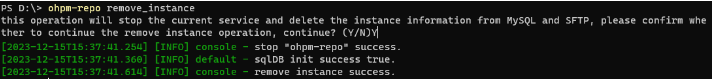

# ohpm-repo remove\_instance

删除本机实例信息。

## 前提条件

* 已成功执行[start 命令](./ide-ohpm-repo-start)或者[restart 命令](./ide-ohpm-repo-restart)，ohpm-repo服务启动成功。
* 数据存储db模块的类型必须为mysql，文件存储store模块的类型必须为sftp或custom。

## 命令格式

```
ohpm-repo remove_instance
```

## 功能描述

该命令会停止当前运行的ohpm-repo服务，同时删除本机在mysql和sftp中的实例信息。命令要求数据存储db模块必须使用mysql，文件存储store模块必须使用sftp或custom。

## 示例

执行以下命令：

```
ohpm-repo remove_instance
```

结果示例：


