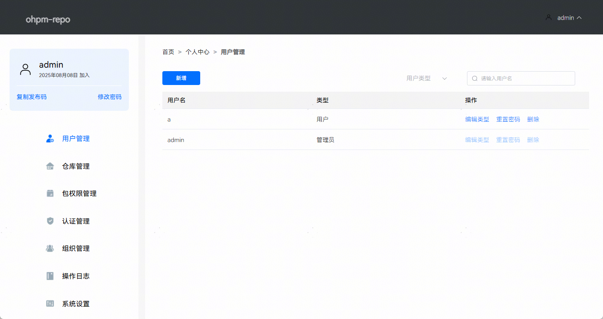
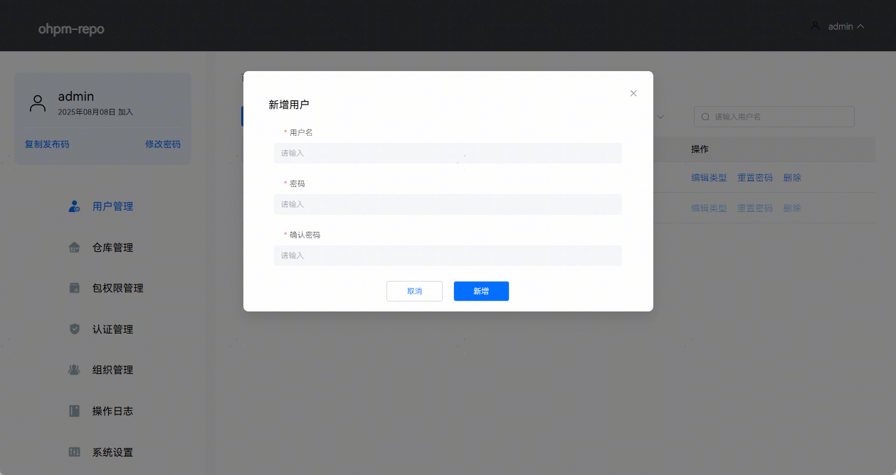
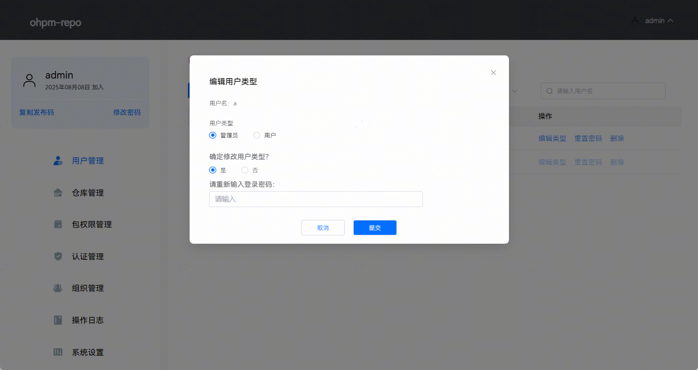
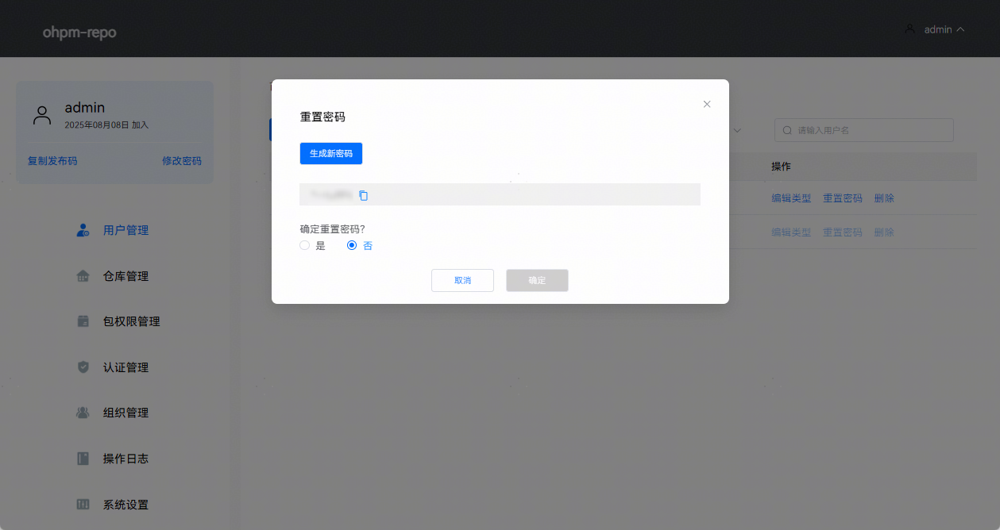
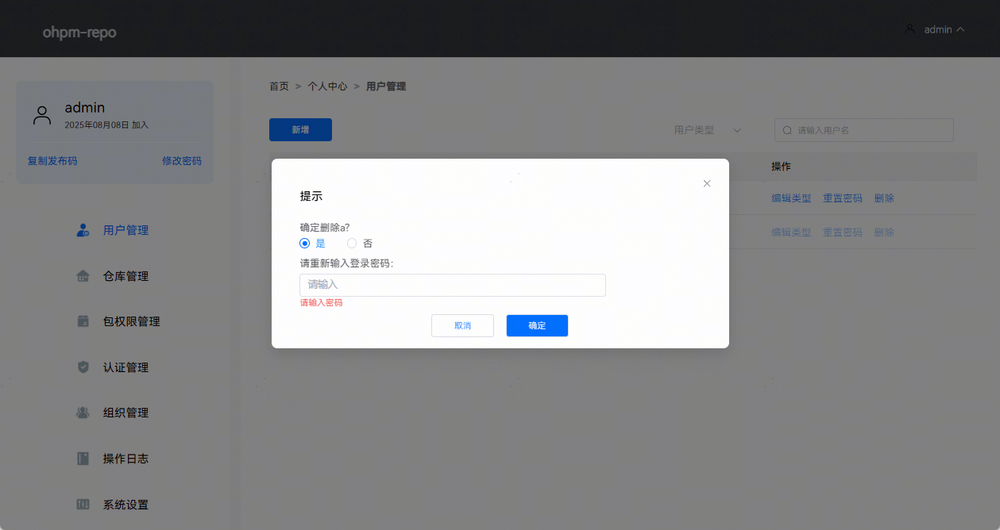
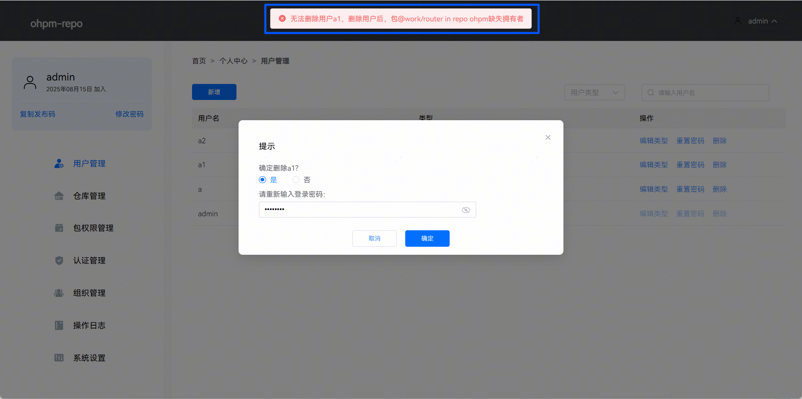
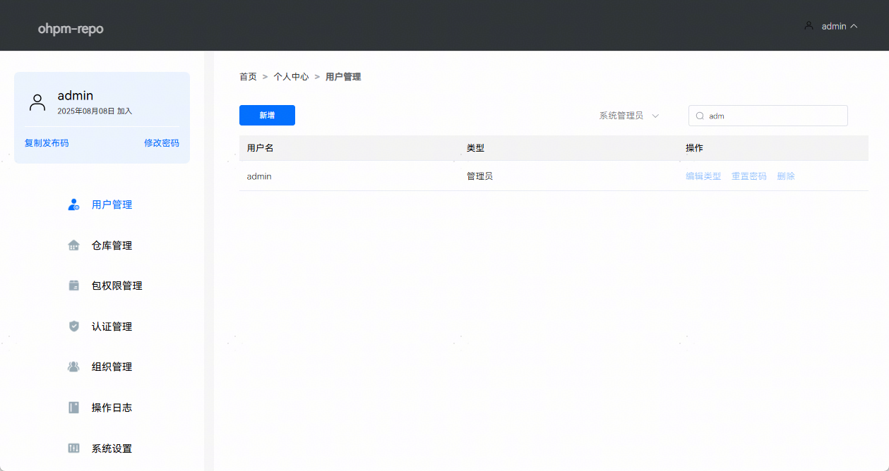

# 用户管理

用户管理页面可以新增用户、修改用户类型、重置用户密码，删除用户和搜索用户，页面效果如下图所示：

1. 点击“新增”按钮，弹出新增用户面板，输入新增用户的用户名和密码，新增用户首次登录将强制重置密码。填完用户信息后点击新增即可添加一个新用户，页面效果如下图所示：

   
2. 点击“编辑类型”按钮，弹出编辑用户类型面板，在此面板中可以修改用户类型成管理员或用户。点击确认修改用户类型，将出现密码输入框，由于管理员修改其他用户的类型是敏感操作，故需要输入当前操作账户的密码进行再次验证，页面效果如下图所示：

   
3. 点击“重置密码”按钮，弹出重置用户密码面板，在此面板中可以通过点击生成新密码为用户生成随机新密码，并可通过点击复制图标将新密码复制进剪贴板（只有点击**确定**按钮才会重置密码）。点击确认重置密码，将出现密码输入框，由于管理员对其他用户重置密码是敏感操作，故需要输入当前操作账户的密码进行再次验证，页面效果如下图所示：

   
4. 点击“删除”按钮，弹出删除提示，如果确定删除，需要点击按钮“是”，将出现密码输入框，由于管理员删除用户属于敏感操作，需要输入当前操作账户的密码进行再次验证，页面效果如下图所示：

   

   当被删除的用户是某个三方包的唯一所有者时，禁止被删除。

   

   5. 点击搜索框，支持指定用户类型（系统管理员/普通用户）和用户名模糊搜索，搜索页面效果如下图所示（以指定用户类型为系统管理员，用户名为admin为例）：

   
