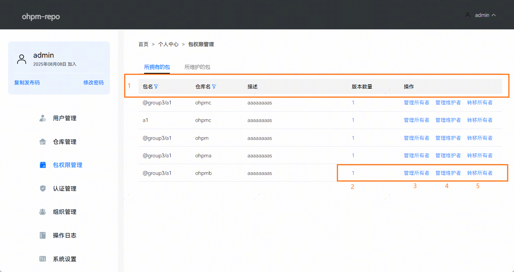
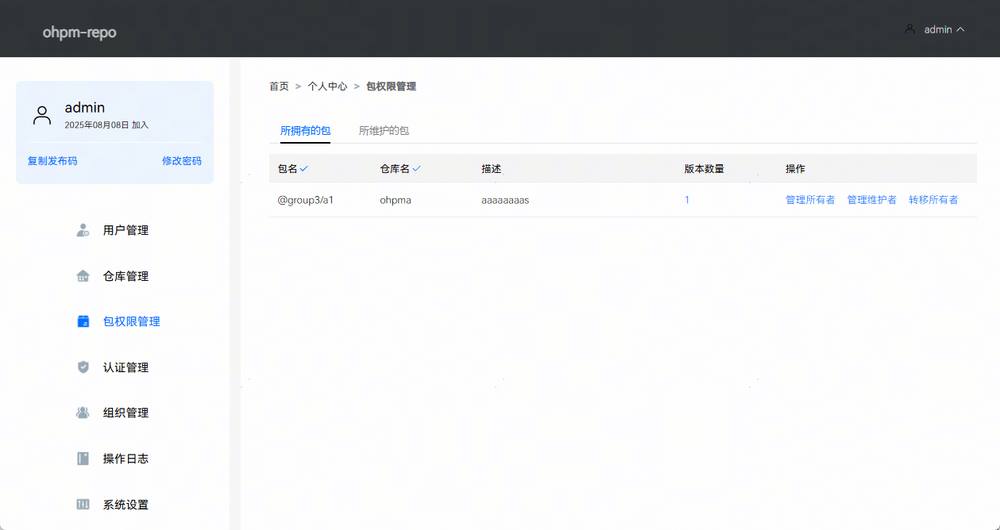
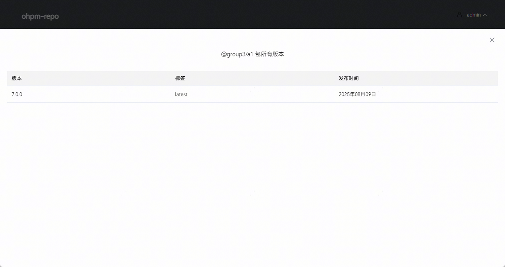
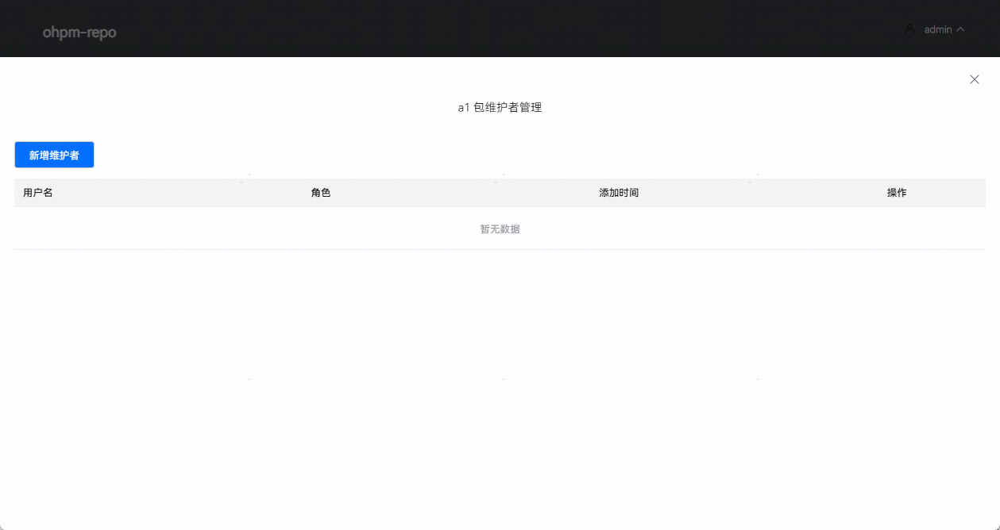
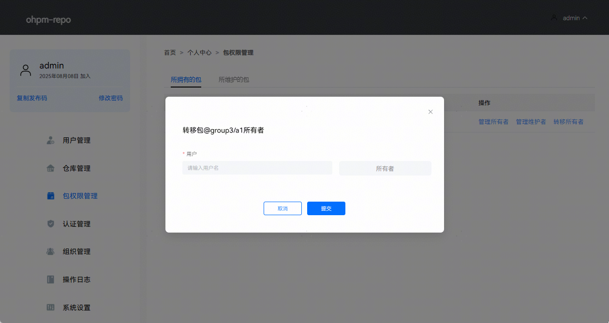
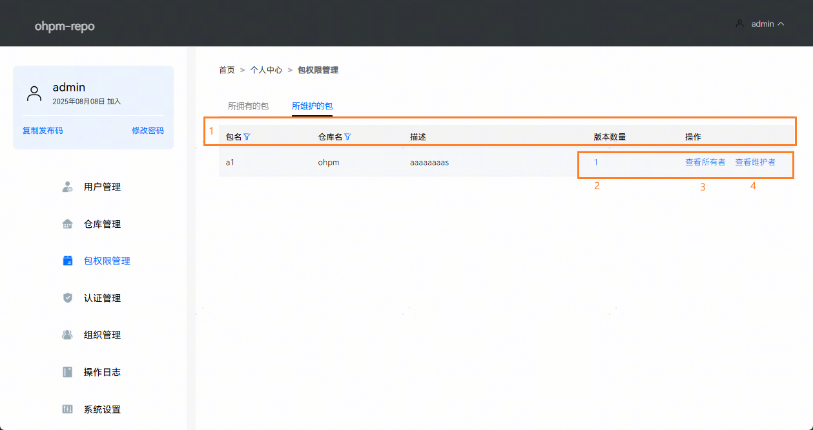
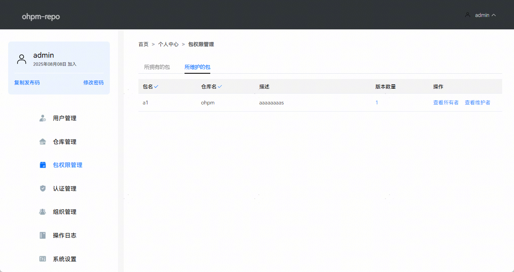
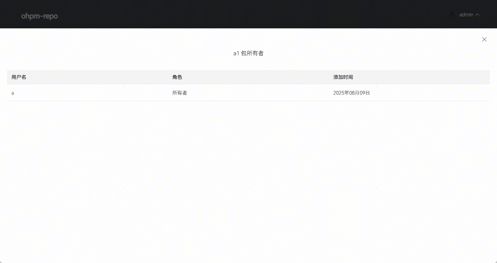

# 包权限管理

ohpm-repo从5.3.0版本开始支持配置包级别的权限管理。系统支持对单个三方包配置精细化的权限控制，包含包的所有者、包的维护者和包的查看者。

系统管理员在仓库管理页的[包的可见性配置](./ide-ohpm-depot-management#li183931814142614)，能够把包设置为授权可读，并通过[白名单配置](./ide-ohpm-depot-management#li174331117117)，添加包的查看者。当用户在执行下载、上传、下架和编辑Tag标签时，需要同时具有[仓库的对应权限](./ide-ohpm-depot-management#zh-cn_topic_0000001792256181_管理仓库)和包的对应权限，缺一不可。

| 包权限角色 | 操作权限 | 适用场景 |
| --- | --- | --- |
| 所有者 | * 下载包 * 上传新包 * 下架现有包 * 编辑包标签（Tag） | 包的管理员，需要所有控制权限 |
| 维护者 | * 下载 * 上传 * 编辑包标签（Tag） | 核心开发者，允许更新但不允许删除包（下架包） |
| 查看者 | * 下载包 | 仅需访问权限的成员或外部协作者 |

在包权限管理页，支持对所拥有的包执行如下操作：管理所有者、管理维护者、转移所有者；对所维护的包执行如下操作：查看所有者、查看维护者。

## 所拥有的包

在所拥有的包界面，支持完成如下操作：

1. 筛选。
2. 查看包所有版本列表。
3. 管理所有者。
4. 管理维护者。
5. 转移所有者。

* 区域1：筛选，点击列表标题旁的漏斗图标，可以进行包数据的筛选，支持针对包名和仓库名进行模糊搜索。例如筛选出包名含有group3，仓库名为ohpma的包，数据筛选效果如下图所示：

  
* 区域2：查看包所有版本列表，点击版本数量中的值，能够查看当前包具有多少个版本。

  
* 区域3：管理所有者，包的所有者具有包的下载，上传，下架和编辑包Tag权限，支持对包所有者进行新增和删除。

  当包仅剩唯一一个所有者用户时，禁止删除。当一个用户已经是包的维护者时，禁止被添加为包的所有者。禁止删除当前用户的所有者权限。

  
* 区域4：管理维护者，包的维护者具有包的下载，上传和编辑Tag权限，支持对包维护者进行新增和删除。当一个用户已经是包的所有者时，禁止被添加为包的维护者。

  
* 区域5：转移所有者，支持当前用户将包的所有者转移给其他非包所有者或维护者。

  

## 所维护的包

在所维护的包界面，支持完成如下操作：

1. 筛选。
2. 查看包所有版本列表。
3. 查看包的所有者用户列表。
4. 查看包的维护者用户列表。

* 区域1：筛选，点击列表标题旁的漏斗图标，可以进行包数据的筛选，支持针对包名和仓库名进行模糊搜索。例如筛选出包名含有a1，仓库名为ohpm的包，数据筛选效果如下图所示：

  
* 区域2：查看包所有版本列表，点击版本数量中的值，能够查看当前包具有多少个版本。
* 区域3：查看包的所有者用户列表。

  
* 区域4：查看包的维护者用户列表。

  
