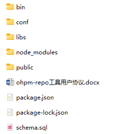
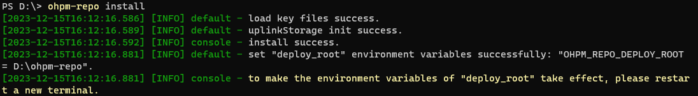

---
title: "1.1.0升级至2.X.X/5.X.X版本"
format: md
original_url: https://developer.huawei.com/consumer/cn/doc/harmonyos-guides-V5/ide-upgrade-110_to_2xx---


# 1.1.0升级至2.X.X/5.X.X版本

升级至2.X.X版本与升级至5.X.X版本步骤一致，本文以升级至2.X.X版本为例。


在升级之前，请务必备份好ohpm-repo私仓工具中的历史数据，避免因升级操作失误，导致数据丢失。备份的内容包括ohpm-repo中[`deploy_root`](#li10435216234)部署根目录内的数据、db元数据以及store三方包数据，详细可参考[数据备份](./ide-ohpm-repo-data-backup)。

1. 旧版本服务停止：如果旧版本的服务还在运行，升级版本前请停止，进入1.1.0版本ohpm-repo私仓工具包解压目录下的bin目录，执行stop

   ```
   ohpm-repo stop
   ```

   

   * 如果部署的是多实例，升级前需要停下所有机器中的ohpm-repo服务，再进行升级操作。
   * 若想在其他目录使用ohpm-repo，请将对应版本ohpm-repo工具包解压目录中bin目录的路径配置到[系统环境变量](./ide-ohpm-repo-faq#section24117279211)path中。

2. 下载并解压工具包：下载版本2.X.X的ohpm-repo私仓工具包，并解压（请解压到一个空文件夹中）。

   
3. 安装完成之后，进入ohpm-repo私仓工具包解压目录下的bin目录，执行如下命令：

   ```
   ohpm-repo -v
   ```

   终端输出为版本号2.X.X，则表示解压成功。
4. 移植配置文件信息：版本2.X.X的配置文件与版本1.1.0相比有较大差异，需要提取旧版本配置文件信息至新版本配置文件中，移植的具体内容如下：

   

   * 如果ohpm-repo版本1.1.0使用的配置文件，配置项均为默认项，则无需移植配置文件信息，直接执行下一步启动操作。
   * 旧版本1.1.0配置文件路径为：`deploy_root`/conf/config.yaml；新版本2.X.X配置文件路径为：``&lt;2.X.X版本ohpm-repo解压目录>``/conf/config.yaml。
   * `deploy_root`：ohpm-repo部署目录，可通过1.1.0版本ohpm-repo私仓工具包解压目录下的.deploy\_root文件查看。

   * **[listen](./ide-ohpm-repo-configuration#zh-cn_topic_0000001745376470_listen)**：旧版本listen值拷贝替换到新版本listen中。如果旧版本是在执行start时指定的listen值，需要把对应的listen值填入新版本配置文件中，新版本中listen值不支持命令行指定。
   * **[https](./ide-ohpm-repo-configuration#zh-cn_topic_0000001745376470_https)**：如果listen配置的协议是https，拷贝https的值：拷贝旧版本https.key和https.cert路径信息至新版本对应的https\_key和https\_cert中。

     ```
     # 旧版本 `1.1.0`
     https:
       key: ./ssl/server.key
       cert: ./ssl/server.crt
     # 新版本 `2.X.X`
     https_key: ./ssl/server.key
     https_cert: ./ssl/server.crt
     ```
   * **[deploy\_root](./ide-ohpm-repo-configuration#zh-cn_topic_0000001745376470_deploy_root)**：打开1.1.0版本ohpm-repo私仓工具包解压目录下的.deploy\_root文件，拷贝文件中的路径信息至新版本配置文件中配置项deploy\_root 处。

     

     如果1.1.0版本ohpm-repo的部署目录deploy\_root使用的是默认路径，即可省略此操作。

     + `deploy_root`：ohpm-repo部署目录：
       1. windows系统默认路径: ~/AppData/Roaming/Huawei/ohpm-repo
       2. 其他操作系统默认路径：~/ohpm-repo
   * **[server](./ide-ohpm-repo-configuration#zh-cn_topic_0000001745376470_server)**： 旧版本server有九个参数信息，拷贝移动到新版本server numeric limit section模块下对应九个参数中。

     

     + 版本1.1.0开始，新增参数api\_timeout。
     + 版本升级时，参数信息会有变化，具体信息可在``<解压目录>``/conf/config.yaml文件中获取。

     ```
     # 旧版本 `1.1.0`
     server:
       max_package_size: 10
       max_extract_size: 50
       max_extract_file_num: 10240
       user_rate_limit: 100
       fetch_timeout: 60
       keep_alive_timeout: 60
       api_timeout: 60
       upload_lock_hour: 24
       upload_max_times: 100

     # 新版本 `2.X.X`
     max_package_size: 10
     max_extract_size: 50
     max_extract_file_num: 10240
     user_rate_limit: 100
     fetch_timeout: 60
     keep_alive_timeout: 60
     api_timeout: 60
     upload_lock_hour: 24
     upload_max_times: 100
     ```
   * **[db](./ide-ohpm-repo-configuration#zh-cn_topic_0000001745376470_db)**： 如果数据存储到本地磁盘中，拷贝替换旧版本db.plugin\_config.path路径信息至新版本db.config.path中；如果数据存储到mysql中，拷贝旧版本db.plugin\_config中各项信息至新版本db.config中。

     ```
     # 旧版本 `1.1.0`: 本地存储
     db:
       plugin_name: ohpm-repo-plugin-filedb
       plugin_config:
         path: ./db
     # 新版本 `2.X.X`: 本地存储
     db:
       type: filedb
       config:
         path: ./db
     ```

     ```
     # 旧版本 `1.1.0`: mysql存储
     db:
       plugin_name: ohpm-repo-plugin-mysqlDB
       plugin_config:
         host: "localhost"
         port: 3306
         username: "root"
         password: "password"
         database: "repo"
     # 新版本 `2.X.X`: mysql存储
     db:
       type: mysql
       config:
         host: "localhost"
         port: 3306
         username: "root"
         password: "password"
         database: "repo"
     ```
   * **[store](./ide-ohpm-repo-configuration#zh-cn_topic_0000001745376470_store)**： 如果文件存储在本地磁盘中 ，拷贝替换旧版本store.plugin\_config.path路径信息和store.plugin\_config.server值至新版本对应的store.config.path和store.config.server中；如果文件存储在sftp中，拷贝旧版本 store.plugin\_config中各项信息至新版本store.config中。

     

     在ohpm-repo 2.0.0版本中，listen的默认值已更改为listen: 0.0.0.0:8088，如果listen的host配置为0.0.0.0，则字段store.config.server不可省略**，必须**配置为详细地址，例如`http://localhost:8088`。

     ```
     # 旧版本 `1.1.0`: 本地存储
     store:
       plugin_name: ohpm-repo-plugin-fs
       plugin_config:
         path: ./storage
         #server: http://localhost:8088
     # 新版本 `2.X.X`: 本地存储
     store:
       type: fs
       config:
         path: ./storage
         #server: http://localhost:8088
     ```

     ```
     # 旧版本 `1.1.0`: sftp存储
     store:
       plugin_name: ohpm-repo-plugin-sftp
       plugin_config:
         location:
           -
             name: test_one_sftp
             host: "localhost"
             port: 22
             read_username: "read"
             read_password: "encrypted_password"
             write_username: "write"
             write_password: "encrypted_password"
             path: /source22
           -
             name: test_two_sftp
             host: "localhost"
             port: 24
             read_username: "read"
             read_password: "encrypted_password"
             write_username: "write"
             write_password: "encrypted_password"
             path: /source24
         #server: http://localhost:8088

     # 新版本 `2.X.X`: sftp存储
     store:
       type: sftp
       config:
         location:
           -
             name: test_one_sftp
             host: "localhost"
             port: 22
             read_username: "read"
             read_password: "password"
             write_username: "write"
             write_password: "password"
             path: /source22
           -
             name: test_two_sftp
             host: "localhost"
             port: 24
             read_username: "read"
             read_password: "password"
             write_username: "write"
             write_password: "password"
             path: /source24
         #server: http://localhost:8088
     ```
   * **[uplink](./ide-ohpm-repo-configuration#zh-cn_topic_0000001745376470_uplink)**: 拷贝旧版本uplink.store\_path路径信息uplink.cache\_time缓存时间信息至新版本对应的uplink\_store\_path和uplink\_cache\_time中。

     ```
     # 旧版本 `1.1.0`
     uplink:
     store_path: ./uplink
     cache_time: 168

     # 新版本 `2.X.X`
     uplink_store_path: ./uplink
     uplink_cache_time: 168
     ```
   * **[logs](./ide-ohpm-repo-configuration#zh-cn_topic_0000001745376470_logs)**：拷贝旧版本logs\_path路径信息至新版本logs\_path中。
   * **[loglevel](./ide-ohpm-repo-configuration#zh-cn_topic_0000001745376470_loglevel)**：拷贝旧版本loglevel.run， loglevel.operate和loglevel.access至新版本对应的loglevel\_run，loglevel\_operate和loglevel\_access中。

     ```
     # 旧版本 `1.1.0`
     loglevel:
       run: info
       operate: info
       access: info

     # 新版本 `2.X.X`
     loglevel_run: info
     loglevel_operate: info
     loglevel_access: info
     ```

   

   新版本配置文件还添加了很多信息的配置，例如[deploy\_root](./ide-ohpm-repo-configuration#zh-cn_topic_0000001745376470_deploy_root)和[logs\_path](./ide-ohpm-repo-configuration#zh-cn_topic_0000001745376470_logs)等，此类信息在升级过程中可不改变，使用默认项。
5. （可选项）新版本如果需要使用新的部署目录`new_deploy_root`，需要手动迁移数据。
   * 升级ohpm-repo：按照步骤1-4，解压和拷贝替换配置文件信息。
   * 建立新部署目录：判断指定的新部署目录`new_deploy_root`是否存在，不存在则新建，新部署目录需存在且为空。
   * 拷贝数据文件：拷贝旧版本部署目录[`deploy_root`](#li194741894251)下的全部文件至新部署目录中。
   * 修改新版本ohpm-repo配置文件：打开新版本ohpm-repo 2.X.X的解压目录，进入conf目录下，修改新配置文件config.yaml，修改配置项deploy\_root为新的部署目录`new_deploy_root`。

   

   在使用新部署目录时，旧版本的部署目录中meta文件一定要迁移到新版本部署目录中，否则使用meta加密组件加密的数据无法被正确解密。
6. 新版本服务启动：正确拷贝替换配置文件信息后，进入ohpm-repo私仓工具包解压目录下的bin目录，执行以下命令启动新版本ohpm-repo服务：

   * 执行安装命令：

     ```
     ohpm-repo install
     ```

     结果示例：

     
   * 刷新环境变量：安装成功后，必须根据给出的提示信息刷新环境变量，针对Windows系统和Linux/Mac系统，有不同处理方式：
     + Windows系统： 关闭当前窗口，重新开启一个窗口
     + Linux系统或Mac系统： 在命令行中执行刷新命令：source ~/.bashrc或者 . ~/.bashrc。
   * 执行start命令：

     ```
     ohpm-repo start
     ```

     结果示例：

     
7. 多实例部署机器快速升级

   在多实例部署中，可先升级一台机器，然后拷贝其配置文件到其他机器中进行快速升级，具体步骤如下

   

   该方法要求部署的多实例机器之间，使用的配置文件除根目录deploy\_root外，其他配置项必须完全相同。

   * 第一台多实例机器根据步骤一至步骤五完成版本的升级，然后复制新版本解压目录中conf目录下的配置文件config.yaml。
   * 复制 新版本配置文件到其他需要升级的机器中。
   * 在需要升级的机器中，首先停止旧版本服务：

     停止旧版本服务

     ```
     ohpm-repo stop
     ```

     

     若您想在其他目录使用ohpm-repo，请将对应版本ohpm-repo根目录中bin目录的路径配置到[系统环境变量](./ide-ohpm-repo-faq#section24117279211)path中。
   * 下载并解压工具包：下载版本*`2.X.X`*的ohpm-repo私仓工具包，并解压。

     
   * 版本检查：进入ohpm-repo私仓工具包解压目录下的bin目录，执行版本查看命令：

     ```
       ohpm-repo -v
     ```

     终端输出为版本号2.X.X，则表示安装成功。
   * 替换配置文件：获取复制获得的新版本配置文件，与2.X.X版本ohpm-repo私仓工具包解压目录中conf目录下的配置文件做替换。
   * 保留旧配置文件的部署目录：打开1.1.0版本ohpm-repo私仓工具包解压目录下的.deploy\_root文件，拷贝文件中的路径信息至替换后的新版本配置文件中配置项deploy\_root处。
   * 新版本ohpm-repo的服务启动：进入ohpm-repo私仓工具包解压目录下的bin目录，执行以下命令启动新版本ohpm-repo服务：
     1. 执行安装命令：

        ```
        ohpm-repo install
        ```

        结果示例：

        
     2. 刷新环境变量：安装成功后，必须根据给出的提示信息刷新环境变量，针对Windows系统和Linux/Mac系统，有不同处理方式

        

        + Windows系统： 关闭当前窗口，重新开启一个窗口
        + Linux系统或Mac系统： 在命令行中执行刷新命令：source ~/.bashrc或者. ~/.bashrc。
     3. 执行 start 命令：

        ```
        ohpm-repo start
        ```

        结果示例：

        

        

        版本升级之前，如果浏览器中已访问ohpm-repo页面，版本升级之后请刷新ohpm-repo页面。
